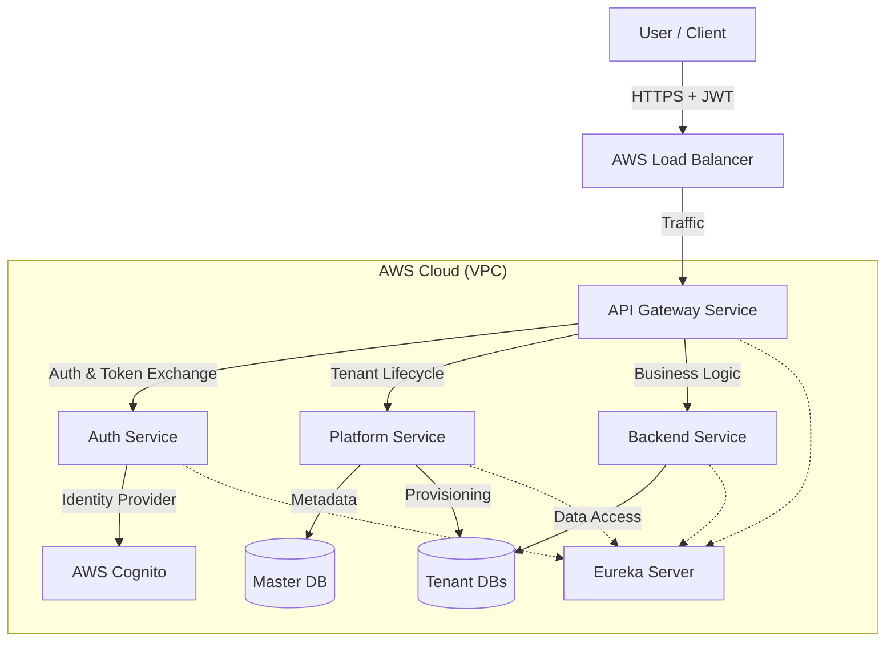

# High-Level Design (HLD) & Architecture

**Version:** 2.0
**Last Updated:** 2025-11-24

---

## 1. Executive Summary

This document serves as the primary architectural blueprint for the AWS-Infra project. It details the system design, service responsibilities, security flows, multi-tenancy model, and infrastructure specifications.

**Project Goal:** Build a production-ready, scalable, multi-tenant SaaS platform using Spring Boot microservices, Angular frontend, and AWS infrastructure.

---

## 2. System Requirements

### 2.1 Functional Requirements
*   **Multi-Tenancy:** Complete data isolation per tenant. Support for "Database-per-Tenant" (preferred) and "Schema-per-Tenant" (legacy/fallback).
*   **Authentication:** Centralized OAuth2/OIDC authentication via AWS Cognito.
*   **Authorization:** Role-Based Access Control (RBAC) enforced at the Gateway and Service layers.
*   **Tenant Management:** Automated provisioning, suspension, and lifecycle management of tenants.
*   **Entry Management:** CRUD operations for business entities ("Entries") with tenant isolation.

### 2.2 Non-Functional Requirements
*   **Scalability:** Horizontal scaling of microservices on AWS EKS/ECS.
*   **Security:** Zero-trust principles. All internal traffic authenticated. Secrets managed via AWS SSM/Secrets Manager.
*   **Observability:** Centralized logging (JSON), distributed tracing (OpenTelemetry), and metrics (Prometheus).
*   **Infrastructure:** Infrastructure as Code (Terraform) for reproducible environments.

---

## 3. High-Level Architecture

### 3.1 Context Diagram

### 3.2 Service Responsibilities

| Service | Port | Responsibility |
| :--- | :--- | :--- |
| **Gateway Service** | 8080 | **Security Boundary**. JWT validation, Tenant ID extraction, Header enrichment (`X-Tenant-Id`, `X-User-Id`), Routing, Rate Limiting. |
| **Auth Service** | 8081 | **Identity**. OAuth2/OIDC flows, User Session management, Token issuance (Internal Tokens), User Profile management. |
| **Backend Service** | 8082 | **Domain Logic**. Tenant-scoped business operations (Entries). Enforces tenant context from headers. |
| **Platform Service** | 8083 | **Control Plane**. Tenant Lifecycle (Provisioning, Suspension), Policy Management, Internal Token Issuance, System Audit. |
| **Eureka Server** | 8761 | **Discovery**. Service registration and discovery. |

---

## 4. Security Architecture

### 4.1 Identity & Authentication Flow
1.  **Login:** Client redirects to AWS Cognito Hosted UI via Auth Service.
2.  **Token:** Cognito issues ID/Access Tokens.
3.  **Session:** Auth Service establishes a session and provides tokens to the Frontend.
4.  **Request:** Frontend sends requests with `Authorization: Bearer <JWT>`.

### 4.2 Gateway Enforcement (The "Gatekeeper")
The Gateway Service acts as the primary Policy Enforcement Point (PEP):
1.  **Validate:** Verifies JWT signature against Cognito JWKS.
2.  **Extract:** Decodes claims to identify `sub` (User ID) and `cognito:groups` (Tenant).
3.  **Enforce:**
    *   **Fail-Closed:** Rejects requests without valid Tenant ID.
    *   **Sanitize:** Strips incoming `X-*` headers to prevent spoofing.
4.  **Enrich:** Adds trusted headers for downstream services:
    *   `X-Tenant-Id`: The resolved tenant identifier.
    *   `X-User-Id`: The authenticated user ID.
    *   `X-Authorities`: User roles/permissions.

### 4.3 Internal Trust (Planned)
*   **Current:** Downstream services trust `X-Tenant-Id` headers from the Gateway (Network isolation required).
*   **Future:** Gateway exchanges external Cognito Token for a short-lived **Internal Service Token** signed by the Platform Service. Downstream services validate this internal token.

---

## 5. Multi-Tenancy Model

### 5.1 Isolation Strategy
We support two modes, controlled by the `platform.storage.mode` feature flag:

1.  **Database-per-Tenant (Target State):**
    *   **Isolation:** Maximum. Each tenant has a dedicated PostgreSQL database (e.g., `tenant_acme`).
    *   **Security:** Distinct DB credentials per tenant.
    *   **Scalability:** Tenants can be moved to different RDS instances.
    *   **Provisioning:** Platform Service creates DB and runs baseline migrations.

2.  **Schema-per-Tenant (Legacy/Fallback):**
    *   **Isolation:** Logical. Shared database, separate schemas (e.g., `schema_acme`).
    *   **Pros:** Lower cost for free-tier/dev.

### 5.2 Tenant Provisioning Workflow
1.  **Request:** Admin calls `POST /platform/api/tenants`.
2.  **Validation:** Platform Service validates uniqueness and plan limits.
3.  **Resource Allocation:**
    *   Creates Database (or Schema).
    *   Creates DB User (if DB-per-tenant).
4.  **Migration:** Triggers Flyway migrations to initialize the tenant's schema.
5.  **Registration:** Records metadata (JDBC URL, State) in the Master DB `tenants` table.
6.  **Identity:** Creates a Tenant Group in Cognito (e.g., `tenant_<id>`).

---

## 6. Data Model

### 6.1 Master Database (Platform)
*   `tenants`: Registry of all tenants.
    *   `id` (PK), `name`, `status` (ACTIVE, SUSPENDED), `storage_mode`, `jdbc_url`, `tier`.
*   `policies`: RBAC definitions (Roles, Permissions).

### 6.2 Tenant Database (Domain)
*   `entries`: Business data.
    *   `id` (UUID), `title`, `content`, `created_by`, `created_at`.
*   *Note: No tenant_id column needed in tables as the DB/Schema itself is the isolation boundary.*

---

## 7. Infrastructure & Deployment

### 7.1 Tech Stack
*   **Backend:** Java 21, Spring Boot 3.x
*   **Frontend:** Angular 18+
*   **Database:** PostgreSQL 15+ (RDS)
*   **Container:** Docker, ECR
*   **Orchestration:** AWS EKS (Kubernetes) or ECS Fargate
*   **IaC:** Terraform

### 7.2 CI/CD Pipeline
1.  **Build:** Maven build, Unit Tests.
2.  **Package:** Docker build, Push to ECR.
3.  **Deploy:** Terraform apply (Infra), Helm Upgrade (App).

---

## 8. Future Roadmap (From Plans)
*   **Internal Token System:** Replace header trust with signed internal tokens.
*   **Policy Engine:** Move authorization logic from code to a data-driven policy engine in Platform Service.
*   **Advanced Provisioning:** Async provisioning with retry queues.
