# High-Level Design: Multi-Tenant SaaS Template System

**Version:** 3.0  
**Last Updated:** 2025-11-27  
**Purpose:** Production-ready, reusable multi-tenant architecture template

---

## 🎯 What Is This Project?

This is a **template system** for building multi-tenant SaaS applications. It provides all the supporting infrastructure and services you need - just plug in your business logic.

### Key Philosophy
- **Backend-Service is a Mimic** - Replace it with your real service (work-service, inventory-service, etc.)
- **Auth, Platform, Gateway are Reusable** - These supporting services work for any domain
- **Complete Multi-Tenancy** - Database-per-tenant isolation, automated provisioning, AWS Cognito integration
- **Production-Ready** - Security, observability, IaC with Terraform included

---

## 🏗️ System Architecture

```mermaid
graph TB
    subgraph "Client Layer"
        User[👤 End Users]
        Admin[🔧 System Admin]
    end
    
    subgraph "Entry Point"
        ALB[AWS Application Load Balancer]
    end
    
    subgraph "Microservices"
        Gateway[🛡️ Gateway Service<br/>Port 8080<br/><b>Gatekeeper</b>]
        Auth[🔐 Auth Service<br/>Port 8081<br/><b>Identity & Permissions</b>]
        Platform[⚙️ Platform Service<br/>Port 8083<br/><b>Tenant Lifecycle</b>]
        Backend[📦 Backend Service<br/>Port 8082<br/><b>REPLACEABLE MIMIC</b>]
        Eureka[🔍 Eureka Server<br/>Port 8761<br/><b>Service Discovery</b>]
    end
    
    subgraph "AWS Services"
        Cognito[AWS Cognito<br/>User Pools & Identity]
        RDS[PostgreSQL RDS<br/>Master + Tenant DBs]
        SecretsManager[AWS Secrets Manager]
        SSM[AWS SSM Parameter Store]
    end
    
    subgraph "Infrastructure (Optional)"
        Redis[Redis Cache]
        DocumentDB[DocumentDB/MongoDB]
    end
    
    User --> ALB
    Admin --> ALB
    ALB --> Gateway
    
    Gateway --> Auth
    Gateway --> Platform
    Gateway --> Backend
    
    Gateway -.- Eureka
    Auth -.- Eureka
    Platform -.- Eureka
    Backend -.- Eureka
    
    Auth --> Cognito
    Auth --> Platform
    Platform --> RDS
    Backend --> RDS
    
    Platform --> SecretsManager
    Platform --> SSM
    
    style Backend fill:#ffe6e6,stroke:#ff4444
    style Gateway fill:#e6f3ff,stroke:#0066cc
    style Auth fill:#fff3e6,stroke:#ff9900
    style Platform fill:#e6ffe6,stroke:#00cc44
```



---

## 📋 Service Responsibilities

### 🛡️ Gateway Service (Port 8080)
**Role:** Gatekeeper - Security boundary for ALL incoming requests

**Responsibilities:**
- ✅ **Authentication Validation** - Verify JWT tokens from Cognito
- ✅ **Tenant Context Extraction** - Extract tenant ID from token/headers
- ✅ **Header Enrichment** - Inject trusted headers (`X-Tenant-Id`, `X-User-Id`, `X-Authorities`)
- ✅ **Load Balancing** - Route to healthy service instances via Eureka
- ✅ **Rate Limiting** - Prevent abuse (future)
- ✅ **Request Sanitization** - Strip incoming `X-*` headers to prevent spoofing

**Key Feature:** Fail-closed security - rejects requests without valid tenant context

---

### 🔐 Auth Service (Port 8081)
**Role:** Complete identity and permission management

**Responsibilities:**

#### Authentication
- ✅ **Multi-Provider Login Support:**
  - Email/Password via Cognito
  - SSO (Google, Microsoft, Azure AD)
  - SAML 2.0 (Ping, Okta, etc.)
  - OAuth2/OIDC flows
- ✅ **User Signup Orchestration:**
  - B2C (personal) and B2B (organization) flows
  - Calls Platform Service for tenant provisioning
  - Creates Cognito users with custom attributes
- ✅ **Session Management** - Token issuance, refresh, logout
- ✅ **MFA Support** - Via Cognito (SMS, TOTP)

#### Authorization (Future)
- 🔜 **Permission-Based Access Control** - Fine-grained permissions (read, write, delete, etc.)
- 🔜 **Role Management** - Admin, User, Guest roles per tenant
- 🔜 **Policy Engine** - Dynamic permission evaluation

**Technology:** AWS Cognito User Pools, Spring Security OAuth2

---

### ⚙️ Platform Service (Port 8083)
**Role:** Control plane for entire tenant lifecycle

**Responsibilities:**

#### Tenant Provisioning
- ✅ **Database Provisioning:**
  - Database-per-tenant (primary) - Creates dedicated PostgreSQL database
  - Schema-per-tenant (fallback) - Creates schema in shared database
- ✅ **Database User Management** - Creates DB credentials, stores in AWS Secrets Manager
- ✅ **Schema Initialization** - Runs Flyway migrations for each tenant
- ✅ **Tenant Registry** - Maintains master metadata (JDBC URLs, status, tier)

#### Tenant Management
- ✅ **Lifecycle Operations:**
  - Activate, Suspend, Delete tenants
  - Upgrade/downgrade tiers (STANDARD, PREMIUM, ENTERPRISE)
- ✅ **Metadata Storage** - Master database tracks all tenant configurations
- ✅ **Service Coordination** - Notifies backend services of new tenants

#### Admin Operations
- ✅ **Internal APIs** - Tenant migration triggers, health checks
- 🔜 **Billing Integration** - Usage tracking, plan limits enforcement
- 🔜 **Compliance** - Data residency, retention policies

**Databases:**
- **Master DB:** Tenant registry, system configuration
- **Tenant DBs:** Created dynamically per tenant

---

### 📦 Backend Service (Port 8082)
**Role:** Domain-specific business logic - **THIS IS THE REPLACEABLE PART**

**Current Implementation:**
- ✅ Example "Entry" CRUD operations
- ✅ Demonstrates multi-tenant data isolation patterns
- ✅ Shows how to use tenant context from headers

**How to Replace:**
1. Keep the multi-tenant data access patterns
2. Replace `Entry` entity with your domain (Order, Product, Task, etc.)
3. Add your business logic
4. Register with Eureka using same pattern

**Examples of What You Might Build:**
- `work-service` - Task/project management
- `inventory-service` - Stock/warehouse management
- `crm-service` - Customer relationship management
- `analytics-service` - Reporting and dashboards

**Key Pattern:** Always read tenant from `X-Tenant-Id` header injected by Gateway

---

### 🔍 Eureka Server (Port 8761)
**Role:** Service discovery and health monitoring

**Responsibilities:**
- ✅ Service registration - All services register on startup
- ✅ Health checks - Monitors service availability
- ✅ Load balancing - Gateway uses Eureka to find healthy instances
- ✅ Failover - Automatically routes around unhealthy services

---

## 🔐 Security & Authentication Flow

### User Signup Flow


### User Login & Request Flow


---

## 🏢 Multi-Tenancy Model

### Isolation Strategy: Database-per-Tenant (Primary)

**Why Database-per-Tenant?**
- ✅ **Maximum Security** - Complete data isolation
- ✅ **Performance** - No query filtering overhead
- ✅ **Scalability** - Move tenants to different RDS instances
- ✅ **Compliance** - Easier data residency/GDPR compliance
- ✅ **Backup/Restore** - Per-tenant operations

**How It Works:**
1. Platform Service creates database: `tenant_<company_slug>`
2. Unique DB credentials stored in AWS Secrets Manager
3. Flyway runs migrations to initialize schema
4. Backend services connect to correct database using `X-Tenant-Id`

**Alternative:** Schema-per-tenant (shared database, separate schemas) for cost optimization

### Tenant Tiers & Limits

| Tier | Max Users | Features | Storage | Price |
|------|-----------|----------|---------|-------|
| **STANDARD** | 50 | Basic features | 10 GB | $ |
| **PREMIUM** | 200 | Advanced features + API access | 50 GB | $$ |
| **ENTERPRISE** | 10,000 | Custom + dedicated support | Unlimited | $$$ |

---

## 🗄️ Data Architecture

### Master Database (Platform Service)
```sql
-- Tenant Registry
CREATE TABLE tenants (
    id VARCHAR(64) PRIMARY KEY,              -- tenant_acme, user_john_doe_xyz
    name VARCHAR(255) NOT NULL,              -- Acme Corp, John's Workspace
    status VARCHAR(20) NOT NULL,             -- ACTIVE, SUSPENDED, DELETED
    storage_mode VARCHAR(20) NOT NULL,       -- DATABASE, SCHEMA
    jdbc_url TEXT NOT NULL,                  -- Connection string to tenant DB
    tier VARCHAR(20) NOT NULL,               -- STANDARD, PREMIUM, ENTERPRISE
    tenant_type VARCHAR(20) NOT NULL,        -- PERSONAL, ORGANIZATION
    owner_email VARCHAR(255) NOT NULL,
    max_users INTEGER NOT NULL,
    created_at TIMESTAMP DEFAULT NOW(),
    updated_at TIMESTAMP DEFAULT NOW()
);

-- DB Credentials (encrypted, could also use AWS Secrets Manager)
CREATE TABLE tenant_credentials (
    tenant_id VARCHAR(64) PRIMARY KEY,
    db_username VARCHAR(64) NOT NULL,
    db_password_secret VARCHAR(255) NOT NULL,  -- ARN to AWS Secrets Manager
    created_at TIMESTAMP DEFAULT NOW()
);
```

### Tenant Database (Backend Service)
```sql
-- Example: Entry entity (replace with your domain)
CREATE TABLE entries (
    id UUID PRIMARY KEY DEFAULT gen_random_uuid(),
    title VARCHAR(255) NOT NULL,
    content TEXT,
    created_by VARCHAR(255) NOT NULL,         -- User ID from X-User-Id
    created_at TIMESTAMP DEFAULT NOW(),
    updated_at TIMESTAMP DEFAULT NOW()
);
-- NOTE: No tenant_id column needed - database itself is the isolation boundary
```

---

## 🔧 Technology Stack

### Backend Services
- **Language:** Java 21
- **Framework:** Spring Boot 3.x
- **Security:** Spring Security OAuth2, AWS Cognito SDK
- **Service Discovery:** Spring Cloud Netflix Eureka
- **Database:** PostgreSQL 15+ (RDS)
- **Migrations:** Flyway
- **Build:** Maven

### Frontend (Optional)
- **Framework:** Angular 18+
- **Auth:** OAuth2 PKCE flow

### AWS Services
- **Cognito:** User authentication, MFA, SSO integration
- **RDS PostgreSQL:** Master + Tenant databases
- **Secrets Manager:** Database credentials
- **SSM Parameter Store:** Configuration
- **Application Load Balancer:** HTTPS termination, routing
- **ECS/EKS:** Container orchestration (future)

### Infrastructure as Code
- **Terraform:** AWS resource provisioning
  - VPC, subnets, security groups
  - RDS instances, parameter groups
  - Cognito user pools, app clients
  - IAM roles, policies
  - ALB, target groups

### Observability
- **Logging:** JSON structured logs via Logback + ELK (future)
- **Tracing:** OpenTelemetry + Zipkin
- **Metrics:** Prometheus + Grafana
- **Monitoring:** AWS CloudWatch

---

## 🚀 Deployment Architecture

### Development Environment
```yaml
Services: Docker Compose
Database: Local PostgreSQL
Cognito: LocalStack (emulated)
Eureka: Single instance
```

### Production Environment
```yaml
Compute: AWS ECS Fargate or EKS
Load Balancer: AWS ALB with SSL/TLS
Database: RDS Multi-AZ with read replicas
Cognito: AWS Cognito
Cache: ElastiCache Redis (future)
Storage: S3 for static assets
CDN: CloudFront
```

---

## 🔄 How to Use This Template

### For a New Project

1. **Keep As-Is:**
   - Gateway Service
   - Auth Service  
   - Platform Service
   - Eureka Server
   - Terraform modules

2. **Replace:**
   - Backend Service → Your domain service (e.g., `work-service`)
   - Update entity models, repositories, controllers
   - Keep multi-tenant data access patterns

3. **Add New Services (Optional):**
   - `notification-service` - Email/SMS
   - `analytics-service` - Reports
   - `billing-service` - Payments
   - All should register with Eureka and respect `X-Tenant-Id`

4. **Configure:**
   - Update `application.yml` with your AWS credentials
   - Run Terraform to create infrastructure
   - Deploy services to ECS/EKS

---

## 🛣️ Request Flow Example

**User wants to create an Entry in their tenant**

1. **User** sends: `POST /api/entries` with JWT token
2. **Gateway** validates JWT, extracts `tenantId=acme` from token
3. **Gateway** adds headers: `X-Tenant-Id: acme`, `X-User-Id: user123`
4. **Gateway** routes to Backend Service via Eureka
5. **Backend** reads `X-Tenant-Id: acme` header
6. **Backend** connects to `tenant_acme` database
7. **Backend** creates entry, sets `created_by=user123`
8. **Backend** returns success
9. **Gateway** forwards response to user

**Security:** No tenant can access another tenant's data - enforced at database level

---

## 📁 Project Structure

```
AWS-Infra/
├── auth-service/           # Identity & permission management
├── platform-service/       # Tenant lifecycle control plane
├── backend-service/        # REPLACE THIS - domain logic mimic
├── gateway-service/        # API gateway & security enforcement
├── eureka-server/          # Service discovery
├── common-dto/             # Shared DTOs across services
├── common-infra/           # Shared utilities (JSON writer, etc.)
├── terraform/              # Infrastructure as Code
│   ├── modules/
│   │   ├── vpc/
│   │   ├── rds/
│   │   ├── cognito/
│   │   └── ecs/
│   └── environments/
│       ├── dev/
│       └── prod/
├── docker-compose.yml      # Local dev environment
└── HLD.md                  # This document
```

---

## 🎓 Key Concepts

### Tenant Context Propagation
Every request carries tenant context through headers:
- `X-Tenant-Id` - Database to connect to
- `X-User-Id` - User making the request
- `X-Authorities` - User permissions/roles

### Fail-Closed Security
- Gateway rejects requests without valid JWT
- Gateway rejects requests without tenant context
- Services trust headers from Gateway (network isolation required)

### Dynamic Tenant Onboarding
- No code deployment needed to add new tenant
- Platform Service provisions on-demand
- Fully automated via signup API

---

## 📚 Additional Documentation

- **[Implementation Guide](docs/tenant-onboarding/IMPLEMENTATION_GUIDE.md)** - Step-by-step setup
- **[API Documentation](docs/api/)** - Service endpoints (future)
- **[Terraform Guide](terraform/README.md)** - Infrastructure setup
- **[Runbook](docs/runbook.md)** - Operations guide (future)

---

## 🔮 Future Roadmap

- [ ] **Permission Engine** - Fine-grained authorization in Auth Service
- [ ] **Redis Integration** - Distributed caching
- [ ] **Async Provisioning** - Queue-based tenant creation for scale
- [ ] **Tenant Migration Tools** - Move tenants between RDS instances
- [ ] **Multi-Region Support** - Data residency compliance
- [ ] **GraphQL API** - Alternative to REST
- [ ] **Event-Driven Architecture** - Kafka/SNS integration
- [ ] **Admin Portal** - Web UI for tenant management

---

**Questions?** This template is designed to be self-explanatory. Start with Gateway → Auth → Platform → Your Service.
