# High-Level Design: Multi-Tenant SaaS Template System

**Version:** 4.3  
**Last Updated:** 2025-12-06  
**Purpose:** Production-ready, reusable multi-tenant architecture template with RBAC authorization and complete database-per-tenant isolation


---

## 🎯 What Is This Project?

This is a **template system** for building multi-tenant SaaS applications. It provides all the supporting infrastructure and services you need - just plug in your business logic.

### Key Philosophy
- **Backend-Service is a Mimic** - Replace it with your real service (work-service, inventory-service, etc.)
- **Auth, Platform, Gateway are Reusable** - These supporting services work for any domain
- **Angular Frontend Included** - Pre-built UI with AWS Amplify for client-side auth, ready to customize
- **B2B & B2C Support** - Handle both individual users and organizations with tenant isolation
- **Complete Multi-Tenancy** - Database-per-tenant isolation, automated provisioning, AWS Cognito integration
- **Production-Ready** - Security, observability, IaC with Terraform included

---

## 🏗️ System Architecture


---

## 📋 Service Responsibilities

### 🛡️ Gateway Service (Port 8080)
**Role:** Gatekeeper - Security boundary for ALL incoming requests

**Responsibilities:**
- ✅ **Authentication Validation** - Verify JWT tokens from Cognito (**Sole Validator**)
- ✅ **Tenant Context Extraction** - Extract tenant ID from token/headers
- ✅ **Header Enrichment** - Inject trusted headers (`X-Tenant-Id`, `X-User-Id`, `X-Authorities`, `X-Email`)
- ✅ **Load Balancing** - Route to healthy service instances via Eureka
- ✅ **Rate Limiting** - Prevent abuse (future)
- ✅ **Request Sanitization** - Strip incoming `X-*` headers to prevent spoofing

**Key Feature:** Fail-closed security - rejects requests without valid tenant context. Acts as the **only** OAuth2 Resource Server in the system.

---

### 🔐 Auth Service (Port 8081)
**Role:** Complete identity and permission management

**Responsibilities:**

#### Authentication
- ✅ **Multi-Provider Login Support:**
  - Email/Password via Cognito
  - SSO (Google, Microsoft, Azure AD)
  - SAML 2.0 (Ping, Okta, etc.)
  - OAuth2/OIDC flows
- ✅ **User Signup Orchestration:**
  - B2C (personal) and B2B (organization) flows
  - Calls Platform Service for tenant provisioning
  - Creates Cognito users with custom attributes
- ✅ **Session Management** - Token issuance, refresh, logout
- ✅ **MFA Support** - Via Cognito (SMS, TOTP)
- ✅ **Trusts Gateway:** Relies on `X-User-Id` and `X-Tenant-Id` headers. **No local JWT validation.**

#### Authorization (RBAC - Role-Based Access Control)
- ✅ **Permission-Based Access Control (PBAC)** - Fine-grained permissions system
  - Resource-action model (e.g., `entry:read`, `entry:create`, `tenant:delete`)
  - Super-admin wildcard permission (`*:*`)
- ✅ **Role Management** - Hierarchical role system
  - Platform roles: `super-admin`, `platform-admin`
  - Tenant roles: `tenant-admin`, `tenant-user`, `tenant-guest`
  - Roles scoped to tenant or platform level
- ✅ **Database Schema:**
  - `roles` - Role definitions with scope (PLATFORM/TENANT)
  - `permissions` - Granular permissions (resource + action)
  - `role_permissions` - Maps roles to permissions
  - `user_roles` - Assigns roles to users within tenant context
- ✅ **Permission APIs:**
  - `POST /api/v1/permissions/check` - Remote permission validation (used by other services)
  - `GET /api/v1/permissions/user/{userId}/tenant/{tenantId}` - Get all user permissions
  - `GET /api/v1/permissions` - List all defined permissions (resource + action)
- ✅ **Role Assignment APIs:**
  - `GET /api/v1/roles` - List all available roles (Platform & Tenant scopes)
  - `POST /api/v1/roles/assign` - Assign role to user
  - `POST /api/v1/roles/revoke` - Revoke role from user
  - `PUT /api/v1/roles/users/{userId}` - Update user's role
  - `GET /api/v1/roles/user/{userId}` - Get user's roles
- ✅ **User Statistics APIs:**
  - `GET /api/v1/stats/users` - Get aggregated user statistics for tenant
    - Returns: total users, pending invitations, role distribution
    - Aggregates from `invitations` and `user_roles` tables
- ✅ **Invitation Management APIs:**
  - `POST /api/v1/invitations` - Send invitation to new user
  - `GET /api/v1/invitations/{tenantId}` - List all invitations for tenant
  - `POST /api/v1/invitations/{token}/accept` - Accept invitation and join organization
  - `DELETE /api/v1/invitations/{id}` - Revoke pending invitation
  - `POST /api/v1/invitations/{id}/resend` - Resend invitation email
- ✅ **Email Verification APIs:**
  - `POST /api/v1/auth/resend-verification` - Resend verification email to user
  - `POST /api/v1/auth/confirm-signup` - Confirm signup with verification code
- ✅ **Invitation Schema:**
  - Table: `invitations` (id, tenant_id, email, token, role_id, status, expires_at, invited_by)
  - Statuses: PENDING, ACCEPTED, EXPIRED, REVOKED

**Technology:** AWS Cognito User Pools, Spring Security (OAuth2 Client only), JPA

**Email Verification Flow (B2C Personal Signup):**
1. User signs up → `signUp` API with `clientMetadata` (tenantId, role)
2. Cognito sends verification **code** via email
3. **Frontend** displays code input (VerifyEmailComponent)
4. User enters code → `confirmSignUp` API with `clientMetadata` (tenantId, role)
5. **Lambda PostConfirmation trigger** sets `custom:tenantId` and `custom:role`
6. User redirected to login with full tenant context in JWT

**Key Implementation Details:**
- `clientMetadata` must be passed during BOTH `signUp` AND `confirmSignUp`
- Gateway permits `/auth/signup/verify` without authentication
- Frontend stores `tenantId` in router state between signup and verify pages

**Lambda Functions:**
- `cognito-post-confirmation` - Sets custom attributes (`custom:tenantId`, `custom:role`) after email verification.
  - **Purpose:** Persists tenant context into the user profile so it's available in the JWT on every login without runtime latency.
  - Runtime: Python 3.11
  - Trigger: Cognito PostConfirmation event
  - Permissions: AdminUpdateUserAttributes on User Pool

**Authorization Architecture:**
- `PermissionService` - Core permission evaluation logic
- `UserRoleService` - Role assignment/revocation
- `UserStatsService` - User statistics aggregation for admin dashboard
- `AuthServicePermissionEvaluator` - Local evaluator (direct database access)


---

### ⚙️ Platform Service (Port 8083)
**Role:** Control plane for entire tenant lifecycle

**Responsibilities:**

#### Tenant Provisioning
- ✅ **Database Provisioning:**
  - Database-per-tenant (primary) - Creates dedicated PostgreSQL database
  - Schema-per-tenant (fallback) - Creates schema in shared database
- ✅ **Database User Management** - Creates DB credentials, stores in AWS Secrets Manager
- ✅ **Schema Initialization** - Runs Flyway migrations for each tenant
- ✅ **Tenant Registry** - Maintains master metadata (JDBC URLs, status, tier)

#### Tenant Management
- ✅ **Lifecycle Operations:**
  - Activate, Suspend, Delete tenants
  - **Tenant Deletion:** (`DELETE /api/tenants/{id}`)
    - Hard delete of tenant entry (logically marked `DELETED`)
    - Requires `tenant:delete` permission
    - **Note:** Actual database drop is currently manual/safety-gated
  - Upgrade/downgrade tiers (STANDARD, PREMIUM, ENTERPRISE)
- ✅ **Metadata Storage** - Master database tracks all tenant configurations
- ✅ **Service Coordination** - Notifies backend services of new tenants
- ✅ **Trusts Gateway:** Relies on `X-User-Id` and `X-Tenant-Id` headers. **No local JWT validation.**

#### System Administration
- ✅ **Super Admin Bootstrapping:**
  - Created via `scripts/bootstrap-system-admin.sh`
  - Attributes: `custom:role=super-admin`, `custom:tenantId=system`
  - Access: Full control over all tenants (`*:*` permission)
- ✅ **Organization Management Profile:**
  - `GET /api/v1/organizations` - Get organization profile for current tenant

  - `PUT /api/v1/organizations` - Update organization profile (company name, industry, size, website, logo)
- ✅ **Tenant Entity Fields:**
  - Core: `id`, `name`, `status`, `tenantType`, `slaTier`
  - Organization Profile: `companyName`, `industry`, `companySize`, `website`, `logoUrl`
  - Limits: `maxUsers`, `subscriptionStatus`, `trialEndsAt`

#### Admin Operations
- ✅ **Internal APIs** - Tenant migration triggers, health checks
- 🔜 **Billing Integration** - Usage tracking, plan limits enforcement
- 🔜 **Compliance** - Data residency, retention policies

**Databases:**
- **Master DB:** Tenant registry, system configuration
- **Tenant DBs:** Created dynamically per tenant

---

### 📦 Backend Service (Port 8082)
**Role:** Domain-specific business logic - **THIS IS THE REPLACEABLE PART**

**Current Implementation:**
- ✅ Example "Entry" CRUD operations
- ✅ Demonstrates multi-tenant data isolation patterns
- ✅ Shows how to use tenant context from headers
- ✅ **Authorization Integration:**
  - `RemotePermissionEvaluator` - Calls auth-service to validate permissions
  - `@RequirePermission` annotations on endpoints (e.g., `entry:read`, `entry:create`)
  - `TenantContextFilter` - Extracts `X-Tenant-Id` from headers
  - `CacheConfiguration` - Caches permission check results (10 min TTL)
- ✅ **Trusts Gateway:** Relies on `X-User-Id` and `X-Tenant-Id` headers. **No local JWT validation.**

**How to Replace:**
1. Keep the multi-tenant data access patterns
2. Keep the authorization infrastructure (`RemotePermissionEvaluator`, `TenantContextFilter`)
3. Replace `Entry` entity with your domain (Order, Product, Task, etc.)
4. Add `@RequirePermission` to your endpoints
5. Register with Eureka using same pattern

**Examples of What You Might Build:**
- `work-service` - Task/project management
- `inventory-service` - Stock/warehouse management
- `crm-service` - Customer relationship management
- `analytics-service` - Reporting and dashboards

**Key Pattern:** Always read tenant from `X-Tenant-Id` header injected by Gateway

---

### 🔍 Eureka Server (Port 8761)
**Role:** Service discovery and health monitoring

**Responsibilities:**
- ✅ Service registration - All services register on startup
- ✅ Health checks - Monitors service availability
- ✅ Load balancing - Gateway uses Eureka to find healthy instances
- ✅ Failover - Automatically routes around unhealthy services

---

## 🔐 Security & Authentication Flow

### User Signup Flow


### User Login & Request Flow


### Authorization Flow (Permission Check)


**Key Components:**
- **TenantContextFilter** (`common-infra`) - Extracts tenant ID from headers into ThreadLocal
- **AuthorizationAspect** (`common-infra`) - AOP interceptor for `@RequirePermission` annotations
- **RemotePermissionEvaluator** (`backend/platform`) - Calls auth-service to check permissions
- **PermissionService** (`auth-service`) - Core evaluation logic with database queries
- **Caffeine Cache** - 10-minute TTL cache to reduce auth-service calls

**Authorization Decision Logic:**
1. Check if user has `super-admin` role → Grant all permissions (`*:*`)
2. Query `user_roles` table for user's active roles in the tenant
3. For each role, check `role_permissions` and `permissions` tables
4. Return `true` if any role grants the requested `resource:action` permission

---

## 🔐 Roles and Permissions Model

This section provides a comprehensive overview of the Role-Based Access Control (RBAC) system implemented in the platform.

### Role Hierarchy

```mermaid
graph TB
    subgraph "Platform Level"
        SA[🔴 super-admin<br/>Platform Owner]
    end
    
    subgraph "Tenant Level"
        TA[🟠 tenant-admin<br/>Organization Admin]
        TU[🟢 tenant-user<br/>Standard User]
        TG[⚪ tenant-guest<br/>Read-Only]
    end
    
    SA -.->|manages| TA
    TA -->|manages| TU
    TA -->|manages| TG
    TU -.->|can become| TA
```



### Role Definitions

| Role | Scope | Description | Typical Use Case |
|------|-------|-------------|------------------|
| **super-admin** | Platform | Full system access. Manages all tenants. | System operators, DevOps |
| **tenant-admin** | Tenant | Full access within their organization. Can manage users and roles. | Organization owners, IT admins |
| **tenant-user** | Tenant | Standard user within an organization. Full CRUD on business data. | Regular employees |
| **tenant-guest** | Tenant | Read-only access to organization data. | External contractors, auditors |

### Permission Model

Permissions follow a **Resource:Action** pattern:

```
<resource>:<action>

Examples:
- entry:read      → Read data entries
- entry:create    → Create new entries
- user:invite     → Invite users to organization
- tenant:delete   → Delete a tenant (super-admin only)
- *:*             → Wildcard (all permissions)
```

### Default Role Permissions

#### super-admin
```
*:*                    → All permissions (wildcard)
```

#### tenant-admin
| Resource | Actions |
|----------|---------|
| entry | read, create, update, delete |
| user | read, invite, update, delete |
| role | read, assign, revoke |
| organization | read, manage |
| stats | read |

#### tenant-user
| Resource | Actions |
|----------|---------|
| entry | read, create, update, delete |

#### tenant-guest
| Resource | Actions |
|----------|---------|
| entry | read |

### Database Schema


### Frontend Route Guards

| Guard | Purpose | Redirects To |
|-------|---------|--------------|
| `authGuard` | Requires authentication | `/auth/login` |
| `guestGuard` | Only for unauthenticated users | `/app` |
| `adminGuard` | Requires `tenant-admin` OR `super-admin` | `/app/dashboard` |
| `superAdminGuard` | Requires `super-admin` only | `/app/dashboard` |
| `tenantUserGuard` | Blocks `super-admin` from tenant routes | `/app/admin/dashboard` |

### Super-Admin Specifics

**Super-admin is a special platform-level role with these characteristics:**

1. **No Tenant Context** - Uses `tenantId: "system"` instead of real tenant
2. **Wildcard Permission** - Has `*:*` which matches all permission checks
3. **Platform Management** - Can view/manage all tenants
4. **Separate UI** - Lands on Platform Dashboard, not data entries
5. **Cannot Be Deleted** - Account deletion is hidden for super-admins

**How Super-Admin Bypass Works:**
```java
// In PermissionController.checkPermission()
if ("super-admin".equals(role)) {
    return ResponseEntity.ok(true);  // Grant all permissions
}
```

### Adding New Permissions

1. **Add permission to seed data:**
```sql
INSERT INTO permissions (id, resource, action, description)
VALUES (gen_random_uuid(), 'invoice', 'create', 'Create invoices');
```

2. **Assign to roles:**
```sql
INSERT INTO role_permissions (role_id, permission_id)
SELECT r.id, p.id 
FROM roles r, permissions p
WHERE r.name = 'tenant-admin' 
AND p.resource = 'invoice' AND p.action = 'create';
```

3. **Use in code:**
```java
@RequirePermission(resource = "invoice", action = "create")
public ResponseEntity<Invoice> createInvoice(...) { ... }
```

### API Endpoints

| Endpoint | Method | Description |
|----------|--------|-------------|
| `/api/v1/roles` | GET | List all roles (Platform + Tenant) |
| `/api/v1/roles/assign` | POST | Assign role to user |
| `/api/v1/roles/revoke` | POST | Revoke role from user |
| `/api/v1/roles/user/{userId}` | GET | Get user's roles |
| `/api/v1/permissions/check` | POST | Check if user has permission (internal) |
| `/api/v1/permissions` | GET | List all defined permissions |


---

## 🏢 Multi-Tenancy Model


### Isolation Strategy: Database-per-Tenant (Primary)

**Why Database-per-Tenant?**
- ✅ **Maximum Security** - Complete data isolation
- ✅ **Performance** - No query filtering overhead
- ✅ **Scalability** - Move tenants to different RDS instances
- ✅ **Compliance** - Easier data residency/GDPR compliance
- ✅ **Backup/Restore** - Per-tenant operations

**How It Works:**
1. Platform Service creates database: `tenant_<company_slug>`
2. Unique DB credentials stored in AWS Secrets Manager
3. Flyway runs migrations to initialize schema
4. Backend services connect to correct database using `X-Tenant-Id`

**Alternative:** Schema-per-tenant (shared database, separate schemas) for cost optimization

### Tenant Tiers & Limits

| Tier | Max Users | Features | Storage | Price |
|------|-----------|----------|---------|-------|
| **STANDARD** | 50 | Basic features | 10 GB | $ |
| **PREMIUM** | 200 | Advanced features + API access | 50 GB | $$ |
| **ENTERPRISE** | 10,000 | Custom + dedicated support | Unlimited | $$$ |

---

## 🗄️ Data Architecture

### Database Allocation by Service

> **CRITICAL:** All tenant-specific data MUST reside in tenant databases. Only the tenant registry exists in the shared platform database.

| Service | Platform DB (`awsinfra`) | Tenant DB (`t_<tenant_id>`) |
|---------|--------------------------|------------------------------|
| **Platform Service** | ✅ `tenant` table<br/>✅ `tenant_credentials`<br/>✅ System config | ❌ None |
| **Auth Service** | ❌ None | ✅ `roles`<br/>✅ `permissions`<br/>✅ `role_permissions`<br/>✅ `user_roles`<br/>✅ `invitations` |
| **Backend Service** | ❌ None | ✅ `entries` (your domain tables) |
| **Gateway Service** | ❌ None (stateless) | ❌ None (stateless) |

**Key Principle:** Database itself is the tenant isolation boundary. No `tenant_id` columns needed in tenant databases.

---

### Platform Database (Shared - `awsinfra`)

**Purpose:** Tenant registry and platform-level configuration ONLY  
**Owner:** Platform Service  
**Location:** Shared RDS instance

```sql
-- ============================================================================
-- TENANT REGISTRY (Platform Service)
-- ============================================================================
CREATE TABLE tenant (\n    id VARCHAR(64) PRIMARY KEY,              -- t_acme, t_john_doe_xyz
    name VARCHAR(255) NOT NULL,              -- Acme Corp, John's Workspace
    status VARCHAR(20) NOT NULL,             -- ACTIVE, SUSPENDED, DELETED
    storage_mode VARCHAR(20) NOT NULL,       -- DATABASE, SCHEMA
    jdbc_url TEXT NOT NULL,                  -- Connection string to tenant DB
    db_user_secret_ref VARCHAR(255),         -- ARN to AWS Secrets Manager
    db_user_password_enc TEXT,               -- Encrypted password (or use Secrets Manager)
    tier VARCHAR(20) NOT NULL,               -- STANDARD, PREMIUM, ENTERPRISE
    tenant_type VARCHAR(20) NOT NULL,        -- PERSONAL, ORGANIZATION
    owner_email VARCHAR(255) NOT NULL,
    owner_cognito_id VARCHAR(255),
    max_users INTEGER NOT NULL DEFAULT 50,
    created_at TIMESTAMPTZ NOT NULL DEFAULT NOW(),
    updated_at TIMESTAMPTZ NOT NULL DEFAULT NOW()
);

CREATE INDEX idx_tenant_status ON tenant(status);
CREATE INDEX idx_tenant_owner ON tenant(owner_email);

COMMENT ON TABLE tenant IS 'Master registry of all tenants in the system';
COMMENT ON COLUMN tenant.jdbc_url IS 'JDBC URL to tenant-specific database';
COMMENT ON COLUMN tenant.db_user_secret_ref IS 'AWS Secrets Manager ARN for DB credentials';
```

**That's it!** Platform database only contains the tenant registry.

---

### Tenant Databases (Isolated - `t_<tenant_id>`)

**Purpose:** ALL tenant-specific application data  
**Owners:** Auth Service, Backend Service (your domain)  
**Location:** Separate RDS databases per tenant (or schemas in shared DB)

Each tenant gets a dedicated database with the following schema:

#### Auth Service Tables (in Tenant DB)

```sql
-- ============================================================================
-- AUTHORIZATION SCHEMA (Auth Service)
-- Stores: roles, permissions, user assignments, invitations
-- ============================================================================

-- Role Definitions (Tenant-scoped)
CREATE TABLE roles (
    id VARCHAR(64) PRIMARY KEY,                -- tenant-admin, tenant-user, tenant-guest
    name VARCHAR(100) NOT NULL UNIQUE,
    description TEXT,
    scope VARCHAR(32) NOT NULL CHECK (scope IN ('PLATFORM', 'TENANT')),
    created_at TIMESTAMPTZ NOT NULL DEFAULT NOW(),
    updated_at TIMESTAMPTZ NOT NULL DEFAULT NOW()
);

CREATE INDEX idx_roles_scope ON roles(scope);

-- Permission Definitions (Resource:Action pairs)
CREATE TABLE permissions (
    id VARCHAR(64) PRIMARY KEY,
    resource VARCHAR(50) NOT NULL,             -- entry, user, tenant, billing
    action VARCHAR(50) NOT NULL,               -- create, read, update, delete, manage
    description TEXT,
    created_at TIMESTAMPTZ NOT NULL DEFAULT NOW(),
    UNIQUE(resource, action)
);

CREATE INDEX idx_permissions_resource ON permissions(resource);

-- Role-Permission Mappings
CREATE TABLE role_permissions (
    role_id VARCHAR(64) NOT NULL,
    permission_id VARCHAR(64) NOT NULL,
    created_at TIMESTAMPTZ NOT NULL DEFAULT NOW(),
    PRIMARY KEY (role_id, permission_id),
    FOREIGN KEY (role_id) REFERENCES roles(id) ON DELETE CASCADE,
    FOREIGN KEY (permission_id) REFERENCES permissions(id) ON DELETE CASCADE
);

CREATE INDEX idx_role_permissions_role ON role_permissions(role_id);
CREATE INDEX idx_role_permissions_permission ON role_permissions(permission_id);

-- User-Role Assignments (NO tenant_id column - database itself is the tenant boundary)
CREATE TABLE user_roles (
    id BIGSERIAL PRIMARY KEY,
    user_id VARCHAR(255) NOT NULL,             -- Cognito user ID (sub claim)
    role_id VARCHAR(64) NOT NULL,
    assigned_by VARCHAR(255),
    assigned_at TIMESTAMPTZ NOT NULL DEFAULT NOW(),
    expires_at TIMESTAMPTZ,
    UNIQUE(user_id, role_id),
    FOREIGN KEY (role_id) REFERENCES roles(id) ON DELETE RESTRICT
);

CREATE INDEX idx_user_roles_user ON user_roles(user_id);

-- User Invitations
CREATE TABLE invitations (
    id UUID PRIMARY KEY DEFAULT gen_random_uuid(),
    email VARCHAR(255) NOT NULL,
    role_id VARCHAR(64) NOT NULL,
    token VARCHAR(255) NOT NULL UNIQUE,
    status VARCHAR(32) NOT NULL CHECK (status IN ('PENDING', 'ACCEPTED', 'EXPIRED', 'REVOKED')),
    invited_by VARCHAR(255) NOT NULL,
    expires_at TIMESTAMPTZ NOT NULL,
    created_at TIMESTAMPTZ NOT NULL DEFAULT NOW(),
    updated_at TIMESTAMPTZ NOT NULL DEFAULT NOW(),
    FOREIGN KEY (role_id) REFERENCES roles(id) ON DELETE RESTRICT
);

CREATE INDEX idx_invitations_email ON invitations(email);
CREATE INDEX idx_invitations_token ON invitations(token);
CREATE INDEX idx_invitations_status ON invitations(status);

-- Updated_at trigger
CREATE OR REPLACE FUNCTION update_updated_at_column()
RETURNS TRIGGER AS $$
BEGIN
    NEW.updated_at = NOW();
    RETURN NEW;
END;
$$ LANGUAGE plpgsql;

CREATE TRIGGER update_roles_updated_at
BEFORE UPDATE ON roles
FOR EACH ROW
EXECUTE FUNCTION update_updated_at_column();

CREATE TRIGGER update_invitations_updated_at
BEFORE UPDATE ON invitations
FOR EACH ROW
EXECUTE FUNCTION update_updated_at_column();
```

#### Backend Service Tables (in Tenant DB)

```sql
-- ============================================================================
-- DOMAIN SCHEMA (Backend Service - REPLACE WITH YOUR DOMAIN)
-- Example: Entry entity
-- ============================================================================

CREATE TABLE entries (
    id UUID PRIMARY KEY DEFAULT gen_random_uuid(),
    title VARCHAR(255) NOT NULL,
    content TEXT,
    created_by VARCHAR(255) NOT NULL,         -- User ID from X-User-Id header
    created_at TIMESTAMPTZ NOT NULL DEFAULT NOW(),
    updated_at TIMESTAMPTZ NOT NULL DEFAULT NOW()
);

CREATE INDEX idx_entries_created_by ON entries(created_by);
CREATE INDEX idx_entries_created_at ON entries(created_at DESC);

-- NOTE: No tenant_id column! The database itself provides tenant isolation.
-- All queries automatically scoped to this tenant's database.
```

---

### Database Routing Architecture


**How It Works:**

1. **Request arrives** with JWT token containing `custom:tenantId`
2. **Gateway** extracts `tenantId` from token → Injects `X-Tenant-Id` header
3. **Service receives request** with `X-Tenant-Id: t_acme`
4. **TenantDataSourceRouter** checks tenant ID from `TenantContext` (ThreadLocal)
5. **TenantRegistry** fetches tenant DB config from Platform Service (cached)
6. **DataSource** dynamically routes to correct tenant database
7. **Query executes** in isolated tenant database

**Key Components:**
- `TenantDataSourceRouter` - Extends `AbstractRoutingDataSource`, routes based on `TenantContext`
- `TenantRegistry` - Fetches tenant JDBC URL + credentials from Platform Service
- `LocalCache` - Caches tenant DB configs (Caffeine, 30min TTL)
- `TenantMigrationService` - Runs Flyway migrations on tenant databases

---

### Seed Data (Per Tenant)

Each tenant database is initialized with:

```sql
-- Tenant-scoped roles
INSERT INTO roles (id, name, description, scope) VALUES
('tenant-admin', 'TENANT_ADMIN', 'Full control over tenant resources', 'TENANT'),
('tenant-user', 'TENANT_USER', 'Standard user with CRUD access', 'TENANT'),
('tenant-guest', 'TENANT_GUEST', 'Read-only access', 'TENANT');

-- Standard permissions
INSERT INTO permissions (id, resource, action, description) VALUES
('entry-read', 'entry', 'read', 'View entries'),
('entry-create', 'entry', 'create', 'Create entries'),
('entry-update', 'entry', 'update', 'Update entries'),
('entry-delete', 'entry', 'delete', 'Delete entries'),
('user-invite', 'user', 'invite', 'Invite new users'),
('user-manage', 'user', 'manage', 'Full user management');

-- Role-permission mappings
-- tenant-admin gets everything
INSERT INTO role_permissions (role_id, permission_id) VALUES
('tenant-admin', 'entry-read'),
('tenant-admin', 'entry-create'),
('tenant-admin', 'entry-update'),
('tenant-admin', 'entry-delete'),
('tenant-admin', 'user-invite'),
('tenant-admin', 'user-manage');

-- tenant-user gets CRUD on entries
INSERT INTO role_permissions (role_id, permission_id) VALUES
('tenant-user', 'entry-read'),
('tenant-user', 'entry-create'),
('tenant-user', 'entry-update'),
('tenant-user', 'entry-delete');

-- tenant-guest gets read-only
INSERT INTO role_permissions (role_id, permission_id) VALUES
('tenant-guest', 'entry-read');
```


---

## 🔧 Technology Stack

### Backend Services
- **Language:** Java 21
- **Framework:** Spring Boot 3.x
- **Security:** Spring Security OAuth2, AWS Cognito SDK
- **Service Discovery:** Spring Cloud Netflix Eureka
- **Database:** PostgreSQL 15+ (RDS)
- **Migrations:** Flyway
- **Build:** Maven


### Frontend (Template Included)
- **Framework:** Angular 20+ (latest)
- **Auth Integration:** AWS Amplify Auth SDK (v6)
  - Client-side login/signup with Cognito
  - **Public Client (SPA):** Uses `generate_secret = false` for secure browser auth
  - Direct username/password authentication
  - Extract custom attributes from ID token (`custom:tenantId`, `custom:role`, `custom:tenantType`)
  - Session management with Angular Signals
- **API Client:** Angular HttpClient with functional interceptors
  - Auto-inject JWT tokens in Authorization header
  - Async token retrieval via `fetchAuthSession()`
  - Tenant context from Cognito custom attributes
- **UI Components:** PrimeNG (v20)
  - **Theme:** Aura (Premium Modern Theme)
  - **Design System:** CSS Variables, Glassmorphism, Inter Font
  - **Layout:** PrimeFlex Grid System
  - Card, Table, Dialog, Button, Input components
  - Responsive design with flex layout
  - Form validation with Reactive Forms
- **Routing:** 
  - AuthGuard for protected routes (`/app/*`)
  - GuestGuard for public routes (`/auth/*`)
  - Layout wrapper with navigation menu
- **State Management:** Angular Signals (built-in)
- **Build Tool:** Angular CLI with esbuild
- **Deployment:** 
  - Development: `npm start` (localhost:4200)
  - Production: Static build to `dist/` for AWS Amplify Hosting or S3+CloudFront

**Key Features:**
- ✅ **B2C Signup:** Personal account creation via `POST /auth/signup/personal`
- ✅ **B2B Signup:** Organization creation via `POST /auth/signup/organization`
- ✅ **Dashboard:** User info display with tenant ID and role badges
- ✅ **CRUD Interface:** PrimeNG Table for entries with pagination and lazy loading
- ✅ **Multi-Tenant UI:** Shows user's tenant context in header
- ✅ **Auto-Configuration:** Environment files updated automatically by Terraform deploy script

**Frontend Structure:**
```
frontend/
├── src/
│   ├── app/
│   │   ├── core/
│   │   │   ├── auth.service.ts          # AWS Amplify wrapper
│   │   │   ├── guards/
│   │   │   │   ├── auth.guard.ts        # Protected route guard
│   │   │   │   └── guest.guard.ts       # Public route guard
│   │   │   ├── interceptors/
│   │   │   │   └── auth.interceptor.ts  # JWT injector
│   │   │   └── services/
│   │   │       └── entry.service.ts     # API client
│   │   ├── features/
│   │   │   ├── auth/
│   │   │   │   ├── login.component.ts
│   │   │   │   ├── signup-personal.component.ts
│   │   │   │   └── signup-organization.component.ts
│   │   │   └── dashboard/
│   │   │       └── dashboard.component.ts  # Main app view
│   │   ├── layout/
│   │   │   └── app-layout.component.ts  # Navigation wrapper
│   │   └── app.routes.ts                # Route configuration
│   └── environments/
│       ├── environment.ts               # Production config (auto-updated)
│       └── environment.development.ts   # Dev config (auto-updated)
```


### AWS Services
- **Cognito:** User authentication, MFA, SSO integration
- **RDS PostgreSQL:** Master + Tenant databases
- **Secrets Manager:** Database credentials
- **SSM Parameter Store:** Configuration
- **Application Load Balancer:** HTTPS termination, routing
- **ECS/EKS:** Container orchestration (future)

### Infrastructure as Code
- **Terraform:** AWS resource provisioning
  - VPC, subnets, security groups
  - RDS instances, parameter groups
  - Cognito user pools, app clients
  - IAM roles, policies
  - ALB, target groups

### Observability
- **Logging:** JSON structured logs via Logback + ELK (future)
- **Tracing:** OpenTelemetry + Zipkin
- **Metrics:** Prometheus + Grafana
- **Monitoring:** AWS CloudWatch

---

## 🚀 Deployment Architecture

### Development Environment
```yaml
Services: Docker Compose
Database: Local PostgreSQL
Cognito: LocalStack (emulated)
Eureka: Single instance
```

### Production Environment
```yaml
Compute: AWS ECS Fargate or EKS
Load Balancer: AWS ALB with SSL/TLS
Database: RDS Multi-AZ with read replicas
Cognito: AWS Cognito
Cache: ElastiCache Redis (future)
Storage: S3 for static assets
CDN: CloudFront
```

---

## 🔄 How to Use This Template

### For a New Project

1. **Keep As-Is:**
   - Gateway Service
   - Auth Service  
   - Platform Service
   - Eureka Server
   - Terraform modules

2. **Replace:**
   - Backend Service → Your domain service (e.g., `work-service`)
   - Update entity models, repositories, controllers
   - Keep multi-tenant data access patterns

3. **Add New Services (Optional):**
   - `notification-service` - Email/SMS
   - `analytics-service` - Reports
   - `billing-service` - Payments
   - All should register with Eureka and respect `X-Tenant-Id`

4. **Configure:**
   - Update `application.yml` with your AWS credentials
   - Run Terraform to create infrastructure
   - Deploy services to ECS/EKS

---

## 🛠️ Deployment & Configuration Flow

### Automated Infrastructure Deployment

The project includes automated deployment scripts that handle infrastructure provisioning and application configuration in a single workflow.

#### Terraform Deployment Script

**Location:** `scripts/terraform/deploy.sh`

**What it does:**
1. **Deploys AWS Infrastructure** via Terraform:
   - Cognito User Pool with custom attributes (`tenantId`, `role`, `tenantType`)
   - User Pool Client with OAuth2 configuration
   - Lambda triggers for token customization
   - User groups (admin, tenant-admin, user)
   - SSM Parameter Store entries for all configuration

2. **Stores Configuration in SSM:**
   - `/cloud-infra/dev/cognito/user_pool_id`
   - `/cloud-infra/dev/cognito/client_id`
   - `/cloud-infra/dev/cognito/client_secret` (SecureString)
   - `/cloud-infra/dev/cognito/issuer_uri`
   - `/cloud-infra/dev/cognito/jwks_uri`
   - `/cloud-infra/dev/cognito/domain`
   - Additional metadata (branding, callbacks, etc.)

3. **Auto-Updates Frontend Environment Files:**
   - Fetches Cognito configuration from Terraform outputs
   - Writes `frontend/src/environments/environment.development.ts`
   - Writes `frontend/src/environments/environment.ts`
   - Frontend gets User Pool ID and Client ID automatically

4. **Creates Local Reference File:**
   - Generates `terraform/cognito-config.env` for manual reference
   - Contains all Cognito configuration values
   - **Note:** Do not commit this file (already in `.gitignore`)

**Usage:**
```bash
cd /path/to/AWS-Infra
./scripts/terraform/deploy.sh
```

**Prerequisites:**
- AWS CLI configured with appropriate credentials
- Terraform installed
- AWS profile set (default: `personal`)

#### Configuration Flow Diagram


### Frontend Configuration

The Angular frontend requires Cognito credentials to authenticate users. These are automatically configured by the Terraform deployment script.

#### Automatic Configuration (Recommended)

When you run `./scripts/terraform/deploy.sh`, the frontend environment files are automatically updated with:
- User Pool ID
- Client ID
- AWS Region

**Generated Files:**
- `frontend/src/environments/environment.development.ts` - Used for `npm start`
- `frontend/src/environments/environment.ts` - Used for `npm run build`

**Example Generated Configuration:**
```typescript
export const environment = {
  production: false,
  apiUrl: 'http://localhost:8080',
  cognito: {
    userPoolId: 'us-east-1_jjRFRnxGA',
    userPoolWebClientId: '4apvlvee4rsmnb06ntd49ljvp5',
    region: 'us-east-1'
  }
};
```

#### Manual Configuration (Alternative)

If needed, you can fetch configuration from SSM manually:

```bash
# Get User Pool ID
aws ssm get-parameter \
  --name "/cloud-infra/dev/cognito/user_pool_id" \
  --query 'Parameter.Value' \
  --output text

# Get Client ID
aws ssm get-parameter \
  --name "/cloud-infra/dev/cognito/client_id" \
  --query 'Parameter.Value' \
  --output text
```

Then manually update `frontend/src/environments/environment.development.ts`.

### Backend Services Configuration

Backend services (Auth, Platform, Backend) read configuration from SSM Parameter Store at runtime.

**Spring Boot Integration:**
```yaml
spring:
  cloud:
    aws:
      paramstore:
        enabled: true
        prefix: /cloud-infra
        profile-separator: /
        fail-fast: true
```

**How it works:**
1. Service starts up
2. Reads `/cloud-infra/dev/cognito/*` parameters from SSM
3. Populates Spring environment properties
4. Configures OAuth2 client and resource server

**Key Benefits:**
- ✅ No hardcoded credentials in code
- ✅ Centralized configuration management
- ✅ Easy to update without redeployment
- ✅ Secure storage (SecureString for secrets)
- ✅ IAM-based access control

### Complete Deployment Workflow

```bash
# 1. Deploy AWS Infrastructure (includes frontend config)
./scripts/terraform/deploy.sh

# 2. Start Backend Services
./scripts/start-all.sh

# 3. Start Frontend (in separate terminal)
cd frontend
npm start

# 4. Access Application
# Frontend: http://localhost:4200
# Gateway: http://localhost:8080
```

**First-Time Setup:**
```bash
# Install dependencies
cd frontend && npm install

# Build all services
cd .. && mvn clean install -DskipTests

# Deploy infrastructure
./scripts/terraform/deploy.sh

# Start services
./scripts/start-all.sh

# Start frontend
cd frontend && npm start
```

---

## 🛣️ Request Flow Example

**User wants to create an Entry in their tenant**

1. **User** sends: `POST /api/entries` with JWT token
2. **Gateway** validates JWT, extracts `tenantId=acme` from token
3. **Gateway** adds headers: `X-Tenant-Id: acme`, `X-User-Id: user123`
4. **Gateway** routes to Backend Service via Eureka
5. **Backend** reads `X-Tenant-Id: acme` header
6. **Backend** connects to `tenant_acme` database
7. **Backend** creates entry, sets `created_by=user123`
8. **Backend** returns success
9. **Gateway** forwards response to user

**Security:** No tenant can access another tenant's data - enforced at database level

---

## 📁 Project Structure

```
AWS-Infra/
├── auth-service/           # Identity & permission management
├── platform-service/       # Tenant lifecycle control plane
├── backend-service/        # REPLACE THIS - domain logic mimic
├── gateway-service/        # API gateway & security enforcement
├── eureka-server/          # Service discovery
├── common-dto/             # Shared DTOs across services
├── common-infra/           # Shared utilities (JSON writer, etc.)
├── terraform/              # Infrastructure as Code
│   ├── modules/
│   │   ├── vpc/
│   │   ├── rds/
│   │   ├── cognito/
│   │   └── ecs/
│   └── environments/
│       ├── dev/
│       └── prod/
├── docker-compose.yml      # Local dev environment
└── HLD.md                  # This document
```

---

## 🎓 Key Concepts

### Tenant Context Propagation
Every request carries tenant context through headers:
- `X-Tenant-Id` - Database to connect to
- `X-User-Id` - User making the request
- `X-Authorities` - User permissions/roles

### Fail-Closed Security
- Gateway rejects requests without valid JWT
- Gateway rejects requests without tenant context
- Services trust headers from Gateway (network isolation required)

### Dynamic Tenant Onboarding
- No code deployment needed to add new tenant
- Platform Service provisions on-demand
- Fully automated via signup API

---

## 📚 Additional Documentation

- **[Status Tracking](docs/STATUS.md)** - Current project status and roadmap

---

## 🏭 Production Readiness Features

This section outlines features for enterprise-grade deployments.

### Security & Compliance
| Feature | Description | Status |
|---------|-------------|--------|
| **Tenant Rate Limiting** | Per-tenant request limits based on SLA tier | 🔜 Planned |
| **Audit Logging** | GDPR/HIPAA/SOC2 compliant access logs | 🔜 Planned |
| **Data Export API** | GDPR Right to Data Portability | 🔜 Planned |
| **Soft Delete** | 30-day grace period before permanent deletion | ✅ Implemented |

### Performance Optimization
| Feature | Description | Status |
|---------|-------------|--------|
| **Per-Tenant Connection Pools** | Tier-based pool sizing (FREE: 2-5, ENTERPRISE: 10-20) | 🔜 Planned |
| **DataSource Caching** | Caffeine cache with 1-hour TTL, max 100 tenants | 🔜 Planned |
| **Circuit Breaker** | Resilience4j for platform-service calls | 🔜 Planned |

### Observability
| Feature | Description | Status |
|---------|-------------|--------|
| **Tenant Metrics** | Per-tenant latency, throughput, error rates | 🔜 Planned |
| **Usage Tracking** | API calls, storage, compute hours per tenant | 🔜 Planned |
| **Health Checks** | Active tenant count, DB connectivity checks | 🔜 Planned |

### Lifecycle Management
| Feature | Description | Status |
|---------|-------------|--------|
| **Tenant Archival** | Auto-archive inactive tenants to S3 after 90 days | 🔜 Planned |
| **Database Sharding** | Multi-shard support for 1000s of tenants | 🔜 Planned |

---

## 🛣️ Request Flow Example


**User wants to create an Entry in their tenant**

1. **User** sends: `POST /api/entries` with JWT token
2. **Gateway** validates JWT, extracts `tenantId=acme` from token
3. **Gateway** adds headers: `X-Tenant-Id: acme`, `X-User-Id: user123`
4. **Gateway** routes to Backend Service via Eureka
5. **Backend** reads `X-Tenant-Id: acme` header
6. **Backend** connects to `tenant_acme` database
7. **Backend** creates entry, sets `created_by=user123`
8. **Backend** returns success
9. **Gateway** forwards response to user

**Security:** No tenant can access another tenant's data - enforced at database level

---

## 📁 Project Structure

```
AWS-Infra/
├── auth-service/           # Identity & permission management
├── platform-service/       # Tenant lifecycle control plane
├── backend-service/        # REPLACE THIS - domain logic mimic
├── gateway-service/        # API gateway & security enforcement
├── eureka-server/          # Service discovery
├── common-dto/             # Shared DTOs across services
├── common-infra/           # Shared utilities (JSON writer, etc.)
├── terraform/              # Infrastructure as Code
│   ├── modules/
│   │   ├── vpc/
│   │   ├── rds/
│   │   ├── cognito/
│   │   └── ecs/
│   └── environments/
│       ├── dev/
│       └── prod/
├── docker-compose.yml      # Local dev environment
└── HLD.md                  # This document
```

---

## 🎓 Key Concepts

### Tenant Context Propagation
Every request carries tenant context through headers:
- `X-Tenant-Id` - Database to connect to
- `X-User-Id` - User making the request
- `X-Authorities` - User permissions/roles

### Fail-Closed Security
- Gateway rejects requests without valid JWT
- Gateway rejects requests without tenant context
- Services trust headers from Gateway (network isolation required)

### Dynamic Tenant Onboarding
- No code deployment needed to add new tenant
- Platform Service provisions on-demand
- Fully automated via signup API

---

## 📚 Additional Documentation

- **[Implementation Guide](docs/tenant-onboarding/IMPLEMENTATION_GUIDE.md)** - Step-by-step setup
- **[API Documentation](docs/api/)** - Service endpoints (future)
- **[Terraform Guide](terraform/README.md)** - Infrastructure setup
- **[Runbook](docs/runbook.md)** - Operations guide (future)

---

## 🔮 Implementation Roadmap

### ✅ Phase 1: Self-Service Signup Portal (COMPLETE)

**Status:** DONE - 2025-11-30

**Features Delivered:**
- ✅ Personal signup (B2C) with auto-verification
- ✅ Organization signup (B2B) with admin creation
- ✅ Database-per-tenant isolation
- ✅ Automated tenant provisioning
- ✅ Custom attributes (`custom:tenantId`, `custom:role`)
- ✅ Immediate login post-signup

**Known Limitations:**
- ⚠️ Email verification bypassed (auto-verified for MVP)
- ⚠️ No organization user management yet

---

### ✅ Phase 2: Organization Admin Portal (COMPLETE)

**Completed:** December 2025 (Phase 5 Weeks 1-4)

**Implemented Features:**

#### Week 1-2: User Management
- ✅ **User Management** (`/admin/users`)
  - Invite team members via email (invitation tokens)
  - View user roster and invitation status
  - Resend/revoke invitations
  - Join organization flow for invited users

#### Week 3: Role Management
- ✅ **Role Management UI** (`/admin/roles`)
  - View all available roles (Platform vs Tenant)
  - Permission viewer component (resource:action matrix)
  - Assign/update user roles
  - Role-based access control enforcement

#### Week 4: Dashboard & Settings
- ✅ **Admin Dashboard** (`/admin/dashboard`)
  - Stats cards: Total Users, Pending Invites, Admins, Current Tier
  - Organization info display with copyable Tenant ID
  - Quick actions panel (Invite User, Manage Roles, View Users)
  - Real-time statistics from Auth Service
- ✅ **Organization Settings** (`/admin/settings/organization`)
  - Editable company profile form (name, industry, size, website, logo URL)
  - Read-only fields: Tenant ID, Tier, Organization Type
  - Form validation with error messages
  - Integration with Platform Service organization APIs

**Technical Implementation:**

**Backend (Auth Service):**
- ✅ `InvitationController` - User invitation management
- ✅ `UserRoleController` - Role/permission management
- ✅ `UserStatsController` - Aggregated user statistics
- ✅ `PermissionController` - Permission listing

**Backend (Platform Service):**
- ✅ `OrganizationController` - Organization profile CRUD
- ✅ `OrganizationService` - Business logic for organization management
- ✅ Extended `Tenant` entity with organization fields

**Frontend (Angular + PrimeNG):**
- ✅ `UserListComponent`, `InviteUserDialogComponent` (user management)
- ✅ `RoleListComponent`, `PermissionViewerComponent` (role management)
- ✅ `DashboardComponent` (admin overview with stats)
- ✅ `OrganizationSettingsComponent` (company profile editor)
- ✅ Services: `InvitationService`, `RoleService`, `OrganizationService`, `UserStatsService`
- ✅ Unit tests for all admin components
- ✅ `AdminGuard` for role-based route protection

**Database:**
- ✅ Flyway migration V2: Added organization profile fields to `tenant` table

**Design Decisions Made:**
1. ✅ Invitation flow: Email link with secure token
2. ✅ Role model: Predefined roles (tenant-admin, tenant-user, super-admin)
3. ✅ Dashboard aggregates data from Platform Service (org info) and Auth Service (user stats)
4. ✅ Organization settings use reactive forms with validation
5. 🔜 User capacity limits per organization tier (enforcement not implemented)

---

### 📅 Phase 3: Enterprise SSO Integration

**Target:** Q2 2026

**Features:**
- [ ] **SAML 2.0 Configuration UI**
  - Upload Identity Provider metadata
  - Configure attribute mappings
  - Test SSO connection
- [ ] **OIDC Provider Support**
  - Azure AD integration
  - Okta connector
  - Ping Identity support
- [ ] **Just-In-Time (JIT) Provisioning**
  - Auto-create users on first SSO login
  - Sync user attributes from IDP
- [ ] **Manual org provisioning workflow**
  - Platform admin approval process
  - Enterprise tier activation

**Infrastructure:**
- Cognito Identity Provider configuration
- SAML attribute mapping Lambda
- Admin approval workflow

---

### 🔐 Phase 4: Native Email Verification

**Target:** Q2 2026

**Goal:** Replace auto-verification with Cognito native verification

**Approach:**
- Use `signUp` client API for initial registration
- Trigger `post_confirmation` Lambda after user verifies email
- Lambda sets `custom:tenantId` and `custom:role` attributes
- Update frontend to handle verification flow

**Components:**
- Lambda function: `post-confirmation-handler`
- Update `SignupController` to use `signUp` API
- Frontend verification component (already built)
- Terraform for Lambda trigger

---

### 🎯 Phase 5: Fine-Grained Permissions

**Target:** Q3 2026

**Features:**
- [ ] **Permission Engine** in Auth Service
  - Resource-based permissions
  - Action-level authorization
  - Permission inheritance
- [ ] **Permission Management UI**
  - Define custom permissions
  - Create permission sets
  - Assign to roles
- [ ] **Policy Evaluation**
  - Real-time permission checks
  - Cached permission resolution
  - Audit logging

**Technologies:**
- Casbin / Open Policy Agent (OPA)
- Redis cache for permissions
- Policy definition language

---

### 🚀 Phase 6: Scale & Performance

**Target:** Q3-Q4 2026

**Infrastructure:**
- [ ] **Redis Integration** - Distributed caching for sessions & permissions
- [ ] **Async Tenant Provisioning** - Queue-based (SQS) for large orgs
- [ ] **Database Sharding** - Multiple RDS instances
- [ ] **Tenant Migration Tools** - Move tenants between DB instances
- [ ] **Multi-Region Support** - Data residency compliance
- [ ] **CDN Integration** - CloudFront for static assets
- [ ] **Auto-scaling** - ECS/EKS for service instances

---

### 🔬 Phase 7: Advanced Features

**Target:** 2027

**Features:**
- [ ] **GraphQL API** - Alternative to REST
- [ ] **Event-Driven Architecture** - Kafka/SNS for async workflows
- [ ] **Audit Log Service** - Compliance tracking
- [ ] **Billing Engine** - Usage-based pricing
- [ ] **API Rate Limiting** - Per-tenant quotas
- [ ] **Tenant Analytics** - Usage dashboards
- [ ] **White-Label Support** - Custom branding per tenant
- [ ] **Mobile SDKs** - iOS/Android native auth

---

### 🧪 Continuous Improvements (Ongoing)

**Testing:**
- [ ] Comprehensive integration test suite
- [ ] Load testing framework
- [ ] Chaos engineering practices
- [ ] Security penetration testing

**Observability:**
- [ ] Distributed tracing (X-Ray)
- [ ] Advanced metrics dashboards
- [ ] Alert automation
- [ ] SLA monitoring

**DevOps:**
- [ ] Blue-green deployments
- [ ] Feature flags system
- [ ] Automated rollback triggers
- [ ] Database backup automation

---

**Questions?** This template is designed to be self-explanatory. Start with Gateway → Auth → Platform → Your Service.
