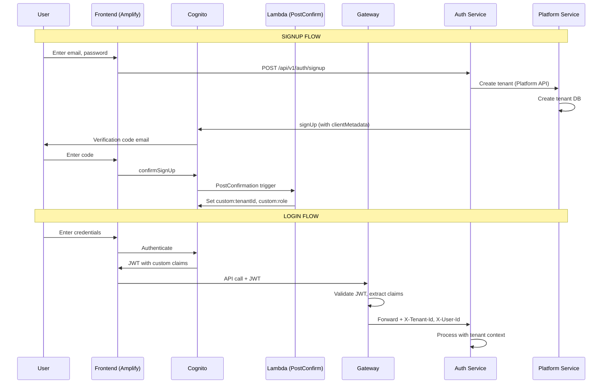

# High-Level Design: Multi-Tenant SaaS Template System

**Version:** 6.0  
**Last Updated:** 2025-12-14  
**Purpose:** Production-ready, reusable multi-tenant architecture template with RBAC authorization and complete database-per-tenant isolation


---

## 🎯 What Is This Project?

This is a **template system** for building multi-tenant SaaS applications. It provides all the supporting infrastructure and services you need - just plug in your business logic.

### Key Philosophy
- **Backend-Service is a Mimic** - Replace it with your real service (work-service, inventory-service, etc.)
- **Auth, Platform, Gateway are Reusable** - These supporting services work for any domain
- **Angular Frontend Included** - Pre-built UI with AWS Amplify for client-side auth, ready to customize
- **B2B & B2C Support** - Handle both individual users and organizations with tenant isolation
- **Complete Multi-Tenancy** - Database-per-tenant isolation, automated provisioning, AWS Cognito integration
- **Production-Ready** - Security, observability, IaC with Terraform included

---

## 🚀 Quick Start Guide

### Prerequisites
- Java 21+, Maven 3.9+
- Docker & Docker Compose
- Node.js 18+ (for frontend)
- AWS CLI configured with credentials
- Terraform 1.9+

### Step 1: Deploy AWS Infrastructure (Cognito)
```bash
cd terraform
terraform init
terraform apply -auto-approve
```
This creates: Cognito User Pool, Lambda triggers, SSM parameters.

### Step 2: Start Backend Services
```bash
# From project root
docker-compose up -d
```
Services available at:
- Gateway: http://localhost:8080
- Frontend: http://localhost:4200
- Eureka Dashboard: http://localhost:8761

### Step 3: Create System Admin
```bash
./scripts/bootstrap-system-admin.sh your-admin@email.com "YourPassword123!"
```

### Step 4: Test the Flow
1. Navigate to http://localhost:4200
2. **Personal Signup (B2C):** Create account → Verify email → Login
3. **Organization Signup (B2B):** Create org → Invite users → Login
4. Access dashboard with your tenant's isolated data

---

## 🔧 Adding Your Own Service

This template is designed to be extended. Here's how to add a new multi-tenant service:

### Step 1: Copy Backend-Service as Starting Point
```bash
cp -r backend-service/ my-new-service/
# Update pom.xml: artifactId, name
# Update application.yml: server.port (e.g., 8084)
```

### Step 2: Add common-infra Dependency
In your `pom.xml`:
```xml
<dependency>
    <groupId>com.learning</groupId>
    <artifactId>common-infra</artifactId>
    <version>${project.version}</version>
</dependency>
```

### Step 3: Configure Tenant Database Routing
Create a `DataSourceConfig.java`:
```java
@Configuration
public class DataSourceConfig {
    @Bean
    public TenantRegistryService tenantRegistryService(WebClient platformWebClient) {
        return new PlatformServiceTenantRegistry(platformWebClient, new TenantLocalCache());
    }
    
    @Bean
    public DataSource dataSource(TenantRegistryService tenantRegistry, DataSource defaultDataSource) {
        return new TenantDataSourceRouter(tenantRegistry, defaultDataSource);
    }
}
```

### Step 4: Add WebClient for Platform-Service
```java
@Bean
public WebClient platformWebClient(WebClient.Builder builder) {
    return builder.baseUrl("http://platform-service/platform").build();
}
```

### Step 5: Register with Eureka
In `application.yml`:
```yaml
spring.application.name: my-new-service
eureka.client.service-url.defaultZone: http://eureka-server:8761/eureka
```

### Step 6: Add to docker-compose.yml
```yaml
my-new-service:
  build: ./my-new-service
  ports: ["8084:8084"]
  depends_on:
    eureka-server: {condition: service_healthy}
    postgres: {condition: service_healthy}
```

### Step 7: Add Gateway Route
In `gateway-service/application.yml`:
```yaml
- id: my-new-service
  uri: lb://my-new-service
  predicates:
    - Path=/my-new/**
```

**Key Points:**
- All services use `TenantContext` for tenant isolation
- Internal APIs use `/internal/**` paths (no auth required)
- Gateway handles all JWT validation - your service trusts `X-Tenant-Id` header

---

## 🏗️ System Architecture


---

## 🎯 Design Principles

### 1. Gateway-as-Gatekeeper (Security Boundary)
```
┌─────────────────────────────────────────────────────────────────┐
│                    EXTERNAL (Untrusted)                         │
│  Browser → JWT Token → ALB → Gateway Service                    │
└─────────────────────────────────────────────────────────────────┘
                              │
                    ┌─────────▼─────────┐
                    │  Gateway Service  │  ← ONLY JWT validator
                    │  • Validates JWT   │
                    │  • Extracts claims │
                    │  • Sets X-* headers│
                    │  • Rate limiting   │
                    └─────────┬─────────┘
                              │
┌─────────────────────────────▼───────────────────────────────────┐
│                    INTERNAL (Trusted Network)                   │
│  Services trust X-Tenant-Id, X-User-Id headers from Gateway     │
│  No JWT validation in internal services                         │
└─────────────────────────────────────────────────────────────────┘
```

**Key Rules:**
- ✅ Gateway is the **ONLY** service that validates JWTs
- ✅ Internal services **NEVER** validate JWTs - they trust Gateway headers
- ✅ Gateway strips incoming `X-*` headers to prevent spoofing
- ✅ Fail-closed: requests without valid JWT are rejected

### 2. Database-per-Tenant Isolation
```
Platform DB (awsinfra)          Tenant DBs (dedicated)
┌──────────────────┐           ┌──────────────────┐
│  tenant table    │           │  tenant_acme_db  │
│  - id            │───────────│  • roles         │
│  - jdbc_url ─────┼───┐       │  • permissions   │
│  - status        │   │       │  • user_roles    │
└──────────────────┘   │       │  • entries       │
                       │       └──────────────────┘
                       │       ┌──────────────────┐
                       └──────►│  tenant_xyz_db   │
                               │  • roles         │
                               │  • permissions   │
                               │  • user_roles    │
                               │  • entries       │
                               └──────────────────┘
```

**Key Rules:**
- ✅ Each tenant gets a **dedicated PostgreSQL database**
- ✅ No `tenant_id` column in tenant tables (database IS the boundary)
- ✅ `TenantDataSourceRouter` switches datasource based on `X-Tenant-Id` header
- ✅ Flyway migrations run per-tenant database

### 3. AWS Infrastructure (Terraform-Managed)

| Component | Purpose | Terraform Resource |
|-----------|---------|-------------------|
| **Cognito User Pool** | User authentication, JWT tokens | `aws_cognito_user_pool` |
| **SSM Parameter Store** | Configuration (Cognito URLs, secrets) | `aws_ssm_parameter` |
| **Secrets Manager** | Tenant DB credentials | `aws_secretsmanager_secret` |
| **RDS PostgreSQL** | Platform + tenant databases | `aws_db_instance` |
| **Lambda** | PostConfirmation trigger for signup | `aws_lambda_function` |

**SSM Parameters (Set by Terraform):**
```
/cloud-infra/dev/cognito/issuer_uri     → https://cognito-idp.{region}.amazonaws.com/{poolId}
/cloud-infra/dev/cognito/jwks_uri       → {issuer}/.well-known/jwks.json
/cloud-infra/dev/cognito/user_pool_id   → us-east-1_xxxxxxxx
/cloud-infra/dev/cognito/client_id      → xxxxxxxxxxxxxxxxxxxxxxxxxx
```

**How Services Use SSM:**
- Gateway reads SSM on startup for JWT validation config
- Auth Service reads SSM for Cognito API calls
- No hardcoded URLs - everything from SSM

### 4. Authentication Flow



### 5. Authorization Flow


**Key Components:**
- `@RequirePermission` annotation on controllers
- `RemotePermissionEvaluator` calls Auth Service
- `LocalPermissionEvaluator` for Auth Service itself
- Caffeine cache (10 min TTL) for permission checks

---

## 📋 Service Responsibilities

### 🛡️ Gateway Service (Port 8080)
**Role:** Gatekeeper - Security boundary for ALL incoming requests

**Responsibilities:**
- ✅ **Authentication Validation** - Verify JWT tokens from Cognito (**Sole Validator**)
- ✅ **Tenant Context Extraction** - Extract tenant ID from token/headers
- ✅ **Header Enrichment** - Inject trusted headers (`X-Tenant-Id`, `X-User-Id`, `X-Authorities`, `X-Email`)
- ✅ **Load Balancing** - Route to healthy service instances via Eureka
- ✅ **Rate Limiting** - Redis-based tenant/IP rate limiting (10 req/s, burst 20)
- ✅ **Request Sanitization** - Strip incoming `X-*` headers to prevent spoofing

**Key Feature:** Fail-closed security - rejects requests without valid tenant context. Acts as the **only** OAuth2 Resource Server in the system.

---

### 🔐 Auth Service (Port 8081)
**Role:** Complete identity and permission management

**Responsibilities:**

#### Authentication
- ✅ **Multi-Provider Login Support:**
  - Email/Password via Cognito
  - SSO (Google, Microsoft, Azure AD)
  - SAML 2.0 (Ping, Okta, etc.)
  - OAuth2/OIDC flows
- ✅ **User Signup Orchestration:**
  - B2C (personal) and B2B (organization) flows
  - Calls Platform Service for tenant provisioning
  - Creates Cognito users with custom attributes
- ✅ **Session Management** - Token issuance, refresh, logout
- ✅ **MFA Support** - Via Cognito (SMS, TOTP)
- ✅ **Trusts Gateway:** Relies on `X-User-Id` and `X-Tenant-Id` headers. **No local JWT validation.**

#### Authorization (RBAC - Role-Based Access Control)
- ✅ **Permission-Based Access Control (PBAC)** - Fine-grained permissions system
  - Resource-action model (e.g., `entry:read`, `entry:create`, `tenant:delete`)
  - Super-admin wildcard permission (`*:*`)
- ✅ **Role Management** - Hierarchical role system
  - Platform roles: `super-admin`, `platform-admin`
  - Tenant roles: `tenant-admin`, `tenant-user`, `tenant-guest`
  - Roles scoped to tenant or platform level
- ✅ **Database Schema:**
  - `roles` - Role definitions with scope (PLATFORM/TENANT)
  - `permissions` - Granular permissions (resource + action)
  - `role_permissions` - Maps roles to permissions
  - `user_roles` - Assigns roles to users within tenant context
- ✅ **Permission APIs:**
  - `POST /api/v1/permissions/check` - Remote permission validation (used by other services)
  - `GET /api/v1/permissions/user/{userId}/tenant/{tenantId}` - Get all user permissions
  - `GET /api/v1/permissions` - List all defined permissions (resource + action)
- ✅ **Role Assignment APIs:**
  - `GET /api/v1/roles` - List all available roles (Platform & Tenant scopes)
  - `POST /api/v1/roles/assign` - Assign role to user
  - `POST /api/v1/roles/revoke` - Revoke role from user
  - `PUT /api/v1/roles/users/{userId}` - Update user's role
  - `GET /api/v1/roles/user/{userId}` - Get user's roles
- ✅ **User Statistics APIs:**
  - `GET /api/v1/stats/users` - Get aggregated user statistics for tenant
    - Returns: total users, pending invitations, role distribution
    - Aggregates from `invitations` and `user_roles` tables
- ✅ **Invitation Management APIs:**
  - `POST /api/v1/invitations` - Send invitation to new user
  - `GET /api/v1/invitations/{tenantId}` - List all invitations for tenant
  - `POST /api/v1/invitations/{token}/accept` - Accept invitation and join organization
  - `DELETE /api/v1/invitations/{id}` - Revoke pending invitation
  - `POST /api/v1/invitations/{id}/resend` - Resend invitation email
- ✅ **Email Verification APIs:**
  - `POST /api/v1/auth/resend-verification` - Resend verification email to user
  - `POST /api/v1/auth/confirm-signup` - Confirm signup with verification code
- ✅ **Invitation Schema:**
  - Table: `invitations` (id, tenant_id, email, token, role_id, status, expires_at, invited_by)
  - Statuses: PENDING, ACCEPTED, EXPIRED, REVOKED

**Technology:** AWS Cognito User Pools, Spring Security (OAuth2 Client only), JPA

**Email Verification Flow (B2C Personal Signup):**
1. User signs up → `signUp` API with `clientMetadata` (tenantId, role)
2. Cognito sends verification **code** via email
3. **Frontend** displays code input (VerifyEmailComponent)
4. User enters code → `confirmSignUp` API with `clientMetadata` (tenantId, role)
5. **Lambda PostConfirmation trigger** sets `custom:tenantId` and `custom:role`
6. User redirected to login with full tenant context in JWT

**Key Implementation Details:**
- `clientMetadata` must be passed during BOTH `signUp` AND `confirmSignUp`
- Gateway permits `/auth/signup/verify` without authentication
- Frontend stores `tenantId` in router state between signup and verify pages

**Lambda Functions:**
- `cognito-post-confirmation` - Sets custom attributes (`custom:tenantId`, `custom:role`) after email verification.
  - **Purpose:** Persists tenant context into the user profile so it's available in the JWT on every login without runtime latency.
  - **Note:** `tenantType` is NOT stored in Cognito - frontend looks it up from platform DB (single source of truth)
  - Runtime: Python 3.11
  - Trigger: Cognito PostConfirmation event
  - Permissions: AdminUpdateUserAttributes on User Pool

**Email Verification Troubleshooting:**

> [!WARNING]
> **Common Issue:** If verification codes aren't being sent, check that `auto_verified_attributes` is set to `["email"]` in Cognito User Pool.

| Issue | Cause | Fix |
|-------|-------|-----|
| No verification email received | `auto_verified_attributes` is null | `aws cognito-idp update-user-pool --user-pool-id <ID> --auto-verified-attributes email` |
| Emails not arriving (SES) | SES sandbox mode - only sends to verified emails | Verify recipient: `aws ses verify-email-identity --email-address <email>` |
| Gmail filtering emails | Using `no-reply@verificationemail.com` (Cognito default) | Switch to SES with your own verified domain |

**Check Cognito Configuration:**
```bash
aws cognito-idp describe-user-pool --user-pool-id <ID> \
  --query 'UserPool.{AutoVerified:AutoVerifiedAttributes,EmailConfig:EmailConfiguration}'
```

**Expected Output:**
```json
{
  "AutoVerified": ["email"],
  "EmailConfig": {"EmailSendingAccount": "COGNITO_DEFAULT"}
}
```

**Internal API for Tenant Provisioning:**
- During signup, auth-service calls `POST /internal/tenants` to provision the tenant
- This endpoint bypasses authentication (service-to-service call)
- Located in `TenantInternalController.java` in platform-service

---

### 🔐 Multi-Tenant Login Flow (Email-First with Smart Tenant Selection)

**Purpose:** Allow users who belong to multiple tenants to select which workspace to access during login.

**Architecture:**
```
┌─────────────────────────────────────────────────────────────────────────────┐
│                       Email-First Login Flow                                │
├─────────────────────────────────────────────────────────────────────────────┤
│                                                                             │
│  1. EMAIL STEP                                                              │
│     User enters email  ────────────►  GET /api/v1/auth/lookup              │
│                                       Returns: List of tenants for email   │
│                                                                             │
│  2. SELECTION STEP (if multiple tenants)                                    │
│     ┌───────────────────────┐  ┌───────────────────────┐                   │
│     │ 🏠 Personal Workspace │  │ 🏢 Acme Corporation   │                   │
│     │     Owner             │  │     Administrator      │                   │
│     │     [Default]         │  │     [SSO]              │                   │
│     └───────────────────────┘  └───────────────────────┘                   │
│                                                                             │
│  3. PASSWORD STEP                                                           │
│     User enters password ────►  Cognito Auth with clientMetadata:          │
│                                 { selectedTenantId: "tenant-xxx" }         │
│                                                                             │
│  4. TOKEN GENERATION                                                        │
│     PreTokenGeneration Lambda ─►  Override custom:tenantId in JWT          │
│                                   with selected tenant                      │
│                                                                             │
│  5. AUTHENTICATED                                                           │
│     JWT contains: { custom:tenantId: "tenant-xxx", ... }                   │
│     User enters selected workspace                                          │
│                                                                             │
└─────────────────────────────────────────────────────────────────────────────┘
```

**Cognito Lambda Triggers:**

| Lambda | Trigger | Purpose |
|--------|---------|---------|
| **PostConfirmation** | After email verification | Sets initial `custom:tenantId`, `custom:role` during signup |
| **PreTokenGeneration** | Before JWT issued | Overrides `custom:tenantId` based on selected tenant at login |

**Database Schema (Platform Service):**
```sql
-- Maps users to their tenant memberships
CREATE TABLE user_tenant_memberships (
    id UUID PRIMARY KEY,
    user_email VARCHAR(255) NOT NULL,           -- User identifier
    cognito_user_id VARCHAR(255),               -- Set after first login
    tenant_id VARCHAR(64) NOT NULL,             -- FK to tenant
    role_hint VARCHAR(50) DEFAULT 'member',     -- Display hint (owner/admin/member/guest)
    is_owner BOOLEAN DEFAULT false,             -- True if user created tenant
    is_default BOOLEAN DEFAULT false,           -- User's default workspace
    last_accessed_at TIMESTAMPTZ,               -- For sorting by recent
    joined_at TIMESTAMPTZ DEFAULT NOW(),
    status VARCHAR(32) DEFAULT 'ACTIVE',        -- ACTIVE, REMOVED, SUSPENDED
    UNIQUE(user_email, tenant_id)
);
```

**API Endpoints:**

| Endpoint | Method | Auth | Purpose |
|----------|--------|------|---------|
| `/api/v1/auth/lookup` | GET | Public | Lookup tenants by email |
| `/api/v1/auth/last-accessed` | PATCH | Public | Update last accessed timestamp |
| `/internal/memberships/by-email` | GET | Internal | Backend lookup for memberships |
| `/internal/memberships` | POST | Internal | Create membership record |

**Frontend State Machine:**
```
                    ┌──────────┐
                    │  email   │ ◄─── Start
                    └────┬─────┘
                         │
              ┌──────────┴──────────┐
              ▼                     ▼
        0 tenants               1 tenant
      [Show Error]            [Auto-select]
                                    │
              ▼                     ▼
        ┌────────────────┐   ┌──────────┐
        │ select-tenant  │◄──│ password │
        └───────┬────────┘   └──────────┘
                │                   ▲
                └───────────────────┘
```

**Security Considerations:**
- Lookup endpoint returns empty for unknown emails (prevents enumeration)
- SSO tenants display message but don't process (Phase 4 feature)
- PreTokenGeneration Lambda only overrides if clientMetadata is provided
- Last accessed timestamp is non-critical (failure doesn't block login)

**Files Created:**
- `terraform/lambdas/cognito-pre-token-generation/` - Lambda source + Terraform module
- `platform-service/.../membership/` - Entity, repository, service, controller
- `auth-service/.../TenantLookupController.java` - Public lookup API
- `frontend/src/app/core/models/` - TypeScript interfaces and enums
- `frontend/src/app/features/auth/login.component.*` - Multi-step UI

---

### B2B vs B2C Feature Differentiation

**Tenant Type Storage:**
- `tenant_type` is stored in **platform DB** (`awsinfra.tenant` table)
- Values: `PERSONAL` (B2C) or `ORGANIZATION` (B2B)

**JWT Contents (What's in the token):**
| Claim | Example | Source | Note |
|-------|---------|--------|------|
| `custom:tenantId` | `user-john-12345` | PostConfirmation / PreTokenGeneration Lambda | **Required** - Used for routing |
| `custom:role` | `owner` | PostConfirmation Lambda | **Legacy** - Display hint only, NOT for authorization |
| `email` | `user@example.com` | Cognito standard | |

> [!IMPORTANT]
> **Authorization uses database, NOT JWT claims!** The `custom:role` in JWT is a legacy display hint. Real permissions are checked via `user_roles` table in tenant DB. Plan to remove `custom:role` from JWT (see ROADMAP).

> [!NOTE]
> **TenantType Architecture (v6.0):** `tenant_type` is NOT stored in Cognito or JWT. Frontend looks it up from platform DB after login:
> ```typescript
> // Frontend auth.service.ts
> const tenantType = await this.lookupTenantType(tenantId);  // GET /platform/api/v1/tenants/{id}
> ```
> This ensures platform DB is the single source of truth for tenant metadata.

**Feature Matrix:**
| Feature | PERSONAL (B2C) | ORGANIZATION (B2B) |
|---------|----------------|-------------------|
| Invite users | ❌ Hidden | ✅ Available |
| Team management | ❌ Hidden | ✅ Available |
| Role assignment | ❌ Hidden | ✅ Available |
| Max users | 1 (fixed) | 5-1000 (by tier) |
| Trial period | None | 30 days |
| Billing | Free tier | Subscription |

**Frontend Implementation:**
```typescript
// Check tenant type before showing features
if (tenant.tenantType === 'ORGANIZATION') {
  showTeamManagement();
  showInviteButton();
} else {
  // PERSONAL - hide multi-user features
}
```

**Backend Enforcement:**
```java
// InvitationController.java
if (tenant.getTenantType() == TenantType.PERSONAL) {
    throw new ForbiddenException("Invitations not available for personal accounts");
}
```

---

**Email Configuration Options:**

| Option | Best For | From Address | Daily Limit | Cost |
|--------|----------|--------------|-------------|------|
| **COGNITO_DEFAULT** (current) | Development/Testing | `no-reply@verificationemail.com` | ~50 | FREE |
| **SES with verified identity** | Production | Your custom address | 62,000/month free | FREE then $0.10/1000 |

> [!TIP]
> For production, switch to SES with your own verified domain for better deliverability and branding. See `terraform/main.tf` for the commented SES configuration.

**Authorization Architecture:**
- `PermissionService` - Core permission evaluation logic
- `UserRoleService` - Role assignment/revocation
- `UserStatsService` - User statistics aggregation for admin dashboard
- `AuthServicePermissionEvaluator` - Local evaluator (direct database access)


---

### ⚙️ Platform Service (Port 8083)
**Role:** Control plane for entire tenant lifecycle

**Responsibilities:**

#### Tenant Provisioning
- ✅ **Database Provisioning:**
  - **Database-per-tenant** - Creates dedicated PostgreSQL database for each tenant
- ✅ **Database User Management** - Creates DB credentials, stores in AWS Secrets Manager
- ✅ **Schema Initialization** - Runs Flyway migrations for each tenant
- ✅ **Tenant Registry** - Maintains master metadata (JDBC URLs, status, tier)

#### Tenant Management
- ✅ **Lifecycle Operations:**
  - Activate, Suspend, Delete tenants
  - **Tenant Deletion:** (`DELETE /api/tenants/{id}`)
    - Hard delete of tenant entry (logically marked `DELETED`)
    - Requires `tenant:delete` permission
    - **Note:** Actual database drop is currently manual/safety-gated
  - Upgrade/downgrade tiers (STANDARD, PREMIUM, ENTERPRISE)
- ✅ **Metadata Storage** - Master database tracks all tenant configurations
- ✅ **Service Coordination** - Notifies backend services of new tenants
- ✅ **Trusts Gateway:** Relies on `X-User-Id` and `X-Tenant-Id` headers. **No local JWT validation.**

#### System Administration
- ✅ **Super Admin Bootstrapping:**
  - Created via `scripts/bootstrap-system-admin.sh`
  - Attributes: `custom:role=super-admin`, `custom:tenantId=system`
  - Access: Full control over all tenants (`*:*` permission)
- ✅ **Organization Management Profile:**
  - `GET /api/v1/organizations` - Get organization profile for current tenant

  - `PUT /api/v1/organizations` - Update organization profile (company name, industry, size, website, logo)
- ✅ **Tenant Entity Fields:**
  - Core: `id`, `name`, `status`, `tenantType`, `slaTier`
  - Organization Profile: `companyName`, `industry`, `companySize`, `website`, `logoUrl`
  - Limits: `maxUsers`, `subscriptionStatus`, `trialEndsAt`

#### Admin Operations
- ✅ **Internal APIs** - Tenant migration triggers, health checks
- 🔜 **Billing Integration** - Usage tracking, plan limits enforcement
- 🔜 **Compliance** - Data residency, retention policies

**Databases:**
- **Master DB:** Tenant registry, system configuration
- **Tenant DBs:** Created dynamically per tenant

---

### 📦 Backend Service (Port 8082)
**Role:** Domain-specific business logic - **THIS IS THE REPLACEABLE PART**

**Current Implementation:**
- ✅ Example "Entry" CRUD operations
- ✅ Demonstrates multi-tenant data isolation patterns
- ✅ Shows how to use tenant context from headers
- ✅ **Authorization Integration:**
  - `RemotePermissionEvaluator` - Calls auth-service to validate permissions
  - `@RequirePermission` annotations on endpoints (e.g., `entry:read`, `entry:create`)
  - `TenantContextFilter` - Extracts `X-Tenant-Id` from headers
  - `CacheConfiguration` - Caches permission check results (10 min TTL)
- ✅ **Trusts Gateway:** Relies on `X-User-Id` and `X-Tenant-Id` headers. **No local JWT validation.**

**How to Replace:**
1. Keep the multi-tenant data access patterns
2. Keep the authorization infrastructure (`RemotePermissionEvaluator`, `TenantContextFilter`)
3. Replace `Entry` entity with your domain (Order, Product, Task, etc.)
4. Add `@RequirePermission` to your endpoints
5. Register with Eureka using same pattern

**Examples of What You Might Build:**
- `work-service` - Task/project management
- `inventory-service` - Stock/warehouse management
- `crm-service` - Customer relationship management
- `analytics-service` - Reporting and dashboards

**Key Pattern:** Always read tenant from `X-Tenant-Id` header injected by Gateway

---

## 🔧 How to Build Your Service (Replacing Backend-Service)

This section provides a detailed guide for replacing the example `backend-service` with your own domain service.

### Step 1: Copy the Structure
```bash
cp -r backend-service your-service-name
cd your-service-name
```

### Step 2: Update Build Configuration
Update `pom.xml`:
```xml
<artifactId>your-service-name</artifactId>
<name>Your Service Name</name>
```

Update `application.yml`:
```yaml
spring:
  application:
    name: your-service-name
server:
  port: 8082  # Or choose a different port
```

### Step 3: Keep These Files (Critical for Multi-Tenancy)
| File | Purpose |
|------|---------|
| `TenantAwareDatabaseConfig.java` | Routes queries to correct tenant database |
| `TenantContextFilter.java` | Extracts `X-Tenant-Id` from request headers |
| `RemotePermissionEvaluator.java` | Validates permissions against auth-service |
| `CacheConfiguration.java` | Caches permission checks (performance) |

### Step 4: Replace Domain Entities
Delete the example `Entry` entity and create your own:
```java
@Entity
@Table(name = "orders")  // Your domain table
public class Order {
    @Id
    @GeneratedValue(strategy = GenerationType.UUID)
    private UUID id;
    
    private String customerId;
    private BigDecimal totalAmount;
    // Your domain fields...
}
```

### Step 5: Add Permissions to Your Endpoints
```java
@RestController
@RequestMapping("/api/v1/orders")
public class OrderController {

    @GetMapping
    @RequirePermission(resource = "order", action = "read")
    public List<Order> getOrders() { ... }
    
    @PostMapping
    @RequirePermission(resource = "order", action = "create")
    public Order createOrder(@RequestBody OrderDto dto) { ... }
}
```

### Step 6: Add Your Permissions to Auth-Service
Add SQL migration in `auth-service/src/main/resources/db/migration/tenant/`:
```sql
-- V100__add_order_permissions.sql
INSERT INTO permissions (id, resource, action, description) VALUES
    (gen_random_uuid(), 'order', 'read', 'View orders'),
    (gen_random_uuid(), 'order', 'create', 'Create orders'),
    (gen_random_uuid(), 'order', 'update', 'Update orders'),
    (gen_random_uuid(), 'order', 'delete', 'Delete orders');

-- Assign to tenant-admin role
INSERT INTO role_permissions (role_id, permission_id)
SELECT 'tenant-admin', id FROM permissions WHERE resource = 'order';
```

### Step 7: Update Gateway Routes
Add your service to `gateway-service/src/main/resources/application.yml`:
```yaml
spring:
  cloud:
    gateway:
      routes:
        - id: your-service
          uri: lb://YOUR-SERVICE-NAME
          predicates:
            - Path=/api/v1/orders/**
```

### Step 8: Update Docker Compose
Add your service to `docker-compose.yml`:
```yaml
your-service:
  build: ./your-service-name
  ports:
    - "8084:8084"
  environment:
    - EUREKA_CLIENT_SERVICEURL_DEFAULTZONE=http://eureka-server:8761/eureka
  depends_on:
    eureka-server:
      condition: service_healthy

---

### 🔍 Eureka Server (Port 8761)
**Role:** Service discovery and health monitoring

**Responsibilities:**
- ✅ Service registration - All services register on startup
- ✅ Health checks - Monitors service availability
- ✅ Load balancing - Gateway uses Eureka to find healthy instances
- ✅ Failover - Automatically routes around unhealthy services

---

## 🔒 Security Boundaries (Architecture Principle)

> [!IMPORTANT]
> **Gateway-Only Authentication** - This is a core architectural principle.

### Network Trust Model
```
┌─────────────────────────────────────────────────────────────┐
│                    PUBLIC INTERNET                          │
└─────────────────────────┬───────────────────────────────────┘
                          │ HTTPS (TLS)
                          ▼
┌─────────────────────────────────────────────────────────────┐
│                   GATEWAY SERVICE                           │
│   • JWT Validation (SOLE validator)                         │
│   • Header Sanitization (strips X-*)                        │
│   • Header Enrichment (injects X-Tenant-Id, X-User-Id)     │
└─────────────────────────┬───────────────────────────────────┘
                          │ HTTP (Internal Network)
                          ▼
┌─────────────────────────────────────────────────────────────┐
│              PRIVATE NETWORK (VPC / Docker Network)         │
│   ┌──────────┐  ┌──────────┐  ┌──────────┐                 │
│   │ Auth     │  │ Platform │  │ Backend  │                 │
│   │ Service  │  │ Service  │  │ Service  │                 │
│   └──────────┘  └──────────┘  └──────────┘                 │
│   • Trust Gateway headers                                   │
│   • ZERO auth logic                                         │
│   • TenantContextFilter reads X-Tenant-Id                  │
└─────────────────────────────────────────────────────────────┘
```

### Implementation Rules
1. **Gateway:** ONLY service with `spring-boot-starter-oauth2-resource-server`
2. **Backend Services:** NO `@EnableWebSecurity`, NO `SecurityConfig.java`
3. **TenantContextFilter:** Blocks requests without `X-Tenant-Id` (in production)
4. **Authorization:** Via `RemotePermissionEvaluator` calling Auth Service

---

## 🔐 Security & Authentication Flow

### User Signup Flow


### User Login & Request Flow


### Authorization Flow (Permission Check)


**Key Components:**
- **TenantContextFilter** (`common-infra`) - Extracts tenant ID from headers into ThreadLocal
- **AuthorizationAspect** (`common-infra`) - AOP interceptor for `@RequirePermission` annotations
- **RemotePermissionEvaluator** (`backend/platform`) - Calls auth-service to check permissions
- **PermissionService** (`auth-service`) - Core evaluation logic with database queries
- **Caffeine Cache** - 10-minute TTL cache to reduce auth-service calls

**Authorization Decision Logic:**
1. Check if user has `super-admin` role → Grant all permissions (`*:*`)
2. Query `user_roles` table for user's active roles in the tenant
3. For each role, check `role_permissions` and `permissions` tables
4. Return `true` if any role grants the requested `resource:action` permission

**Permission Single Source of Truth:**
```
┌─────────────────────────────────────────────────────────────┐
│                     auth-service                            │
│  ┌──────────────────────────────────────────────────────┐  │
│  │             PermissionService.hasPermission()        │  │
│  │                 (queries user_roles table)           │  │
│  └──────────────────────────────────────────────────────┘  │
│              ▲                              ▲               │
│     (direct call)                    (via HTTP)             │
│              │                              │               │
│  AuthServicePermissionEvaluator    PermissionController     │
│       (used by auth-service)          /api/v1/permissions   │
│                                             ▲               │
└─────────────────────────────────────────────│───────────────┘
                                              │
                        RemotePermissionEvaluator (HTTP POST)
                        (used by backend/platform services)
```

> [!IMPORTANT]
> All permission checks route through auth-service's `PermissionService` which queries the tenant database. This ensures:
> - **Single source of truth** - Permissions live in DB, not hardcoded
> - **Real-time updates** - Role changes take effect immediately (after cache expires)
> - **Consistent behavior** - All services use same permission logic

---

## 🔐 Roles and Permissions Model

This section provides a comprehensive overview of the Role-Based Access Control (RBAC) system implemented in the platform.

### Role Hierarchy


### Role Definitions

| Role | Scope | Description | Typical Use Case |
|------|-------|-------------|------------------|
| **super-admin** | Platform | Full system access. Manages all tenants. | System operators, DevOps |
| **tenant-admin** | Tenant | Full access within their organization. Can manage users and roles. | Organization owners, IT admins |
| **tenant-user** | Tenant | Standard user within an organization. Full CRUD on business data. | Regular employees |
| **tenant-guest** | Tenant | Read-only access to organization data. | External contractors, auditors |

### Permission Model

Permissions follow a **Resource:Action** pattern:

```
<resource>:<action>

Examples:
- entry:read      → Read data entries
- entry:create    → Create new entries
- user:invite     → Invite users to organization
- tenant:delete   → Delete a tenant (super-admin only)
- *:*             → Wildcard (all permissions)
```

### Default Role Permissions

#### super-admin
```
*:*                    → All permissions (wildcard)
```

#### tenant-admin
| Resource | Actions |
|----------|---------|
| entry | read, create, update, delete |
| user | read, invite, update, delete |
| role | read, assign, revoke |
| organization | read, manage |
| stats | read |

#### tenant-user
| Resource | Actions |
|----------|---------|
| entry | read, create, update, delete |

#### tenant-guest
| Resource | Actions |
|----------|---------|
| entry | read |

### Database Schema


### Frontend Route Guards

| Guard | Purpose | Redirects To |
|-------|---------|--------------|
| `authGuard` | Requires authentication | `/auth/login` |
| `guestGuard` | Only for unauthenticated users | `/app` |
| `adminGuard` | Requires `tenant-admin` OR `super-admin` | `/app/dashboard` |
| `superAdminGuard` | Requires `super-admin` only | `/app/dashboard` |
| `tenantUserGuard` | Blocks `super-admin` from tenant routes | `/app/admin/dashboard` |

### Super-Admin Specifics

**Super-admin is a special platform-level role with these characteristics:**

1. **No Tenant Context** - Uses `tenantId: "system"` instead of real tenant
2. **Wildcard Permission** - Has `*:*` which matches all permission checks
3. **Platform Management** - Can view/manage all tenants
4. **Separate UI** - Lands on Platform Dashboard, not data entries
5. **Cannot Be Deleted** - Account deletion is hidden for super-admins

**How Super-Admin Bypass Works:**
```java
// In PermissionController.checkPermission()
if ("super-admin".equals(role)) {
    return ResponseEntity.ok(true);  // Grant all permissions
}
```

### Adding New Permissions

1. **Add permission to seed data:**
```sql
INSERT INTO permissions (id, resource, action, description)
VALUES (gen_random_uuid(), 'invoice', 'create', 'Create invoices');
```

2. **Assign to roles:**
```sql
INSERT INTO role_permissions (role_id, permission_id)
SELECT r.id, p.id 
FROM roles r, permissions p
WHERE r.name = 'tenant-admin' 
AND p.resource = 'invoice' AND p.action = 'create';
```

3. **Use in code:**
```java
@RequirePermission(resource = "invoice", action = "create")
public ResponseEntity<Invoice> createInvoice(...) { ... }
```

### API Endpoints

| Endpoint | Method | Description |
|----------|--------|-------------|
| `/api/v1/roles` | GET | List all roles (Platform + Tenant) |
| `/api/v1/roles/assign` | POST | Assign role to user |
| `/api/v1/roles/revoke` | POST | Revoke role from user |
| `/api/v1/roles/user/{userId}` | GET | Get user's roles |
| `/api/v1/permissions/check` | POST | Check if user has permission (internal) |
| `/api/v1/permissions` | GET | List all defined permissions |


---

## 🏢 Multi-Tenancy Model


### Isolation Strategy: Database-per-Tenant (Primary)

**Why Database-per-Tenant?**
- ✅ **Maximum Security** - Complete data isolation
- ✅ **Performance** - No query filtering overhead
- ✅ **Scalability** - Move tenants to different RDS instances
- ✅ **Compliance** - Easier data residency/GDPR compliance
- ✅ **Backup/Restore** - Per-tenant operations

**How It Works:**
1. Platform Service creates database: `tenant_<company_slug>`
2. Unique DB credentials stored in AWS Secrets Manager
3. Flyway runs migrations to initialize schema
4. Backend services connect to correct database using `X-Tenant-Id`

### Tenant Tiers & Limits

| Tier | Max Users | Features | Storage | Price |
|------|-----------|----------|---------|-------|
| **STANDARD** | 50 | Basic features | 10 GB | $ |
| **PREMIUM** | 200 | Advanced features + API access | 50 GB | $$ |
| **ENTERPRISE** | 10,000 | Custom + dedicated support | Unlimited | $$$ |

---

## 🗄️ Data Architecture

### Database Allocation by Service

> **CRITICAL:** All tenant-specific data MUST reside in tenant databases. Only the tenant registry exists in the shared platform database.

| Service | Platform DB (`awsinfra`) | Tenant DB (`t_<tenant_id>`) |
|---------|--------------------------|------------------------------|
| **Platform Service** | ✅ `tenant` table<br/>✅ `tenant_credentials`<br/>✅ System config | ❌ None |
| **Auth Service** | ❌ None | ✅ `roles`<br/>✅ `permissions`<br/>✅ `role_permissions`<br/>✅ `user_roles`<br/>✅ `invitations` |
| **Backend Service** | ❌ None | ✅ `entries` (your domain tables) |
| **Gateway Service** | ❌ None (stateless) | ❌ None (stateless) |

**Key Principle:** Database itself is the tenant isolation boundary. No `tenant_id` columns needed in tenant databases.

---

### Platform Database (Shared - `awsinfra`)

**Purpose:** Tenant registry and platform-level configuration ONLY  
**Owner:** Platform Service  
**Location:** Shared RDS instance

| Table | Purpose | Key Columns |
|-------|---------|-------------|
| `tenant` | Master tenant registry | id, name, status, tier, tenant_type, jdbc_url, owner_email |

**Key Fields:**
- `id` - Tenant identifier (e.g., `t_acme`, `t_john_doe_xyz`)
- `jdbc_url` - Connection string to tenant-specific database
- `db_user_secret_ref` - AWS Secrets Manager ARN for DB credentials
- `tier` - STANDARD, PREMIUM, ENTERPRISE
- `tenant_type` - PERSONAL or ORGANIZATION

> **Migration file:** `platform-service/src/main/resources/db/migration/V1__initial_schema.sql`

**That's it!** Platform database only contains the tenant registry.

---

### Tenant Databases (Isolated - `t_<tenant_id>`)

**Purpose:** ALL tenant-specific application data  
**Owners:** Auth Service, Backend Service (your domain)  
**Location:** Dedicated PostgreSQL database per tenant (`tenant_<company_slug>`)

Each tenant gets a dedicated database with the following tables:

#### Auth Service Tables

| Table | Purpose | Key Columns |
|-------|---------|-------------|
| `roles` | Role definitions | id, name, scope (PLATFORM/TENANT) |
| `permissions` | Resource:action pairs | resource, action |
| `role_permissions` | Role-permission mappings | role_id, permission_id |
| `user_roles` | User role assignments | user_id, role_id, assigned_by |
| `invitations` | User invitations | email, token, status, expires_at |

> **Migration file:** `auth-service/src/main/resources/db/migration/tenant/V1__authorization_schema.sql`

#### Backend Service Tables (Example - Replace with Your Domain)

| Table | Purpose | Key Columns |
|-------|---------|-------------|
| `entries` | Example domain entity | title, content, created_by |

> **Migration file:** `backend-service/src/main/resources/db/migration/tenant/V1__initial_schema.sql`

**Key Design Principle:** No `tenant_id` column needed - database-per-tenant provides isolation.

---

### Database Routing Architecture


**How It Works:**

1. **Request arrives** with JWT token containing `custom:tenantId`
2. **Gateway** extracts `tenantId` from token → Injects `X-Tenant-Id` header
3. **Service receives request** with `X-Tenant-Id: t_acme`
4. **TenantDataSourceRouter** checks tenant ID from `TenantContext` (ThreadLocal)
5. **TenantRegistry** fetches tenant DB config from Platform Service (cached)
6. **DataSource** dynamically routes to correct tenant database
7. **Query executes** in isolated tenant database

**Key Components:**
- `TenantDataSourceRouter` - Extends `AbstractRoutingDataSource`, routes based on `TenantContext`
- `TenantRegistry` - Fetches tenant JDBC URL + credentials from Platform Service
- `LocalCache` - Caches tenant DB configs (Caffeine, 30min TTL)
- `TenantMigrationService` - Runs Flyway migrations on tenant databases

### Migration Orchestration (Each Service Owns Its Schema)

```
┌────────────────────────────────────────────────────────────────────┐
│                    Tenant Provisioning Flow                        │
├────────────────────────────────────────────────────────────────────┤
│                                                                    │
│  Platform-Service (TenantProvisioningServiceImpl)                  │
│        │                                                           │
│        ├─► 1. Create tenant record in awsinfra.tenant table       │
│        │                                                           │
│        ├─► 2. StorageProvisionAction: CREATE DATABASE tenant_xxx  │
│        │                                                           │
│        └─► 3. MigrationInvokeAction: Orchestrate migrations       │
│                    │                                               │
│                    ├─► POST auth-service/internal/migrate          │
│                    │   └─► Auth runs its own Flyway (roles, etc.) │
│                    │                                               │
│                    └─► POST backend-service/internal/migrate       │
│                        └─► Backend runs its Flyway (entries)       │
│                                                                    │
└────────────────────────────────────────────────────────────────────┘
```

**Key Principle: Service Owns Its Schema**
- Each service has its own Flyway scripts in `src/main/resources/db/migration/tenant/`
- Platform-Service **only orchestrates** - it does NOT run other services' migrations
- This allows services to be independently versioned and deployed

**Migration Locations:**
| Service | Location | Tables |
|---------|----------|--------|
| auth-service | `migration/tenant/V1__authorization_schema.sql` | roles, permissions, user_roles |
| backend-service | `migration/tenant/V1__initial_schema.sql` | entries |

---

### Seed Data (Per Tenant)

Each tenant database is initialized with:

```sql
-- Tenant-scoped roles
INSERT INTO roles (id, name, description, scope) VALUES
('tenant-admin', 'TENANT_ADMIN', 'Full control over tenant resources', 'TENANT'),
('tenant-user', 'TENANT_USER', 'Standard user with CRUD access', 'TENANT'),
('tenant-guest', 'TENANT_GUEST', 'Read-only access', 'TENANT');

-- Standard permissions
INSERT INTO permissions (id, resource, action, description) VALUES
('entry-read', 'entry', 'read', 'View entries'),
('entry-create', 'entry', 'create', 'Create entries'),
('entry-update', 'entry', 'update', 'Update entries'),
('entry-delete', 'entry', 'delete', 'Delete entries'),
('user-invite', 'user', 'invite', 'Invite new users'),
('user-manage', 'user', 'manage', 'Full user management');

-- Role-permission mappings
-- tenant-admin gets everything
INSERT INTO role_permissions (role_id, permission_id) VALUES
('tenant-admin', 'entry-read'),
('tenant-admin', 'entry-create'),
('tenant-admin', 'entry-update'),
('tenant-admin', 'entry-delete'),
('tenant-admin', 'user-invite'),
('tenant-admin', 'user-manage');

-- tenant-user gets CRUD on entries
INSERT INTO role_permissions (role_id, permission_id) VALUES
('tenant-user', 'entry-read'),
('tenant-user', 'entry-create'),
('tenant-user', 'entry-update'),
('tenant-user', 'entry-delete');

-- tenant-guest gets read-only
INSERT INTO role_permissions (role_id, permission_id) VALUES
('tenant-guest', 'entry-read');
```


---

## 🔧 Technology Stack

### Backend Services
- **Language:** Java 21
- **Framework:** Spring Boot 3.x
- **Security:** Spring Security OAuth2, AWS Cognito SDK
- **Service Discovery:** Spring Cloud Netflix Eureka
- **Database:** PostgreSQL 15+ (RDS)
- **Migrations:** Flyway
- **Build:** Maven


### Frontend (Template Included)
- **Framework:** Angular 20+ (latest)
- **Auth Integration:** AWS Amplify Auth SDK (v6)
  - Client-side login/signup with Cognito
  - **Public Client (SPA):** Uses `generate_secret = false` for secure browser auth
  - Direct username/password authentication
  - Extract custom attributes from ID token (`custom:tenantId`, `custom:role`, `custom:tenantType`)
  - Session management with Angular Signals
- **API Client:** Angular HttpClient with functional interceptors
  - Auto-inject JWT tokens in Authorization header
  - Async token retrieval via `fetchAuthSession()`
  - Tenant context from Cognito custom attributes
- **UI Components:** PrimeNG (v20)
  - **Theme:** Aura (Premium Modern Theme)
  - **Design System:** CSS Variables, Glassmorphism, Inter Font
  - **Layout:** PrimeFlex Grid System
  - Card, Table, Dialog, Button, Input components
  - Responsive design with flex layout
  - Form validation with Reactive Forms
- **Routing:** 
  - AuthGuard for protected routes (`/app/*`)
  - GuestGuard for public routes (`/auth/*`)
  - Layout wrapper with navigation menu
- **State Management:** Angular Signals (built-in)
- **Build Tool:** Angular CLI with esbuild
- **Deployment:** 
  - Development: `npm start` (localhost:4200)
  - Production: Static build to `dist/` for AWS Amplify Hosting or S3+CloudFront

**Key Features:**
- ✅ **B2C Signup:** Personal account creation via `POST /auth/signup/personal`
- ✅ **B2B Signup:** Organization creation via `POST /auth/signup/organization`
- ✅ **Dashboard:** User info display with tenant ID and role badges
- ✅ **CRUD Interface:** PrimeNG Table for entries with pagination and lazy loading
- ✅ **Multi-Tenant UI:** Shows user's tenant context in header
- ✅ **Auto-Configuration:** Environment files updated automatically by Terraform deploy script

**Frontend Structure:**
```
frontend/
├── src/
│   ├── app/
│   │   ├── core/
│   │   │   ├── auth.service.ts          # AWS Amplify wrapper
│   │   │   ├── guards/
│   │   │   │   ├── auth.guard.ts        # Protected route guard
│   │   │   │   └── guest.guard.ts       # Public route guard
│   │   │   ├── interceptors/
│   │   │   │   └── auth.interceptor.ts  # JWT injector
│   │   │   └── services/
│   │   │       └── entry.service.ts     # API client
│   │   ├── features/
│   │   │   ├── auth/
│   │   │   │   ├── login.component.ts
│   │   │   │   ├── signup-personal.component.ts
│   │   │   │   └── signup-organization.component.ts
│   │   │   └── dashboard/
│   │   │       └── dashboard.component.ts  # Main app view
│   │   ├── layout/
│   │   │   └── app-layout.component.ts  # Navigation wrapper
│   │   └── app.routes.ts                # Route configuration
│   └── environments/
│       ├── environment.ts               # Production config (auto-updated)
│       └── environment.development.ts   # Dev config (auto-updated)
```


### AWS Services
- **Cognito:** User authentication, MFA, SSO integration
- **RDS PostgreSQL:** Master + Tenant databases
- **Secrets Manager:** Database credentials
- **SSM Parameter Store:** Configuration
- **Application Load Balancer:** HTTPS termination, routing
- **ECS/EKS:** Container orchestration (future)

### Infrastructure as Code
- **Terraform:** AWS resource provisioning
  - VPC, subnets, security groups
  - RDS instances, parameter groups
  - Cognito user pools, app clients
  - IAM roles, policies
  - ALB, target groups

### Observability
- **Logging:** JSON structured logs via Logback (logstash-logback-encoder)
- **Tracing:** Micrometer + Zipkin
- **Metrics:** Prometheus + Grafana
- **Monitoring:** AWS CloudWatch

---

## 🚀 Deployment Architecture

### Development Environment
```yaml
Services: Docker Compose
Database: Local PostgreSQL
Cognito: LocalStack (emulated)
Eureka: Single instance
```

### Production Environment
```yaml
Compute: AWS ECS Fargate or EKS
Load Balancer: AWS ALB with SSL/TLS
Database: RDS Multi-AZ with read replicas
Cognito: AWS Cognito
Cache: ElastiCache Redis (rate limiting, session)
Storage: S3 for static assets
CDN: CloudFront
```

---

## 🔄 How to Use This Template

### For a New Project

1. **Keep As-Is:**
   - Gateway Service
   - Auth Service  
   - Platform Service
   - Eureka Server
   - Terraform modules

2. **Replace:**
   - Backend Service → Your domain service (e.g., `work-service`)
   - Update entity models, repositories, controllers
   - Keep multi-tenant data access patterns

3. **Add New Services (Optional):**
   - `notification-service` - Email/SMS
   - `analytics-service` - Reports
   - `billing-service` - Payments
   - All should register with Eureka and respect `X-Tenant-Id`

4. **Configure:**
   - Update `application.yml` with your AWS credentials
   - Run Terraform to create infrastructure
   - Deploy services to ECS/EKS

---

## 🛠️ Deployment & Configuration Flow

### Automated Infrastructure Deployment

The project includes automated deployment scripts that handle infrastructure provisioning and application configuration in a single workflow.

#### Terraform Deployment Script

**Location:** `scripts/terraform/deploy.sh`

**What it does:**
1. **Deploys AWS Infrastructure** via Terraform:
   - Cognito User Pool with custom attributes (`tenantId`, `role`, `tenantType`)
   - User Pool Client with OAuth2 configuration
   - Lambda triggers for token customization
   - User groups (admin, tenant-admin, user)
   - SSM Parameter Store entries for all configuration

2. **Stores Configuration in SSM:**
   - `/cloud-infra/dev/cognito/user_pool_id`
   - `/cloud-infra/dev/cognito/client_id`
   - `/cloud-infra/dev/cognito/client_secret` (SecureString)
   - `/cloud-infra/dev/cognito/issuer_uri`
   - `/cloud-infra/dev/cognito/jwks_uri`
   - `/cloud-infra/dev/cognito/domain`
   - Additional metadata (branding, callbacks, etc.)

3. **Auto-Updates Frontend Environment Files:**
   - Fetches Cognito configuration from Terraform outputs
   - Writes `frontend/src/environments/environment.development.ts`
   - Writes `frontend/src/environments/environment.ts`
   - Frontend gets User Pool ID and Client ID automatically

4. **Creates Local Reference File:**
   - Generates `terraform/cognito-config.env` for manual reference
   - Contains all Cognito configuration values
   - **Note:** Do not commit this file (already in `.gitignore`)

**Usage:**
```bash
cd /path/to/AWS-Infra
./scripts/terraform/deploy.sh
```

**Prerequisites:**
- AWS CLI configured with appropriate credentials
- Terraform installed
- AWS profile set (default: `personal`)

#### Configuration Flow Diagram


### Frontend Configuration

The Angular frontend requires Cognito credentials to authenticate users. These are automatically configured by the Terraform deployment script.

#### Automatic Configuration (Recommended)

When you run `./scripts/terraform/deploy.sh`, the frontend environment files are automatically updated with:
- User Pool ID
- Client ID
- AWS Region

**Generated Files:**
- `frontend/src/environments/environment.development.ts` - Used for `npm start`
- `frontend/src/environments/environment.ts` - Used for `npm run build`

**Example Generated Configuration:**
```typescript
export const environment = {
  production: false,
  apiUrl: 'http://localhost:8080',
  cognito: {
    userPoolId: 'us-east-1_jjRFRnxGA',
    userPoolWebClientId: '4apvlvee4rsmnb06ntd49ljvp5',
    region: 'us-east-1'
  }
};
```

#### Manual Configuration (Alternative)

If needed, you can fetch configuration from SSM manually:

```bash
# Get User Pool ID
aws ssm get-parameter \
  --name "/cloud-infra/dev/cognito/user_pool_id" \
  --query 'Parameter.Value' \
  --output text

# Get Client ID
aws ssm get-parameter \
  --name "/cloud-infra/dev/cognito/client_id" \
  --query 'Parameter.Value' \
  --output text
```

Then manually update `frontend/src/environments/environment.development.ts`.

### Backend Services Configuration

Backend services (Auth, Platform, Backend) read configuration from SSM Parameter Store at runtime.

**Spring Boot Integration:**
```yaml
spring:
  cloud:
    aws:
      paramstore:
        enabled: true
        prefix: /cloud-infra
        profile-separator: /
        fail-fast: true
```

**How it works:**
1. Service starts up
2. Reads `/cloud-infra/dev/cognito/*` parameters from SSM
3. Populates Spring environment properties
4. Configures OAuth2 client and resource server

**Key Benefits:**
- ✅ No hardcoded credentials in code
- ✅ Centralized configuration management
- ✅ Easy to update without redeployment
- ✅ Secure storage (SecureString for secrets)
- ✅ IAM-based access control

### Complete Deployment Workflow

```bash
# 1. Deploy AWS Infrastructure (includes frontend config)
./scripts/terraform/deploy.sh

# 2. Start Backend Services
./scripts/start-all.sh

# 3. Start Frontend (in separate terminal)
cd frontend
npm start

# 4. Access Application
# Frontend: http://localhost:4200
# Gateway: http://localhost:8080
```

**First-Time Setup:**
```bash
# Install dependencies
cd frontend && npm install

# Build all services
cd .. && mvn clean install -DskipTests

# Deploy infrastructure
./scripts/terraform/deploy.sh

# Start services
./scripts/start-all.sh

# Start frontend
cd frontend && npm start
```

---

## 🛣️ Request Flow Example

**User wants to create an Entry in their tenant**

1. **User** sends: `POST /api/entries` with JWT token
2. **Gateway** validates JWT, extracts `tenantId=acme` from token
3. **Gateway** adds headers: `X-Tenant-Id: acme`, `X-User-Id: user123`
4. **Gateway** routes to Backend Service via Eureka
5. **Backend** reads `X-Tenant-Id: acme` header
6. **Backend** connects to `tenant_acme` database
7. **Backend** creates entry, sets `created_by=user123`
8. **Backend** returns success
9. **Gateway** forwards response to user

**Security:** No tenant can access another tenant's data - enforced at database level

---

## 📁 Project Structure

```
AWS-Infra/
├── auth-service/           # Identity & permission management
├── platform-service/       # Tenant lifecycle control plane
├── backend-service/        # REPLACE THIS - domain logic mimic
├── gateway-service/        # API gateway & security enforcement
├── eureka-server/          # Service discovery
├── common-dto/             # Shared DTOs across services
├── common-infra/           # Shared multi-tenant infrastructure (TenantDataSourceRouter, TenantContext, etc.)
├── terraform/              # Infrastructure as Code
│   ├── modules/
│   │   ├── vpc/
│   │   ├── rds/
│   │   ├── cognito/
│   │   └── ecs/
│   └── environments/
│       ├── dev/
│       └── prod/
├── docker-compose.yml      # Local dev environment
└── HLD.md                  # This document
```

---

## 🎓 Key Concepts

### Tenant Context Propagation
Every request carries tenant context through headers:
- `X-Tenant-Id` - Database to connect to
- `X-User-Id` - User making the request
- `X-Authorities` - User permissions/roles

### Fail-Closed Security
- Gateway rejects requests without valid JWT
- Gateway rejects requests without tenant context
- Services trust headers from Gateway (network isolation required)

### Dynamic Tenant Onboarding
- No code deployment needed to add new tenant
- Platform Service provisions on-demand
- Fully automated via signup API

---

## 📚 Additional Documentation

- **[Status Tracking](docs/STATUS.md)** - Current project status and roadmap

---

## ☁️ AWS Deployment Guide

### Deployment Architecture


### Infrastructure Setup (Terraform)

**Step 1: Configure remote state** (recommended for production)
```bash
cd terraform
# Edit backend.tf to use S3 backend
terraform init -migrate-state
```

**Step 2: Create infrastructure**
```bash
terraform apply -var="environment=prod"
```

This creates:
- Cognito User Pool with Lambda triggers
- SSM Parameters for service configuration
- (Optional) VPC, RDS, ECS clusters via modules

### ECS Fargate Deployment

**Service configuration:**
```yaml
# Example task definition
family: gateway-service
cpu: 256
memory: 512
containers:
  - name: gateway
    image: ${ECR_REPO}/gateway-service:latest
    portMappings:
      - containerPort: 8080
    environment:
      - name: SPRING_PROFILES_ACTIVE
        value: prod
```

**Recommended instance sizing:**
| Service | vCPU | Memory | Min Instances |
|---------|------|--------|---------------|
| Gateway | 0.25 | 512MB | 2 |
| Auth | 0.25 | 512MB | 2 |
| Platform | 0.25 | 512MB | 1 |
| Backend | 0.25 | 512MB | 2 |

### Cost Estimation (Monthly)

> [!NOTE]
> Estimates based on us-east-1 pricing. Actual costs may vary.

| Resource | Free Tier | After Free Tier |
|----------|-----------|-----------------|
| **Cognito** | 50,000 MAU | $0.0055/MAU after |
| **Fargate** | - | ~$50/month (4 services, min instances) |
| **RDS PostgreSQL** | 750 hrs/month (t3.micro) | ~$15-30/month (t3.small) |
| **ALB** | - | ~$16/month + data |
| **Secrets Manager** | $0.40/secret/month | $0.40/secret |
| **Lambda** | 1M requests/month | $0.20/1M after |

**Estimated total:** $80-150/month for small production setup

### Environment Variables (Production)

```bash
# Required for each service
SPRING_PROFILES_ACTIVE=prod
AWS_REGION=us-east-1

# Cognito (from SSM)
COGNITO_USER_POOL_ID=us-east-1_xxxxx
COGNITO_CLIENT_ID=xxxxx
COGNITO_CLIENT_SECRET=xxxxx

# Database (from Secrets Manager)
SPRING_DATASOURCE_URL=jdbc:postgresql://rds-endpoint:5432/dbname
SPRING_DATASOURCE_USERNAME=xxx
SPRING_DATASOURCE_PASSWORD=xxx
```

---

## 🏭 Production Readiness Features

This section outlines features for enterprise-grade deployments.

### Security & Compliance
| Feature | Description | Status |
|---------|-------------|--------|
| **Tenant Rate Limiting** | Per-tenant request limits based on SLA tier | 🔜 Planned |
| **Audit Logging** | GDPR/HIPAA/SOC2 compliant access logs | 🔜 Planned |
| **Data Export API** | GDPR Right to Data Portability | 🔜 Planned |
| **Soft Delete** | 30-day grace period before permanent deletion | ✅ Implemented |

### Performance Optimization
| Feature | Description | Status |
|---------|-------------|--------|
| **Per-Tenant Connection Pools** | Tier-based pool sizing (FREE: 2-5, ENTERPRISE: 10-20) | 🔜 Planned |
| **DataSource Caching** | Caffeine cache with 1-hour TTL, max 100 tenants | 🔜 Planned |
| **Circuit Breaker** | Resilience4j for platform-service calls | 🔜 Planned |

### Observability
| Feature | Description | Status |
|---------|-------------|--------|
| **Tenant Metrics** | Per-tenant latency, throughput, error rates | 🔜 Planned |
| **Usage Tracking** | API calls, storage, compute hours per tenant | 🔜 Planned |
| **Health Checks** | Active tenant count, DB connectivity checks | 🔜 Planned |

### Lifecycle Management
| Feature | Description | Status |
|---------|-------------|--------|
| **Tenant Archival** | Auto-archive inactive tenants to S3 after 90 days | 🔜 Planned |
| **Database Sharding** | Multi-shard support for 1000s of tenants | 🔜 Planned |

---

## 🛣️ Request Flow Example


**User wants to create an Entry in their tenant**

1. **User** sends: `POST /api/entries` with JWT token
2. **Gateway** validates JWT, extracts `tenantId=acme` from token
3. **Gateway** adds headers: `X-Tenant-Id: acme`, `X-User-Id: user123`
4. **Gateway** routes to Backend Service via Eureka
5. **Backend** reads `X-Tenant-Id: acme` header
6. **Backend** connects to `tenant_acme` database
7. **Backend** creates entry, sets `created_by=user123`
8. **Backend** returns success
9. **Gateway** forwards response to user

**Security:** No tenant can access another tenant's data - enforced at database level

---

## 📁 Project Structure

```
AWS-Infra/
├── auth-service/           # Identity & permission management
├── platform-service/       # Tenant lifecycle control plane
├── backend-service/        # REPLACE THIS - domain logic mimic
├── gateway-service/        # API gateway & security enforcement
├── eureka-server/          # Service discovery
├── common-dto/             # Shared DTOs across services
├── common-infra/           # Shared multi-tenant infrastructure (TenantDataSourceRouter, TenantContext, etc.)
├── terraform/              # Infrastructure as Code
│   ├── modules/
│   │   ├── vpc/
│   │   ├── rds/
│   │   ├── cognito/
│   │   └── ecs/
│   └── environments/
│       ├── dev/
│       └── prod/
├── docker-compose.yml      # Local dev environment
└── HLD.md                  # This document
```

---

## 🎓 Key Concepts

### Tenant Context Propagation
Every request carries tenant context through headers:
- `X-Tenant-Id` - Database to connect to
- `X-User-Id` - User making the request
- `X-Authorities` - User permissions/roles

### Fail-Closed Security
- Gateway rejects requests without valid JWT
- Gateway rejects requests without tenant context
- Services trust headers from Gateway (network isolation required)

### Dynamic Tenant Onboarding
- No code deployment needed to add new tenant
- Platform Service provisions on-demand
- Fully automated via signup API

---

## 📚 Additional Documentation

- **[Implementation Guide](docs/tenant-onboarding/IMPLEMENTATION_GUIDE.md)** - Step-by-step setup
- **[Roadmap](docs/ROADMAP.md)** - Future phases and feature plans
- **[Terraform Guide](terraform/README.md)** - Infrastructure setup
- **[Status](docs/STATUS.md)** - Sprint tracking and current progress

---

**Questions?** This template is designed to be self-explanatory. Start with Gateway → Auth → Platform → Your Service.

See **[ROADMAP.md](docs/ROADMAP.md)** for future phases and feature plans.


**Questions?** This template is designed to be self-explanatory. Start with Gateway → Auth → Platform → Your Service.
