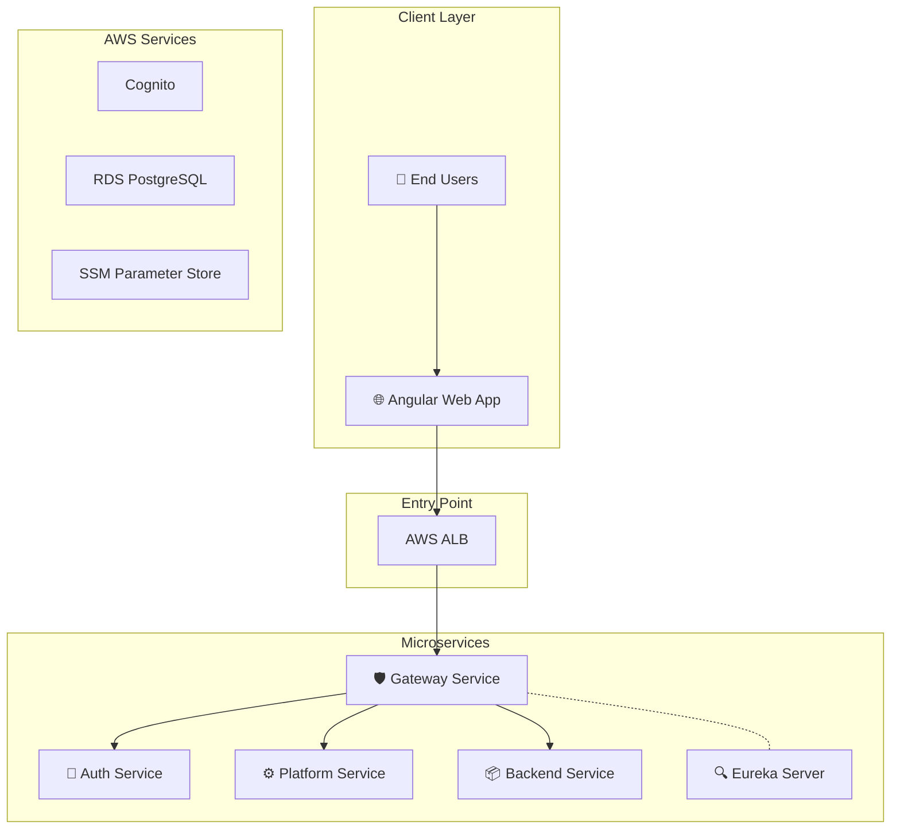
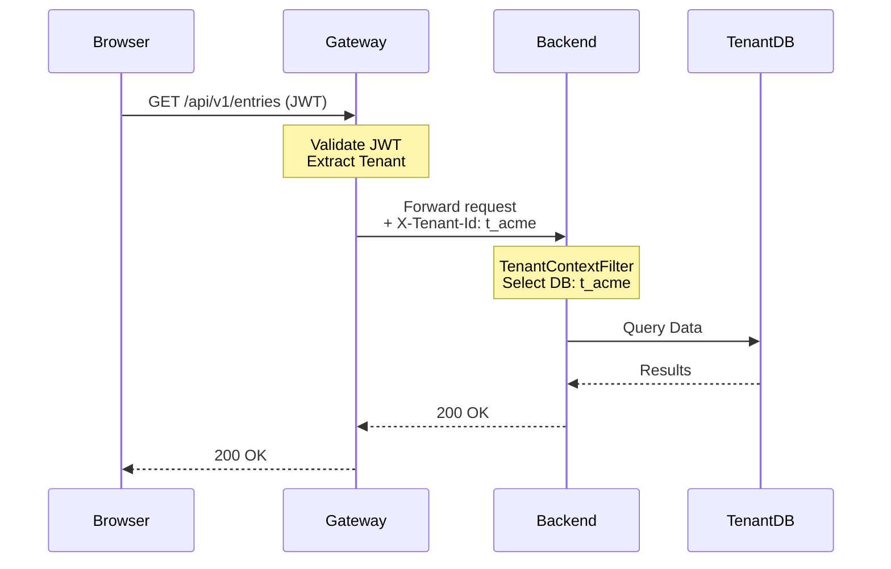

# System Architecture

**Version:** 9.0 (Phase 9.1.2 — Async Provisioning)
**Last Updated:** 2026-02-11

This document details the microservices architecture, component responsibilities, and request flows of the SaaS Foundation.

---

## 🏗️ High-Level Architecture



---

## 📋 Service Roles & Responsibilities

### 🛡️ Gateway Service (Port 8080)
**Role:** Gatekeeper - Security boundary for ALL incoming requests.

- **Authentication:** Validates JWT tokens from Cognito. **Sole Validator**.
- **Tenant Context:** Extracts `X-Tenant-Id` from JWT/Headers.
- **Header Enrichment:** Injects `X-User-Id`, `X-Authorities` downstream.
- **Rate Limiting:** Redis-based limiting per tenant/IP.
- **Routing:** Dispatches requests to services via Eureka.

### 🔐 Auth Service (Port 8081, gRPC 9091)
**Role:** Identity, Permissions, and Signup Orchestration.

- **User Management:** Wraps Cognito actions, manages user profiles.
- **RBAC & PBAC:** Stores Roles (`admin`, `viewer`) and Permissions (`entry:read`).
- **Signup Pipeline:** Orchestrates tenant creation, DB provisioning, and email verification.
- **OpenFGA Writer:** If enabled, writes ReBAC tuples.

### ⚙️ Platform Service (Port 8083)
**Role:** Control plane for Tenant Lifecycle.

- **Tenant Registry:** Master list of tenants and their JDBC URLs.
- **Provisioning:** Creates new tenant databases and runs Flyway migrations.
- **API Keys:** Manages programmatic access keys.

### 💳 Payment Service (Port 8088)
**Role:** Dedicated Billing and Subscription Management.

- **Providers:** Abstraction over Stripe/Razorpay.
- **Webhooks:** Processes provider events.
- **Status Authority:** Updates Redis `billing:status:{tenant}` for real-time enforcement.

### 📦 Backend Service (Port 8082)
**Role:** Domain-specific business logic (MIMIC/TEMPLATE).

- **Business Logic:** Your actual SaaS application code (Orders, Projects, etc.).
- **Authorization:** Enforces `@RequirePermission` checks.
- **Isolation:** Connects to specific tenant DB based on `X-Tenant-Id`.

### 🔍 Eureka Server (Port 8761)
**Role:** Service Discovery.
- Services register here on startup (`http://eureka-server:8761/eureka`).
- Gateway queries Eureka to find service instances.

---

## 🔗 Internal Service Communication (gRPC Mesh)

Internal service-to-service calls use **gRPC (HTTP/2 + Protobuf)** for hot-path operations, with automatic REST fallback for resilience.

### Architecture

| Channel | Transport | Use Case |
|---------|-----------|----------|
| **External → Gateway** | REST / HTTP 1.1 | All client-facing APIs |
| **Gateway → Services** | REST / HTTP 1.1 | Request routing & header enrichment |
| **Services → Auth** | **gRPC / HTTP 2** | Permission checks, role lookups (hot path) |
| **Fallback** | REST / HTTP 1.1 | Automatic fallback if gRPC unavailable |

### gRPC Service Ports

| Service | REST Port | gRPC Port |
|---------|-----------|-----------|
| Auth Service | 8081 | **9091** |

### Feature Flag

The gRPC transport is feature-flagged for safe rollback:
```yaml
app:
  grpc:
    enabled: true   # Set to false to revert all calls to REST
```

### Proto Definition
- **File:** `common-dto/src/main/proto/auth_permission.proto`
- **Service:** `PermissionService`
  - `CheckPermission` — RBAC permission check (replaces `POST /auth/api/v1/permissions/check`)
  - `GetUserRole` — Role lookup with SSO group mapping (replaces `GET /auth/internal/users/{userId}/role`)

---

## ⚡ Async Tenant Provisioning (SQS)

Organization tenant provisioning runs **asynchronously** via AWS SQS. Personal tenants remain synchronous (fast, shared schema).

### Flow
1. **Auth-service** creates tenant row with `PROVISIONING` status (`POST /internal/tenants/init`)
2. **Auth-service** sends `ProvisionTenantEvent` to SQS queue
3. **Auth-service** returns success to user immediately (non-blocking)
4. **Platform-service** consumes event and runs the full action chain (DB creation → Flyway migrations → audit)
5. Tenant status transitions: `PROVISIONING` → `MIGRATING` → `ACTIVE`

### Configuration
```yaml
app:
  async-provision:
    enabled: true  # Feature-flagged, default: false
```

### Error Handling
- Failed messages retry via SQS visibility timeout (120s)
- After 3 failures, messages move to Dead Letter Queue (`tenant-provisioning-dlq`)
- Tenant status set to `PROVISION_ERROR` or `MIGRATION_ERROR`

---

## 🗑️ Async Tenant Deletion (SNS/SQS Fanout)

Tenant deletion uses a **two-phase** approach: synchronous soft-delete + asynchronous resource cleanup via SNS → SQS fanout.

### Flow
1. **Auth-service** calls `DELETE /internal/tenants/{id}` on platform-service
2. **Platform-service** performs soft-delete (DELETING → DELETED, memberships REMOVED, audit record)
3. **Platform-service** publishes `TenantDeletedEvent` to SNS topic (`tenant-deleted`)
4. **SNS fans out** to subscribed SQS queues (currently: `tenant-cleanup` for DB drop)
5. **TenantCleanupConsumer** drops the tenant's dedicated database (ORG tenants only)

### Configuration
```yaml
app:
  async-deletion:
    enabled: true          # Feature-flagged, default: false
    topic-arn: arn:aws:sns:...  # SNS topic ARN
```

### Error Handling
- Cleanup queue DLQ (`tenant-cleanup-dlq`) catches failures after 3 retries
- DB connections are terminated before drop to prevent locks
- Personal tenants (shared schema) are skipped

---

## 📡 API Request Flow (Production)

### 1. Simplified Flow
1. **User** sends request → **Gateway**
2. **Gateway** validates JWT & extracts Tenant ID.
3. **Gateway** injects headers: `X-Tenant-Id`, `X-User-Id`.
4. **Gateway** forwards to **Backend Service**.
5. **Backend** reads header → Connects to **Tenant Database**.
6. **Backend** executes logic & returns response.

### 2. Request Diagram


### 3. Security Boundaries
> [!IMPORTANT]
> **Gateway-as-Gatekeeper Principle**
> - **External Traffic**: MUST go through Gateway.
> - **Gateway**: The ONLY service that validates JWTs.
> - **Internal Services**: Trust `X-Tenant-Id` and `X-User-Id` headers from Gateway.
> - **Network**: Internal services should not be exposed publicly.

---

## 🔍 Observability

The platform uses **OpenTelemetry** and **AWS X-Ray** for distributed tracing.

### Tracing Flow
1. **Gateway** receives request → Starts Trace ID.
2. **Services** propagate Trace ID (B3/W3C format).
3. **OTEL Collector** gathers spans.
4. **AWS X-Ray** visualizes the full request path.

### Configuration
```yaml
management:
  tracing:
    enabled: true
    sampling:
      probability: 1.0 # 100% in Dev
```
