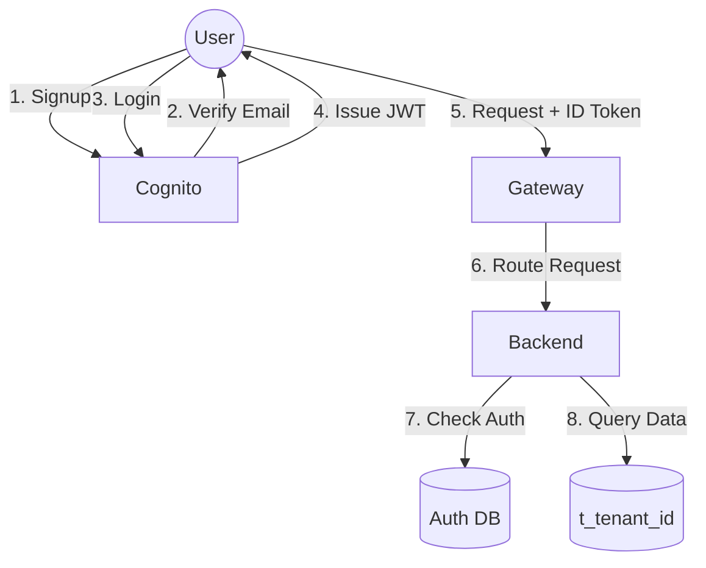
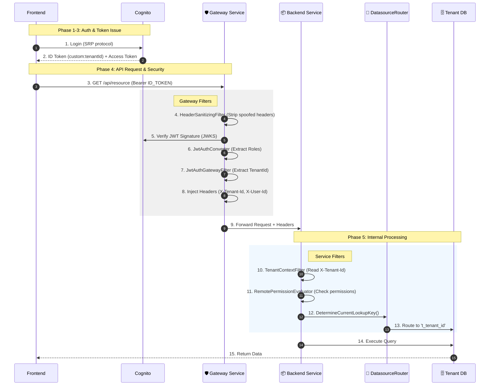

# Authentication & JWT Flow

**Version:** 7.6 (Merged & Fully Restored)
**Last Updated:** 2026-01-17

This document details the end-to-end authentication flow, from Signup to Login to API Requests.

---

## 🎯 End-to-End Flow Summary

```
SIGNUP → COGNITO → EMAIL VERIFY → LOGIN → JWT → GATEWAY → TENANT ROUTING → AUTHORIZATION → DATABASE
```

### Process Flow (Visual)


The system uses **AWS Cognito** for identity management but orchestrates everything through the **Auth Service** to ensure multi-tenant setup (Database creation) happens synchronously.

---

## 📋 Complete Flow Diagram

```
┌─────────────────────────────────────────────────────────────────────────────────┐
│                    END-TO-END AUTHENTICATION & AUTHORIZATION                     │
├─────────────────────────────────────────────────────────────────────────────────┤
│                                                                                  │
│  PHASE 1: SIGNUP                                                                 │
│  ───────────────                                                                 │
│  Frontend                 Auth-Service                 Cognito                   │
│  ────────                 ────────────                 ───────                   │
│  signupOrg() ─────────────► SignupController ─────────► signUp()                │
│              POST /auth/    - signupOrganization()      - Creates user          │
│              api/v1/auth/   - Provisions tenant via     - Sets custom attrs     │
│              signup/org     PlatformService             - Sends verify email    │
│                                                                                  │
│                                                                                  │
│  PHASE 2: EMAIL VERIFICATION                                                     │
│  ──────────────────────────                                                      │
│  Frontend                 Auth-Service                 Cognito                   │
│  ────────                 ────────────                 ───────                   │
│  verifyEmail() ───────────► SignupController ─────────► confirmSignUp()         │
│              POST /auth/    - verifyEmail()             - Confirms user         │
│              api/v1/auth/   - Validates code            - Triggers Lambda       │
│              verify                                                              │
│                                      ┌─────────────────────────────────┐        │
│                                      │  PostConfirmation Lambda        │        │
│                                      │  - Sets custom:tenantId         │        │
│                                      │  - Sets custom:role             │        │
│                                      └─────────────────────────────────┘        │
│                                                                                  │
│                                                                                  │
│  PHASE 3: LOGIN                                                                  │
│  ─────────────                                                                   │
│  Frontend                 Cognito                      Lambda                    │
│  ────────                 ───────                      ──────                    │
│  signIn() ────────────────► InitiateAuth ──────────────► PreTokenGeneration     │
│  (AWS Amplify)               - Validates password        - Extracts tenant      │
│                              - Generates tokens          - Syncs groups (SSO)   │
│                                                          - Overrides claims     │
│                     ◄────────────────────────────────────┘                      │
│                     Returns: { idToken, accessToken, refreshToken }              │
│                                                                                  │
│                                                                                  │
│  PHASE 4: API REQUEST                                                            │
│  ───────────────────                                                             │
│                                                                                  │
│  Frontend                                                                        │
64 │  ────────                                                                        │
│  auth.interceptor.ts                                                             │
│  - Extracts idToken (NOT accessToken)                                           │
│  - Sets: Authorization: Bearer <idToken>                                        │
│     │                                                                            │
│     ▼                                                                            │
│  ┌─────────────────────────────────────────────────────────────────┐            │
│  │                        GATEWAY SERVICE                           │            │
│  │                                                                  │            │
│  │  ┌──────────────────────────────────────────────────────────┐  │            │
│  │  │ 1. HeaderSanitizingGlobalFilter                          │  │            │
│  │  │    - Strips spoofed X-Tenant-Id, X-User-Id headers       │  │            │
│  │  └──────────────────────────────────────────────────────────┘  │            │
│  │                           │                                     │            │
│  │                           ▼                                     │            │
│  │  ┌──────────────────────────────────────────────────────────┐  │            │
│  │  │ 2. SecurityConfig (OAuth2 Resource Server)               │  │            │
│  │  │    - Validates JWT signature (JWKS from Cognito)         │  │            │
│  │  │    - Checks issuer, expiration                           │  │            │
│  │  │    - PUBLIC: /auth/api/v1/auth/login, /signup/**         │  │            │
│  │  └──────────────────────────────────────────────────────────┘  │            │
│  │                           │                                     │            │
│  │                           ▼                                     │            │
│  │  ┌──────────────────────────────────────────────────────────┐  │            │
│  │  │ 3. JwtAuthenticationConverter                            │  │            │
│  │  │    - Extracts cognito:groups → ROLE_* authorities        │  │            │
│  │  └──────────────────────────────────────────────────────────┘  │            │
│  │                           │                                     │            │
│  │                           ▼                                     │            │
│  │  ┌──────────────────────────────────────────────────────────┐  │            │
│  │  │ 4. JwtAuthenticationGatewayFilterFactory                 │  │            │
│  │  │    - Extracts custom:tenantId from JWT                   │  │            │
│  │  │    - Extracts email (tries email, custom:email, idents)  │  │            │
│  │  │    - Injects headers:                                    │  │            │
│  │  │      • X-Tenant-Id                                       │  │            │
│  │  │      • X-User-Id (sub claim)                             │  │            │
│  │  │      • X-Email                                           │  │            │
│  │  │      • X-Username                                        │  │            │
│  │  │      • X-Authorities                                     │  │            │
│  │  │      • X-Groups (for role mapping)                       │  │            │
│  │  └──────────────────────────────────────────────────────────┘  │            │
│  │                           │                                     │            │
│  │                           ▼                                     │            │
│  │  ┌─────────────────────────────────────────────────────────────────────────┐    │
│  │  │ Auth/Platform/Backend Service                                            │    │
│  │  │                                                                          │    │
│  │  │  ┌─────────────────────────────────────────────────────────────────┐   │    │
│  │  │  │ 1. TenantContextFilter                                          │   │    │
│  │  │    - Reads X-Tenant-Id header                                    │   │    │
│  │  │    - Sets TenantContext.setCurrentTenant(tenantId)               │   │    │
│  │  │    - Clears context after request                                │   │    │
│  │  │  └─────────────────────────────────────────────────────────────────┘   │    │
│  │  │                           │                                             │    │
│  │  │                           ▼                                             │    │
│  │  │  ┌─────────────────────────────────────────────────────────────────┐   │    │
│  │  │  │ 2. RemotePermissionEvaluator                                    │   │    │
│  │  │    - @PreAuthorize("hasPermission('resource', 'action')")        │   │    │
│  │  │    - Calls RoleLookupService.getUserRole(userId, tenantId)       │   │    │
│  │  │    - Role hierarchy: admin > editor > viewer > guest             │   │    │
│  │  │    - Fallback: calls auth-service /permissions/check             │   │    │
│  │  │  └─────────────────────────────────────────────────────────────────┘   │    │
│  │  │                           │                                             │    │
│  │  │                           ▼                                             │    │
│  │  │  ┌─────────────────────────────────────────────────────────────────┐   │    │
│  │  │  │ 3. TenantDataSourceRouter                                       │   │    │
│  │  │    - Reads TenantContext.getCurrentTenant()                      │   │    │
│  │  │    - Routes to tenant-specific database: t_<tenantId>            │   │    │
│  │  │    - Creates/caches HikariDataSource per tenant                  │   │    │
│  │  │    - "system" tenant → default platform database                 │   │    │
│  │  │  └─────────────────────────────────────────────────────────────────┘   │    │
│  │  │                           │                                             │    │
│  │  │                           ▼                                             │    │
│  │  │  ┌─────────────────────────────────────────────────────────────────┐   │    │
│  │  │  │ 4. Business Logic (Controller → Service → Repository)           │   │    │
│  │  │    - All queries automatically scoped to tenant's database       │   │    │
│  │  │  └─────────────────────────────────────────────────────────────────┘   │    │
│  │  │                                                                          │    │
│  │  └─────────────────────────────────────────────────────────────────────────┘    │
│  │                                                                                  │
│  └─────────────────────────────────────────────────────────────────────────────────┘
```

---

## 📝 Sequence View (Mermaid)



---

## 🔑 Token Types

| Token | Purpose | Contains `custom:tenantId`? | Used By |
|-------|---------|----------------------------|---------|
| **ID Token** | User identity | ✅ Yes | Frontend → Gateway |
| **Access Token** | Standard OAuth2 | ❌ No | NOT USED |

**Why ID Token?** Custom claims (`custom:tenantId`, `custom:tenantType`) are only in ID tokens.

---

## 📊 Headers Injected by Gateway

| Header | Source | Purpose |
|--------|--------|---------|
| `X-Tenant-Id` | JWT `custom:tenantId` | Database routing |
| `X-User-Id` | JWT `sub` | User identification |
| `X-Email` | JWT `email` | Display name |
| `X-Authorities` | `cognito:groups` | Role-based auth |
| `X-Groups` | `custom:samlGroups` | IdP group sync |

---

## 🛡️ Security Boundaries

1. **Gateway is King:** All external traffic MUST pass through Gateway.
2. **Fail-Closed:** Gateway rejects requests with invalid JWTs or missing Tenant ID.
3. **Network Isolation:** Internal services (Auth, Backend) should strictly accept traffic only from Gateway and each other.

---

## 📁 Key Files Reference

### Signup & Login

| File | Purpose |
|------|---------|
| [SignupController.java](../auth-service/src/main/java/com/learning/authservice/controller/SignupController.java) | `signupPersonal()`, `signupOrganization()`, `verifyEmail()` |
| [AuthServiceImpl.java](../auth-service/src/main/java/com/learning/authservice/service/AuthServiceImpl.java) | `login()`, `getCurrentUser()` |
| [auth.interceptor.ts](../frontend/src/app/core/interceptors/auth.interceptor.ts) | Attaches ID Token to requests |

### Cognito Lambda

| File | Purpose |
|------|---------|
| [handler.py](../terraform/lambdas/cognito-pre-token-generation/handler.py) | PreTokenGeneration - sets claims |

### Gateway

| File | Purpose |
|------|---------|
| [SecurityConfig.java](../gateway-service/src/main/java/com/learning/gateway/config/SecurityConfig.java) | JWT validation, public endpoints |
| [JwtAuthenticationGatewayFilterFactory.java](../gateway-service/src/main/java/com/learning/gateway/filter/JwtAuthenticationGatewayFilterFactory.java) | Extracts tenant, injects headers |
| [HeaderSanitizingGlobalFilter.java](../gateway-service/src/main/java/com/learning/gateway/filter/HeaderSanitizingGlobalFilter.java) | Strips spoofed headers |

### Authorization & Tenant Routing

| File | Purpose |
|------|---------|
| [TenantContextFilter.java](../common-infra/src/main/java/com/learning/common/infra/tenant/TenantContextFilter.java) | Sets TenantContext from header |
| [TenantContext.java](../common-infra/src/main/java/com/learning/common/infra/tenant/TenantContext.java) | ThreadLocal for current tenant |
| [TenantDataSourceRouter.java](../common-infra/src/main/java/com/learning/common/infra/tenant/TenantDataSourceRouter.java) | Routes queries to tenant DB |
| [RemotePermissionEvaluator.java](../common-infra/src/main/java/com/learning/common/infra/security/RemotePermissionEvaluator.java) | Role-based access control |

### SSM Configuration

| File | Purpose |
|------|---------|
| [gateway-service/entrypoint.sh](../gateway-service/entrypoint.sh) | Loads Cognito config from SSM |
| [auth-service/entrypoint.sh](../auth-service/entrypoint.sh) | Loads Cognito config from SSM |

---

## 🔐 SSM Parameters Reference

All services load Cognito config from AWS SSM at startup.

| Path Pattern | Example Value |
|--------------|---------------|
| `/cloud-infra/dev/cognito/user_pool_id` | `us-east-1_JTWyGznRm` |
| `/cloud-infra/dev/cognito/issuer_uri` | `https://cognito-idp...` |
| `/cloud-infra/dev/cognito/jwks_uri` | `.../.well-known/jwks.json` |
| `/cloud-infra/dev/cognito/spa_client_id` | `5ipcdulrm...` |

---

## ✅ Local Verification (Snapshot)

These tests were last passed on 2026-01-16.

| Test | Result |
|------|--------|
| Organization Signup | ✅ Pass |
| Login | ✅ Pass |
| User = Admin | ✅ Pass |
| Account = Organization | ✅ Pass |

---

## 🔧 Troubleshooting

**"401 Unauthorized"**
- Check if Gateway can reach Cognito JWKS endpoint.
- Verify token is not expired.

**"Missing Tenant Context"**
- Check if user has `custom:tenantId` in Cognito.
- Check if `HeaderSanitizingGlobalFilter` is active in Gateway.

```bash
# Check Gateway Cognito config
docker exec gateway-service printenv | grep COGNITO

# Check Gateway logs
docker logs gateway-service 2>&1 | grep -i "jwt\|auth\|401"

# Decode JWT
# 1. Browser DevTools → Network → API request → Headers → Authorization
# 2. Paste at https://jwt.io
```
