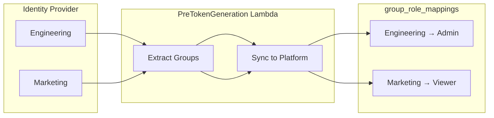
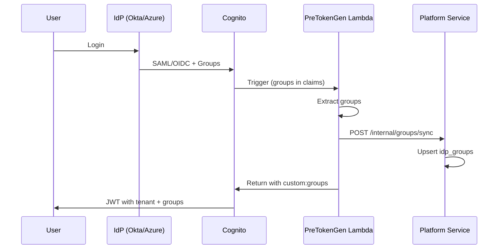

# Authorization & Permissions Guide

**Version:** 7.4 (Merged & Fully Restored)
**Last Updated:** 2026-01-17

This guide details the "3-Layer" Authorization system: **Platform**, **Tenant (RBAC)**, and **Resource (ACL/ReBAC)** levels.

---

## 1. The 3-Layer Model

| Layer | Name | Scope | Description |
|:------|:-----|:------|:------------|
| **0** | Platform | `Global` | **Super Admin**. Manages tenants and system settings. |
| **1** | Implementation | `Tenant` | **RBAC**. Roles like `Admin`, `Editor`, `Viewer`. |
| **2** | Resource | `Item` | **ACLs/ReBAC**. Fine-grained sharing ("Share Folder X with Bob"). |

> **The Golden Rule:** Access is granted if **Organization Role** OR **Resource ACL** permits it.
> ```python
> # Logic:
> is_allowed = (org_role.has_permission(action) OR resource_acl.has_permission(action))
> ```

---

## 2. Role-Based Access Control (RBAC)

These roles apply to the entire tenant scope.

| Role | Permissions | Description |
|------|-------------|-------------|
| **admin** | Full access | Manage users, billing, settings, and all data. |
| **editor** | `create`,`edit`,`delete` | Can modify content but cannot manage users. |
| **viewer** | `read` | Read-only access to organization data. |
| **guest** | Limited read | Minimal access (view shared resources only). |
| **user** | `crud` | Standard employee access. |

### Detailed Permission Matrix
| Permission | Admin | Editor | Viewer | Guest |
|:-----------|:-----:|:------:|:------:|:-----:|
| `entry:read` | ✅ | ✅ | ✅ | ✅ |
| `entry:create` | ✅ | ✅ | ❌ | ❌ |
| `entry:edit` | ✅ | ✅ | ❌ | ❌ |
| `entry:delete` | ✅ | ✅ | ❌ | ❌ |
| `entry:share` | ✅ | ✅ | ❌ | ❌ |
| `user:view` | ✅ | ✅ | ✅ | ❌ |
| `user:invite` | ✅ | ❌ | ❌ | ❌ |
| `user:manage` | ✅ | ❌ | ❌ | ❌ |
| `billing:manage`| ✅ | ❌ | ❌ | ❌ |

---

## 3. Resource-Level ACLs (Fine-Grained)

Used for specific sharing scenarios. Uses **Role Bundles** attached to specific resource IDs.

| Bundle | Capabilities |
|:-------|:-------------|
| **VIEWER** | `read`, `download`, `view_metadata` |
| **CONTRIBUTOR**| `upload`, `create_folder` (extends Viewer) |
| **EDITOR** | `edit`, `move`, `rename`, `delete_own` (extends Contributor) |
| **MANAGER** | `delete_any`, `share`, `manage_access` (extends Editor) |

### ACL Use Cases
**Case 1: User has read on Project, full access on specific Folder**
```
User A: VIEWER on /projects/p1
User A: MANAGER on /projects/p1/folders/x  ← Override
```

**Case 2: User has no project access, but can view specific Folder**
```
User B: (no access to /projects/p2)
User B: VIEWER on /projects/p2/folders/y  ← Specific grant
```

### Database Schema (`acl_entries`)
```sql
CREATE TABLE acl_entries (
    id UUID PRIMARY KEY DEFAULT gen_random_uuid(),
    resource_id UUID NOT NULL,              -- ID of the shared resource
    resource_type VARCHAR(64) NOT NULL,     -- PROJECT, FOLDER, FILE
    principal_type VARCHAR(32) NOT NULL,    -- USER, GROUP, PUBLIC
    principal_id VARCHAR(255),              -- User ID
    role_bundle VARCHAR(32) NOT NULL,       -- VIEWER, EDITOR, MANAGER
    granted_at TIMESTAMPTZ NOT NULL DEFAULT NOW(),
    expires_at TIMESTAMPTZ,                  -- Optional time-limited access
    UNIQUE(resource_id, principal_type, principal_id)
);
```

### ACL API Endpoints
| Method | Endpoint | Description |
|:-------|:---------|:------------|
| `POST` | `/api/v1/acl` | Grant access (Share) |
| `DELETE` | `/api/v1/acl/{id}` | Revoke access |
| `GET` | `/api/v1/acl/resource/{id}` | List who has access |
| `GET` | `/api/v1/acl/user/{userId}`| List user's accessible resources |
| `GET` | `/api/v1/acl/check` | Check capability |
| `GET` | `/api/v1/acl/role-bundles`| Get available role bundles |

---

## 4. SSO/IdP Integration & Group Mapping

Automatically assign roles based on Identity Provider (IdP) groups.

### Supported Identity Providers
| IdP | Protocol | Group Claim |
|:----|:---------|:------------|
| Azure AD | SAML/OIDC | `groups` |
| Okta | SAML/OIDC | `groups` |
| Google Workspace | OIDC | `groups` |
| Ping Identity | SAML | `memberOf` |

### SSO Architecture


### SSO Login Flow


### Group Mappings API
| Method | Endpoint | Description |
|:-------|:---------|:------------|
| `GET`  | `/api/v1/groups/mappings` | List all mappings |
| `POST` | `/api/v1/groups/mappings` | Create mapping (`externalId` → `roleId`) |
| `DELETE`| `/api/v1/groups/mappings/{id}` | Delete mapping |

### Database Schemas for Groups

**`idp_groups` (Platform)**
```sql
CREATE TABLE idp_groups (
    id UUID PRIMARY KEY,
    tenant_id VARCHAR(64) NOT NULL,
    external_group_id VARCHAR(512) NOT NULL, -- e.g. "marketing-group-oid"
    group_name VARCHAR(255) NOT NULL,
    last_synced_at TIMESTAMPTZ,
    UNIQUE(tenant_id, external_group_id)
);
```

**`group_role_mappings` (Auth)**
```sql
CREATE TABLE group_role_mappings (
    id UUID PRIMARY KEY,
    external_group_id VARCHAR(512) NOT NULL UNIQUE,
    role_id VARCHAR(64) NOT NULL REFERENCES roles(id),
    priority INTEGER DEFAULT 0,
    auto_assign BOOLEAN DEFAULT true
);
```

---

## 5. Security Constraints

| Constraint | Description |
|:-----------|:------------|
| **Tenant Isolation** | ACL entries and group mappings are per-tenant. |
| **Admin Only** | Only `admin` can manage mappings and share with MANAGER role. |
| **Sync Limit** | Groups synced once per login (prevents IdP hammering). |
| **Priority** | When user has multiple groups, mapping with highest `priority` wins. |

---

## 6. Implementation Reference

### How to Check Permissions in Code
Use the `@RequirePermission` annotation. The `AuthorizationAspect` intercepts the call and verifies access via Auth Service.

```java
@GetMapping("/{id}")
@RequirePermission(resource = "order", action = "read")
public Order getOrder(@PathVariable UUID id) { ... }
```

### Service Map
| Service | Component | Purpose |
|:--------|:----------|:--------|
| **Auth** | `AclService` | ACL grant/revoke logic |
| **Auth** | `GroupRoleMappingService` | Rule engine for SSO groups |
| **Platform** | `GroupSyncService` | Syncs groups from IdP tokens |
| **Common** | `RemotePermissionEvaluator` | Client-side check in Backend services |

---

## 7. Future Considerations
- **Deny Rules**: Explicit `DENY` entries to override `ALLOW`.
- **Anonymous Public Links**: Secure shareable tokens for public access.
- **ABAC Policies**: Dynamic attribute-based rules.
- **Audit Trail**: Log all ACL changes for compliance.
