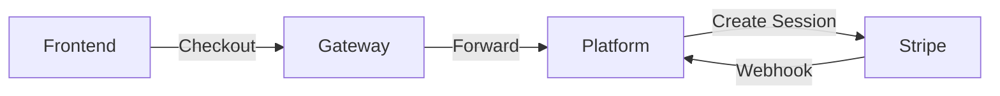

# Stripe Billing Integration

**Version:** 7.4 (Merged & Fully Restored)
**Last Updated:** 2026-01-17

This guide covers the B2B subscription billing system integrated into the **Platform Service**.

---

## 🏗️ Architecture Overview



### Components
- **Platform Service:** Handles logical billing, invoice tracking, and webhooks.
- **Stripe:** Handles PCI-compliant payments and subscription recurrence.

---

## 1. Stripe Dashboard Setup

Before running the application, you must configure Stripe.

### 1.1 Get API Keys
1. Go to [Stripe Dashboard](https://dashboard.stripe.com/test/apikeys).
2. Copy your **Secret key** (starts with `sk_test_`).

### 1.2 Create Products and Prices
Navigate to **Products** and create the following:

| Product Name | Price (Monthly) | Notes |
|-------------|-----------------|-------|
| **Starter** | $9/month | For small teams (up to 5 users) |
| **Pro** | $29/month | For growing teams (up to 50 users) |
| **Enterprise** | $99/month | Unlimited users |

> **Important:** Copy the **Price ID** (starts with `price_`) for each product. You will need these for your environment variables.

---

## 2. Environment Configuration

Add these variables to your `.env` or `application.yml` (via SSM in production).

```bash
# Stripe Configuration
STRIPE_API_KEY=sk_test_your_key
STRIPE_WEBHOOK_SECRET=whsec_your_secret

# Stripe Price IDs (From Dashboard)
STRIPE_PRICE_STARTER=price_xxx
STRIPE_PRICE_PRO=price_yyy
STRIPE_PRICE_ENTERPRISE=price_zzz

# Redirect URLs
STRIPE_SUCCESS_URL=http://localhost:4200/settings/billing?success=true
STRIPE_CANCEL_URL=http://localhost:4200/settings/billing?canceled=true
```

---

## 3. Subscription Tiers

Defined in `application.yml` and enforced by Platform Service.

```yaml
billing:
  enabled: true
  tiers:
    starter:
      price-id: ${STRIPE_PRICE_STARTER}
      name: Starter
      max-users: 5
    pro:
      price-id: ${STRIPE_PRICE_PRO}
      name: Pro
      max-users: 50
```

---

## 4. Webhook Handling

Webhooks are crucial for keeping the local database in sync with Stripe.

**Endpoint:** `POST /billing/webhook` (Publicly accessible, signature verified)

| Event | System Action |
|-------|---------------|
| `checkout.session.completed` | **Activate Tenant**. Set status to `ACTIVE`. |
| `invoice.payment_failed` | **Suspend/Downgrade**. Set status to `PAST_DUE`. |
| `customer.subscription.deleted`| **Cancel**. Set status to `CANCELLED`. |
| `invoice.paid` | Log payment success. |
| `customer.subscription.updated` | Sync status changes. |

> **Security Note:** The Gateway permits traffic to `/billing/webhook` without a JWT. The Platform Service verifies the **Stripe-Signature** header using the secret key to ensure authenticity.

---

## 5. API Reference

| Endpoint | Method | Description |
|----------|--------|-------------|
| `/api/v1/billing/checkout` | POST | Generate Stripe Checkout URL |
| `/api/v1/billing/portal` | POST | Generate Customer Portal URL |
| `/api/v1/billing/status` | GET | Check current tier and status |

---

## 6. Testing & Verification

### 6.1 Prerequisites
- Docker running (`docker-compose up`)
- Stripe CLI installed (`brew install stripe/stripe-cli/stripe`)
- Stripe Account (Test Mode)

### 6.2 Forward Webhooks
Start the listener to forward events to your local Platform Service:
```bash
stripe listen --forward-to localhost:8080/platform-service/billing/webhook
# Output: Ready! Your webhook signing secret is whsec_xxxxx
# Copy this secret to your .env
```

### 6.3 CLI Testing

**Get Status:**
```bash
curl -X GET http://localhost:8082/api/v1/billing/status \
  -H "X-Tenant-Id: your-tenant-id" \
  -H "X-Email: admin@test.com"
```

**Create Checkout:**
```bash
curl -X POST http://localhost:8082/api/v1/billing/checkout \
  -H "Content-Type: application/json" \
  -H "X-Tenant-Id: your-tenant-id" \
  -d '{"tier": "starter"}'
```
Response: `{ "checkoutUrl": "https://checkout.stripe.com/..." }`

**Test Card Numbers:**
| Number | Result |
|--------|--------|
| `4242 4242 4242 4242` | Success |
| `4000 0000 0000 9995` | Declined (Insufficient Funds) |
| `4000 0000 0000 3220` | 3D Secure Required |

---

## 7. Database Schema

### `stripe_customers`
Maps tenants to Stripe customer IDs.
```sql
CREATE TABLE stripe_customers (
    tenant_id VARCHAR(64) PRIMARY KEY,
    stripe_customer_id VARCHAR(255) NOT NULL,
    created_at TIMESTAMPTZ DEFAULT NOW()
);
```

### `tenant` (Billing Fields)
```sql
ALTER TABLE tenant 
ADD COLUMN subscription_status VARCHAR(32), -- ACTIVE, TRIAL, PAST_DUE
ADD COLUMN stripe_subscription_id VARCHAR(255),
ADD COLUMN stripe_price_id VARCHAR(255),
ADD COLUMN current_period_end TIMESTAMPTZ;
```

---

## 8. Production Checklist

- [ ] **API Keys:** Replace test keys with Live keys in SSM.
- [ ] **Webhooks:** Configure production webhook endpoint in Stripe Dashboard.
- [ ] **Product IDs:** Ensure Production Price IDs match your Terraform/SSM config.
- [ ] **Redirects:** Update Success/Cancel URLs to point to your production Frontend domain.
- [ ] **Alerting:** Set up alerts for `invoice.payment_failed` webhooks to catch churn risks.
