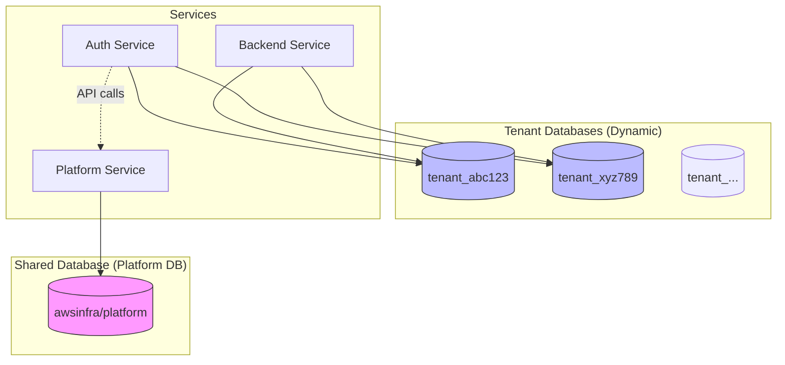
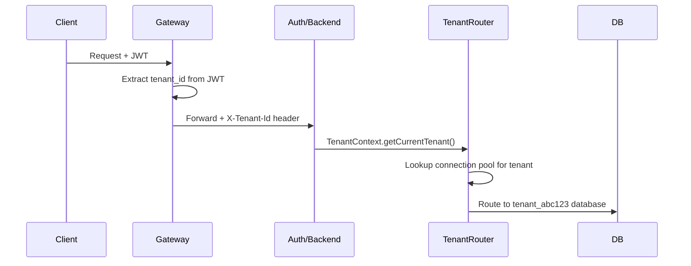
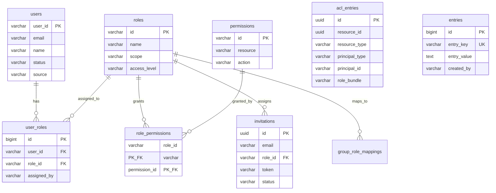

# Database Architecture &amp; Schema Documentation

> **Version:** 1.0 | **Last Updated:** 2026-01-22  
> **Audience:** Developers, DBAs, and new team members

---

## Architecture Overview



> **Note:** Auth Service does NOT connect directly to Platform DB. It calls Platform Service via internal API for shared data (tenant info, memberships).

---

## Database Types

| Database | Purpose | Routing | Created By |
|----------|---------|---------|------------|
| **Platform DB** | Tenant registry, billing, memberships | Fixed connection | Terraform (at deploy) |
| **Tenant DB** | Per-tenant data: users, roles, entries | Dynamic via `X-Tenant-Id` header | Tenant provisioning service |

---

## Service-to-Database Connectivity

| Service | Platform DB | Tenant DB | Notes |
|---------|-------------|-----------|-------|
| **platform-service** | ✅ Direct | ❌ No | Only service with direct access to shared DB |
| **auth-service** | ❌ No | ✅ Direct | Uses API calls to platform-service for shared data |
| **backend-service** | ❌ No | ✅ Direct | Business logic in tenant context |
| **gateway-service** | ❌ No | ❌ No | Stateless routing only |

### Auth-Service → Platform-Service API Calls

Auth-service calls platform-service internal APIs for:

| Endpoint | Purpose |
|----------|---------|
| `POST /platform/internal/tenants` | Provision new tenant |
| `GET /platform/internal/tenants/{id}` | Get tenant info |
| `POST /platform/internal/memberships` | Create user membership |
| `DELETE /platform/internal/tenants/{id}` | Delete tenant |
| `GET /platform/internal/memberships?email=` | Get user's workspaces |

---

## Database Connectivity

### Connection Strings

```bash
# Platform DB (Shared)
SPRING_DATASOURCE_URL=jdbc:postgresql://rds-host:5432/awsinfra

# Tenant DB (Dynamic per-request)
# Resolved at runtime via TenantContextFilter + TenantDataSourceRouter
# Pattern: jdbc:postgresql://rds-host:5432/tenant_{tenant_id}
```

### Connection Flow



---

# SHARED DATABASE (Platform Schema)

> **Database:** `awsinfra` (or `saas_db` in production)  
> **Service:** `platform-service`  
> **Migration:** `platform-service/src/main/resources/db/migration/V1__init_platform_service.sql`

---

## 1. tenant

**Purpose:** Central registry of all tenants (workspaces/organizations).

| Column | Type | Description |
|--------|------|-------------|
| `id` | VARCHAR(64) | **PK** - Unique tenant identifier (e.g., `t_abc123`) |
| `name` | VARCHAR(100) | Display name |
| `status` | VARCHAR(32) | `ACTIVE`, `SUSPENDED`, `DELETED`, `DELETING` |
| `tenant_type` | VARCHAR(32) | `PERSONAL` or `ORGANIZATION` |
| `owner_email` | VARCHAR(255) | Email of the owner who created the tenant |
| `max_users` | INTEGER | User limit based on subscription tier |
| `sla_tier` | VARCHAR(32) | `FREE`, `STARTER`, `PRO`, `ENTERPRISE` |
| `storage_mode` | VARCHAR(32) | `DEDICATED` (separate DB) |
| `jdbc_url` | TEXT | Connection string for tenant's dedicated database |
| `sso_enabled` | BOOLEAN | Whether SSO is configured |
| `idp_type` | VARCHAR(64) | `SAML`, `OIDC`, `OKTA`, `AZURE_AD`, etc. |

| `fga_store_id` | VARCHAR(255) | OpenFGA store for fine-grained permissions |
| `created_at` | TIMESTAMPTZ | Creation timestamp |
| `updated_at` | TIMESTAMPTZ | Last update timestamp |

**Relationships:**
- **Parent of:** `user_tenant_memberships`, `tenant_audit_log`, `tenant_usage_metrics`, `api_keys`, `stripe_customers`, `idp_groups`

**Indexes:**
- `idx_tenant_status` - Filter by status
- `idx_tenant_type` - Filter by type
- `idx_tenant_owner` - Find by owner email
- `idx_tenant_sso` - SSO-enabled tenants

---

## 2. user_tenant_memberships

**Purpose:** Links users to tenants they can access. Enables multi-workspace login.

| Column | Type | Description |
|--------|------|-------------|
| `id` | UUID | **PK** |
| `user_email` | VARCHAR(255) | User's email (primary identifier) |
| `cognito_user_id` | VARCHAR(255) | Cognito sub claim (set after first login) |
| `tenant_id` | VARCHAR(64) | **FK → tenant.id** |
| `role_hint` | VARCHAR(50) | Display role: `owner`, `admin`, `member`, `guest` |
| `is_owner` | BOOLEAN | True if user created this tenant |
| `is_default` | BOOLEAN | User's default workspace (one per user) |
| `last_accessed_at` | TIMESTAMPTZ | For "recently used" sorting |
| `status` | VARCHAR(32) | `ACTIVE`, `REMOVED`, `SUSPENDED` |
| `joined_at` | TIMESTAMPTZ | When user joined this tenant |
| `invited_by` | VARCHAR(255) | Email of inviter (null for owner/self-signup) |

**Relationships:**
- **FK:** `tenant_id` → `tenant.id` (CASCADE DELETE)
- **Unique:** `(user_email, tenant_id)` - One membership per user-tenant pair
- **Partial Unique:** Only one `is_default = true` per user

**Use Cases:**
```sql
-- Get all workspaces for a user
SELECT t.*, m.role_hint, m.is_default 
FROM tenant t
JOIN user_tenant_memberships m ON t.id = m.tenant_id
WHERE m.user_email = 'user@example.com' AND m.status = 'ACTIVE'
ORDER BY m.last_accessed_at DESC;
```

---

## 3. api_keys

**Purpose:** API keys for programmatic access (CI/CD, integrations).

| Column | Type | Description |
|--------|------|-------------|
| `id` | UUID | **PK** |
| `tenant_id` | VARCHAR(64) | **FK → tenant.id** |
| `name` | VARCHAR(100) | User-friendly name (e.g., "CI/CD Integration") |
| `key_hash` | VARCHAR(256) | SHA-256 hash (raw key never stored) |
| `key_prefix` | VARCHAR(20) | First 8 chars for UI display (e.g., `sk_live_a1b2`) |
| `created_by_user_id` | VARCHAR(255) | Cognito user ID - key inherits this user's permissions |
| `created_by_email` | VARCHAR(255) | For display purposes |
| `rate_limit_per_minute` | INTEGER | Rate limit override (default: 60) |
| `expires_at` | TIMESTAMPTZ | Expiration date (required, max 2 years) |
| `last_used_at` | TIMESTAMPTZ | Last usage timestamp |
| `usage_count` | BIGINT | Total API calls made |
| `status` | VARCHAR(20) | `ACTIVE`, `REVOKED`, `EXPIRED` |

**Key Design:**
- Raw key is shown ONCE at creation, only hash is stored
- Permissions are inherited from `created_by_user_id`

---


## 4. idp_groups

**Purpose:** Stores groups synced from external Identity Providers (SSO).

| Column | Type | Description |
|--------|------|-------------|
| `id` | UUID | **PK** |
| `tenant_id` | VARCHAR(64) | **FK → tenant.id** |
| `external_group_id` | VARCHAR(512) | Original group ID from IdP |
| `group_name` | VARCHAR(255) | Human-readable display name |
| `idp_type` | VARCHAR(64) | `SAML`, `OIDC`, `OKTA`, `AZURE_AD`, `GOOGLE` |
| `member_count` | INTEGER | Approximate member count |
| `last_synced_at` | TIMESTAMPTZ | Last sync timestamp |

---

## 7. deleted_accounts

**Purpose:** Audit trail for deleted accounts (GDPR compliance).

| Column | Type | Description |
|--------|------|-------------|
| `id` | UUID | **PK** |
| `email` | VARCHAR(255) | Email of deleted user |
| `original_tenant_id` | VARCHAR(64) | Original tenant ID |
| `tenant_type` | VARCHAR(20) | `PERSONAL` or `ORGANIZATION` |
| `tenant_name` | VARCHAR(255) | Tenant name at deletion time |
| `deleted_at` | TIMESTAMPTZ | Deletion timestamp |
| `deleted_by` | VARCHAR(255) | Who triggered deletion |

---

## 8. tenant_audit_log

**Purpose:** Compliance audit trail (GDPR, HIPAA, SOC2).

| Column | Type | Description |
|--------|------|-------------|
| `id` | BIGSERIAL | **PK** |
| `tenant_id` | VARCHAR(64) | **FK → tenant.id** |
| `user_id` | VARCHAR(255) | User who performed action |
| `action` | VARCHAR(64) | Action type |
| `resource_type` | VARCHAR(64) | Resource type |
| `resource_id` | VARCHAR(255) | Resource ID |
| `ip_address` | INET | Client IP |
| `request_id` | VARCHAR(64) | Correlation ID |
| `timestamp` | TIMESTAMPTZ | When action occurred |

---

## 9. tenant_usage_metrics

**Purpose:** Usage tracking for billing and cost allocation.

| Column | Type | Description |
|--------|------|-------------|
| `id` | BIGSERIAL | **PK** |
| `tenant_id` | VARCHAR(64) | **FK → tenant.id** |
| `metric_date` | DATE | Date of metrics |
| `api_calls` | BIGINT | API call count |
| `storage_mb` | BIGINT | Storage usage |
| `data_transfer_mb` | BIGINT | Data transfer usage |
| `compute_hours` | DECIMAL | Compute usage |

---

# TENANT DATABASE (Per-Tenant Schema)

> **Database:** `tenant_{tenant_id}` (e.g., `tenant_abc123`)  
> **Services:** `auth-service`, `backend-service`  
> **Migrations:**  
> - `auth-service/src/main/resources/db/migration/tenant/V1__authorization_schema.sql`  
> - `backend-service/src/main/resources/db/tenant-template/V1__tenant_initial_schema.sql`

---

## Entity Relationship Diagram



---

## 10. roles

**Purpose:** Predefined organization roles.

| Column | Type | Description |
|--------|------|-------------|
| `id` | VARCHAR(64) | **PK** - Role identifier |
| `name` | VARCHAR(100) | Display name (UNIQUE) |
| `description` | TEXT | Role description |
| `scope` | VARCHAR(32) | `PLATFORM` (super-admin) or `TENANT` |
| `access_level` | VARCHAR(32) | `admin`, `editor`, `viewer`, `guest` |

**Seed Data:**
| ID | Name | Scope | Access Level |
|----|------|-------|--------------|
| `super-admin` | SUPER_ADMIN | PLATFORM | admin |
| `admin` | ADMIN | TENANT | admin |
| `editor` | EDITOR | TENANT | editor |
| `viewer` | VIEWER | TENANT | viewer |
| `guest` | GUEST | TENANT | guest |

---

## 11. users (Tenant User Registry)

**Purpose:** Registry of all users in a tenant.

| Column | Type | Description |
|--------|------|-------------|
| `user_id` | VARCHAR(255) | **PK** - Cognito sub claim |
| `email` | VARCHAR(255) | User's email |
| `name` | VARCHAR(255) | Display name |
| `avatar_url` | TEXT | Profile picture URL |
| `status` | VARCHAR(32) | `ACTIVE`, `INVITED`, `DISABLED` |
| `source` | VARCHAR(32) | `COGNITO`, `SAML`, `OIDC`, `MANUAL`, `INVITATION` |
| `first_login_at` | TIMESTAMPTZ | First login timestamp |
| `last_login_at` | TIMESTAMPTZ | Last login timestamp |

**Note:** This is in the TENANT database, so each tenant has its own user registry.

---

## 12. user_roles

**Purpose:** Assigns roles to users within a tenant.

| Column | Type | Description |
|--------|------|-------------|
| `id` | BIGSERIAL | **PK** |
| `user_id` | VARCHAR(255) | Cognito user ID (sub claim) |
| `role_id` | VARCHAR(64) | **FK → roles.id** |
| `assigned_by` | VARCHAR(255) | Who assigned the role |
| `assigned_at` | TIMESTAMPTZ | Assignment timestamp |
| `expires_at` | TIMESTAMPTZ | Optional expiration |

**Unique:** `(user_id, role_id)`

**Use Case:**
```sql
-- Get user's permissions
SELECT DISTINCT p.id, p.resource, p.action
FROM user_roles ur
JOIN role_permissions rp ON ur.role_id = rp.role_id
JOIN permissions p ON rp.permission_id = p.id
WHERE ur.user_id = 'cognito-sub-uuid';
```

---

## 13. permissions

**Purpose:** Defines all available permissions in the system.

| Column | Type | Description |
|--------|------|-------------|
| `id` | VARCHAR(64) | **PK** - Format: `resource:action` |
| `resource` | VARCHAR(50) | Resource type |
| `action` | VARCHAR(50) | Action type |
| `description` | TEXT | Permission description |

**Seed Data:**
| ID | Resource | Action | Description |
|----|----------|--------|-------------|
| `entry:create` | entry | create | Create new entries |
| `entry:read` | entry | read | View entries |
| `entry:update` | entry | update | Edit existing entries |
| `entry:delete` | entry | delete | Delete entries |
| `user:read` | user | read | View user list |
| `user:invite` | user | invite | Invite new users |
| `user:manage` | user | manage | Manage user roles |
| `tenant:settings` | tenant | settings | Manage tenant settings |
| `sso:read` | sso | read | View SSO configuration |
| `sso:manage` | sso | manage | Configure SSO |

---

## 14. role_permissions

**Purpose:** Maps roles to their granted permissions (M:N junction table).

| Column | Type | Description |
|--------|------|-------------|
| `role_id` | VARCHAR(64) | **PK/FK → roles.id** |
| `permission_id` | VARCHAR(64) | **PK/FK → permissions.id** |

**Role-Permission Matrix:**
| Role | Permissions |
|------|-------------|
| `admin` | All (entry:*, user:*, tenant:*, sso:*, group:*) |
| `editor` | entry:*, user:read |
| `viewer` | entry:read, user:read |
| `guest` | entry:read |

---

## 15. invitations

**Purpose:** Pending user invitations.

| Column | Type | Description |
|--------|------|-------------|
| `id` | UUID | **PK** |
| `email` | VARCHAR(255) | Invitee's email |
| `role_id` | VARCHAR(64) | **FK → roles.id** |
| `token` | VARCHAR(255) | Invitation token (UNIQUE) |
| `status` | VARCHAR(32) | `PENDING`, `ACCEPTED`, `EXPIRED`, `REVOKED` |
| `invited_by` | VARCHAR(255) | Inviter's user ID |
| `expires_at` | TIMESTAMPTZ | Expiration timestamp |

---

## 16. group_role_mappings

**Purpose:** Maps SSO/IdP groups to roles for auto-assignment.

| Column | Type | Description |
|--------|------|-------------|
| `id` | UUID | **PK** |
| `external_group_id` | VARCHAR(512) | Group ID from IdP (UNIQUE) |
| `group_name` | VARCHAR(255) | Display name |
| `role_id` | VARCHAR(64) | **FK → roles.id** |
| `priority` | INTEGER | For conflict resolution |
| `auto_assign` | BOOLEAN | Auto-assign on SSO login |

---

## 17. acl_entries (Resource ACLs)

**Purpose:** Resource-level access control (Google Drive-style sharing).

| Column | Type | Description |
|--------|------|-------------|
| `id` | UUID | **PK** |
| `resource_id` | UUID | ID of the shared resource |
| `resource_type` | VARCHAR(64) | `FOLDER`, `FILE`, `PROJECT` |
| `principal_type` | VARCHAR(32) | `USER`, `GROUP`, `PUBLIC` |
| `principal_id` | VARCHAR(255) | User/Group ID (null for PUBLIC) |
| `role_bundle` | VARCHAR(32) | `VIEWER`, `CONTRIBUTOR`, `EDITOR`, `MANAGER` |
| `granted_by` | VARCHAR(255) | Who granted access |
| `expires_at` | TIMESTAMPTZ | Optional expiration |

**Role Bundles:**
| Bundle | Capabilities |
|--------|--------------|
| `VIEWER` | read, download, view_metadata |
| `CONTRIBUTOR` | + upload, create_folder |
| `EDITOR` | + edit, move, rename, delete_own |
| `MANAGER` | + delete_any, share, manage_access |

---

## 18. sso_configurations

**Purpose:** Tenant-specific SSO/IdP configuration.

| Column | Type | Description |
|--------|------|-------------|
| `id` | BIGSERIAL | **PK** |
| `tenant_id` | VARCHAR(255) | Tenant ID (UNIQUE) |
| `sso_enabled` | BOOLEAN | SSO enabled flag |
| `idp_type` | VARCHAR(50) | `SAML` or `OIDC` |
| `provider_name` | VARCHAR(255) | Display name |
| `saml_metadata_url` | VARCHAR(1024) | SAML metadata URL |
| `saml_entity_id` | VARCHAR(255) | SAML entity ID |
| `oidc_issuer` | VARCHAR(1024) | OIDC issuer URL |
| `oidc_client_id` | VARCHAR(255) | OIDC client ID |
| `attribute_mappings` | JSONB | Attribute mapping config |
| `jit_provisioning_enabled` | BOOLEAN | Just-in-time user creation |
| `cognito_provider_name` | VARCHAR(255) | Auto-generated Cognito provider |

---

## 19. entries (Business Data)

**Purpose:** Example business data table for tenant-specific storage.

| Column | Type | Description |
|--------|------|-------------|
| `id` | BIGSERIAL | **PK** |
| `entry_key` | VARCHAR(255) | Unique key within tenant |
| `entry_value` | TEXT | Associated value |
| `created_at` | TIMESTAMPTZ | Creation timestamp |
| `created_by` | VARCHAR(255) | Creator's user ID |
| `updated_at` | TIMESTAMPTZ | Last update |
| `updated_by` | VARCHAR(255) | Last updater |

**Note:** No `tenant_id` column needed - database isolation provides tenancy.

---

# Quick Reference

## Table Count by Database

| Database | Tables | Purpose |
|----------|--------|---------|
| Platform DB | 7 | Tenant registry, memberships, API keys |
| Tenant DB | 10 | Users, roles, permissions, business data |
| Payment DB | 1 | Billing accounts (Dedicated Service) |

## Key Joins

```sql
-- Get tenant with owner info
SELECT t.*, m.user_email as owner_email
FROM tenant t
JOIN user_tenant_memberships m ON t.id = m.tenant_id AND m.is_owner = true;

-- Get user permissions in a tenant
SELECT DISTINCT p.id, p.resource, p.action
FROM users u
JOIN user_roles ur ON u.user_id = ur.user_id
JOIN roles r ON ur.role_id = r.id
JOIN role_permissions rp ON r.id = rp.role_id
JOIN permissions p ON rp.permission_id = p.id
WHERE u.user_id = :userId;

-- Get accessible tenants for login
SELECT t.id, t.name, t.tenant_type, m.role_hint, m.is_default
FROM tenant t
JOIN user_tenant_memberships m ON t.id = m.tenant_id
WHERE m.user_email = :email AND m.status = 'ACTIVE'
ORDER BY m.last_accessed_at DESC NULLS LAST;
```

---

## Migration Files

| Service | Path | Tables Created |
|---------|------|----------------|
| Platform | `platform-service/.../V1__init_platform_service.sql` | tenant, memberships, API keys |
| Auth | `auth-service/.../tenant/V1__authorization_schema.sql` | roles, users, permissions, SSO |
| Payment | `payment-service/.../V1__init_payment_db.sql` | billing_account |
| Backend | `backend-service/.../tenant-template/V1__tenant_initial_schema.sql` | entries |

---

## Connection Configuration

```yaml
# Platform Service (Fixed)
spring:
  datasource:
    url: jdbc:postgresql://${DB_HOST}:5432/awsinfra
    
# Auth/Backend (Dynamic via TenantDataSourceRouter)
# Connection resolved per-request based on X-Tenant-Id header
```

---

**Document End**
