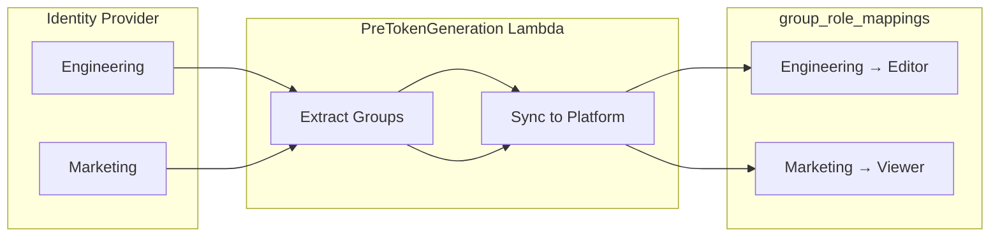
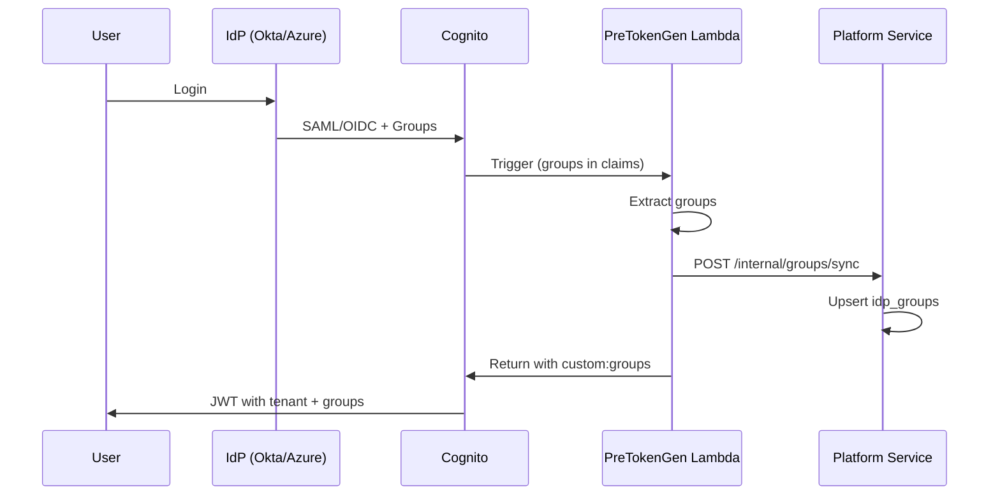

# Design Specification: Enterprise Permission System

**Version:** 7.0 (Simplified Role-Based Access)  
**Status:** ✅ Production-Ready  
**Last Updated:** 2025-12-18

---

## Overview

A production-ready, generic permission system supporting:
- **SSO/IdP integration** with automatic group-to-role mapping
- **Hierarchical resource access** (ACLs) for fine-grained sharing
- **Multi-tenant isolation** with tenant-specific configurations
- **Simplified Permissions** for resource-level access control

---

## 1. Architectural Philosophy

### Hybrid Authorization Model

We employ a **3-layer authorization model**:

| Layer | Name | Scope | Description |
|:------|:-----|:------|:------------|
| **0** | Platform Level | `Global` | System Admin manages SaaS infrastructure |
| **1** | Organization Level | `Tenant` | RBAC roles (Admin, User, Editor, Viewer, Guest) |
| **2** | Resource Level | `Item` | ACLs for per-resource permissions and sharing |

### The "Golden Rule": Permissions are Additive

Access is granted if **EITHER** Organization Role **OR** Resource ACL permits the action:
```
✓ ALLOW = (Org Role grants permission) OR (ACL grants permission)
```

---

## 2. Role Hierarchy (Organization Level)

| Role ID | Display Name | Scope | Description |
|:--------|:-------------|:------|:------------|
| `super-admin` | Super Admin | Platform | SaaS operator, multi-tenant management |
| `admin` | Admin | Tenant | Full control over organization |
| `user` | User | Tenant | Standard CRUD access to resources |
| `editor` | Editor | Tenant | Create, edit, share resources |
| `viewer` | Viewer | Tenant | Read-only access |
| `guest` | Guest | Tenant | Minimal access (view resources only) |

### Permission Matrix

| Permission | Admin | User | Editor | Viewer | Guest |
|:-----------|:-----:|:----:|:------:|:------:|:-----:|
| Resources: View | ✓ | ✓ | ✓ | ✓ | ✓ |
| Resources: Create | ✓ | ✓ | ✓ | — | — |
| Resources: Edit | ✓ | ✓ | ✓ | — | — |
| Resources: Delete | ✓ | ✓ | — | — | — |
| Resources: Share | ✓ | — | ✓ | — | — |
| Users: View | ✓ | ✓ | ✓ | ✓ | — |
| Users: Invite | ✓ | — | — | — | — |
| Users: Manage | ✓ | — | — | — | — |
| Roles: View | ✓ | ✓ | ✓ | ✓ | — |
| Roles: Assign | ✓ | — | — | — | — |
| Settings: View | ✓ | — | — | — | — |
| Settings: Manage | ✓ | — | — | — | — |

---

## 3. Resource-Level ACLs (Role Bundles)

### Permission Bundles

When sharing resources (projects, folders, files), users are assigned one of these **role bundles**:

| Bundle | Description | Capabilities |
|:-------|:------------|:-------------|
| **VIEWER** | Read-only access | `read`, `download`, `view_metadata` |
| **CONTRIBUTOR** | Can add new content | All VIEWER + `upload`, `create_folder` |
| **EDITOR** | Can modify content | All CONTRIBUTOR + `edit`, `move`, `rename`, `delete_own` |
| **MANAGER** | Full control | All EDITOR + `delete_any`, `share`, `manage_access` |

### ACL Use Cases

**Case 1: User has read on Project, full access on specific Folder**
```
User A: VIEWER on /projects/p1
User A: MANAGER on /projects/p1/folders/x  ← Override
```

**Case 2: User has no project access, but can view specific Folder**
```
User B: (no access to /projects/p2)
User B: VIEWER on /projects/p2/folders/y  ← Specific grant
```

### Database Schema

```sql
CREATE TABLE acl_entries (
    id UUID PRIMARY KEY DEFAULT gen_random_uuid(),
    resource_id UUID NOT NULL,              -- ID of the shared resource
    resource_type VARCHAR(64) NOT NULL,     -- PROJECT, FOLDER, FILE, ASSET
    principal_type VARCHAR(32) NOT NULL,    -- USER, GROUP, PUBLIC
    principal_id VARCHAR(255),              -- User ID, Group ID, or null for PUBLIC
    role_bundle VARCHAR(32) NOT NULL,       -- VIEWER, CONTRIBUTOR, EDITOR, MANAGER
    permissions JSONB,                       -- Expanded permissions (optional)
    granted_by VARCHAR(255),
    granted_at TIMESTAMPTZ NOT NULL DEFAULT NOW(),
    expires_at TIMESTAMPTZ,                  -- Optional time-limited access
    UNIQUE(resource_id, principal_type, principal_id)
);
```

### ACL API Endpoints

| Method | Endpoint | Description |
|:-------|:---------|:------------|
| `POST` | `/api/v1/acl` | Grant access to a resource |
| `DELETE` | `/api/v1/acl/{id}` | Revoke access |
| `GET` | `/api/v1/acl/resource/{resourceId}` | List who has access to a resource |
| `GET` | `/api/v1/acl/user/{userId}` | List user's accessible resources |
| `GET` | `/api/v1/acl/check` | Check if user has capability |
| `GET` | `/api/v1/acl/role-bundles` | Get available role bundles |

**Request Example:**
```json
POST /api/v1/acl
{
  "resourceId": "550e8400-e29b-41d4-a716-446655440000",
  "resourceType": "FOLDER",
  "principalType": "USER",
  "principalId": "user-123",
  "roleBundle": "EDITOR",
  "expiresAt": "2025-03-01T00:00:00Z"  // Optional
}
```

---

## 4. SSO/IdP Integration

### Supported Identity Providers

| IdP | Protocol | Group Claim |
|:----|:---------|:------------|
| Azure AD | SAML/OIDC | `groups` |
| Okta | SAML/OIDC | `groups` |
| Google Workspace | OIDC | `groups` |
| Ping Identity | SAML | `memberOf` |
| Generic SAML/OIDC | — | Configurable |

### Architecture



### SSO Login Flow



### Database Schema

**idp_groups (platform-service):**
```sql
CREATE TABLE idp_groups (
    id UUID PRIMARY KEY,
    tenant_id VARCHAR(64) NOT NULL,
    external_group_id VARCHAR(512) NOT NULL,
    group_name VARCHAR(255) NOT NULL,
    idp_type VARCHAR(64) NOT NULL,
    member_count INTEGER DEFAULT 0,
    last_synced_at TIMESTAMPTZ,
    created_at TIMESTAMPTZ DEFAULT NOW(),
    UNIQUE(tenant_id, external_group_id)
);
```

**group_role_mappings (auth-service):**
```sql
CREATE TABLE group_role_mappings (
    id UUID PRIMARY KEY,
    external_group_id VARCHAR(512) NOT NULL UNIQUE,
    group_name VARCHAR(255) NOT NULL,
    role_id VARCHAR(64) NOT NULL REFERENCES roles(id),
    priority INTEGER DEFAULT 0,
    auto_assign BOOLEAN DEFAULT true,
    created_at TIMESTAMPTZ DEFAULT NOW(),
    created_by VARCHAR(255)
);
```

---

## 5. Implementation Reference

### Backend Services

| Service | Location | Purpose |
|:--------|:---------|:--------|
| `AclService` | `auth-service/authorization/service/` | ACL grant, revoke, check |
| `AclController` | `auth-service/authorization/controller/` | ACL REST API |
| `GroupSyncService` | `platform-service/idp/service/` | Sync groups from SSO claims |
| `GroupRoleMappingService` | `auth-service/authorization/service/` | CRUD + role resolution |
| `GroupMappingController` | `auth-service/authorization/controller/` | Admin REST API |
| `GroupInternalController` | `platform-service/idp/controller/` | Lambda internal API |

### Lambda Trigger

| Lambda | Location | Purpose |
|:-------|:---------|:--------|
| PreTokenGeneration | `terraform/lambdas/cognito-pre-token-generation/` | Extract groups, sync, add to JWT |

**Environment Variables:**
- `PLATFORM_SERVICE_URL` - URL for group sync
- `ENABLE_GROUP_SYNC` - Feature flag (true/false)

### Admin UI

| Component | Route | Purpose |
|:----------|:------|:--------|
| RoleListComponent | `/app/admin/roles` | View roles and role bundles |
| SsoConfigComponent | `/app/admin/settings/sso` | SSO configuration |
| GroupMappingComponent | `/app/admin/settings/group-mapping` | Map IdP groups to roles |

---

## 6. API Reference

### Group Mappings API

```http
GET    /api/v1/groups/mappings           # List all mappings
POST   /api/v1/groups/mappings           # Create mapping
GET    /api/v1/groups/mappings/{id}      # Get mapping
PUT    /api/v1/groups/mappings/{id}      # Update mapping
DELETE /api/v1/groups/mappings/{id}      # Delete mapping
```

**Required Permission:** `group:read` (GET), `group:manage` (POST/PUT/DELETE)

### ACL API

```http
GET    /api/v1/acl/role-bundles          # List role bundles
POST   /api/v1/acl                        # Grant access
DELETE /api/v1/acl/{id}                   # Revoke access
GET    /api/v1/acl/resource/{resourceId} # List resource permissions
GET    /api/v1/acl/user/{userId}         # List user permissions
GET    /api/v1/acl/check                  # Check capability
```

---

## 7. Security Constraints

| Constraint | Description |
|:-----------|:------------|
| Tenant Isolation | ACL entries and group mappings are per-tenant |
| Admin Only | Only `admin` can manage mappings and share with MANAGER role |
| Sync Limit | Groups synced once per login (prevent IdP hammering) |
| Priority Resolution | Higher priority wins when user in multiple groups |
| Expiring Access | ACL entries can have optional `expires_at` for time-limited access |

---

## 8. Permission Resolution Algorithm

```python
def check_access(user, resource, capability):
    # 1. Check resource-level ACL (most specific)
    acl = get_acl(user, resource)
    if acl:
        return capability in role_bundle_capabilities[acl.role_bundle]
    
    # 2. Check parent resources (inheritance)
    for parent in resource.get_parents():
        acl = get_acl(user, parent)
        if acl:
            return capability in role_bundle_capabilities[acl.role_bundle]
    
    # 3. Check organization role
    org_role = get_user_role(user)
    return org_role_allows(org_role, capability)
```

---

## 9. Future Considerations

- **Deny Rules**: Explicit `DENY` entries to override `ALLOW`
- **Anonymous Public Links**: Secure shareable tokens for public access
- **ABAC Policies**: Dynamic attribute-based rules
- **Audit Trail**: Log all ACL changes for compliance
