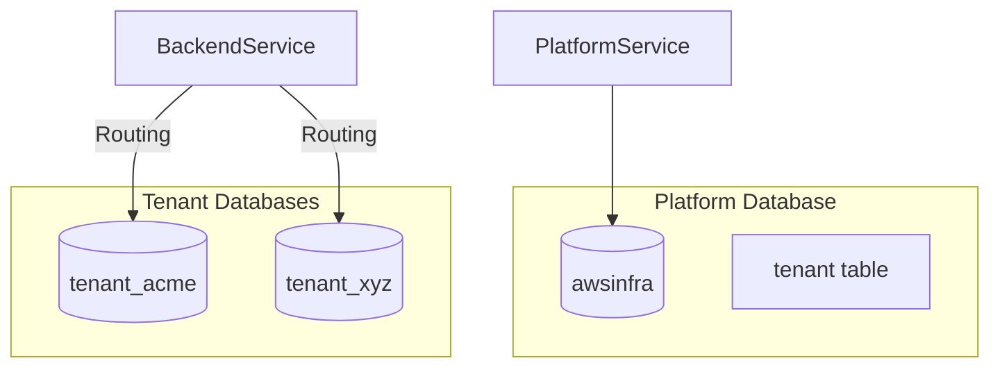

# Multi-Tenancy & Data Architecture

**Version:** 7.2 (Extracted from HLD)
**Last Updated:** 2026-01-17

This document explains the rigorous data isolation strategy used in the SaaS Foundation.

---

## 🏢 Isolation Strategy: Database-per-Tenant

### The "Gold Standard"
We use a **Database-per-Tenant** approach. This means every tenant gets their own dedicated PostgreSQL database (e.g., `tenant_acme`, `tenant_xyz`).

**Benefits:**
- ✅ **Maximum Security:** Impossible to leak data via missing `WHERE tenant_id = ?` clauses.
- ✅ **Performance:** No index bloat from commingled data.
- ✅ **Backup/Restore:** Can restore a single tenant's data without affecting others.
- ✅ **Compliance:** Easier to meet GDPR/Data Residency requirements.

### Architecture Diagram


---

## 🗄️ Data Architecture

### 1. Platform Database (`awsinfra`)
**Owner:** Platform Service
**Purpose:** Global Tenant Registry and System Config.

| Table | Purpose | Key Columns |
|-------|---------|-------------|
| `tenant` | Registry | `id`, `jdbc_url`, `db_secret_arn`, `status`, `tier` |
| `stripe_customers` | Billing | `tenant_id`, `stripe_customer_id` |

### 2. Tenant Databases (`t_<tenant_id>`)
**Owner:** Auth Service, Backend Service
**Purpose:** Application Data (Isolated)

| Table | Service | Purpose |
|-------|---------|---------|
| `roles`, `permissions` | Auth | RBAC definitions |
| `users`, `user_roles` | Auth | User membership |
| `entries` | Backend | **Your Domain Data** |

---

## 🔄 Database Routing

Services (Auth, Backend) strictly follow this flow to connect to the right database.

### The Routing Flow
1. **Request:** Comes with `X-Tenant-Id: t_acme`.
2. **Filter:** `TenantContextFilter` extracts ID → `ThreadLocal`.
3. **Router:** `TenantDataSourceRouter` reads `ThreadLocal`.
4. **Registry:** Checks `TenantLocalCache` for DB credentials.
   - *Miss:* Calls Platform Service (`/internal/tenants/{id}/db-info`).
   - *Hit:* Uses cached HikariDataSource.
5. **Connection:** Configures connection to `jdbc:postgresql://.../tenant_acme`.

### Key Class: TenantDataSourceRouter
```java
public class TenantDataSourceRouter extends AbstractRoutingDataSource {
    @Override
    protected Object determineCurrentLookupKey() {
        return TenantContext.getCurrentTenant();
    }
}
```

---

## 🚀 Migration Orchestration

Each service owns its own schema, but Platform Service triggers the creation.

### Provisioning Flow
1. **Signup:** User signs up.
2. **Platform:** Creates record in `awsinfra.tenant`.
3. **Platform:** Creates physical database `tenant_abc` (via RDS/Postgres).
4. **Platform:** Triggers migrations:
   - call `auth-service/internal/migrate` → Auth runs Flyway on `tenant_abc`.
   - call `backend-service/internal/migrate` → Backend runs Flyway on `tenant_abc`.

**Key Principle:** Platform Service orchestrates, but **Service X owns Schema X**.

---

## 📊 Tenant Tiers & Limits

| Tier | Max Users | Storage |
|------|-----------|---------|
| **STANDARD** | 50 | 10 GB |
| **PREMIUM** | 200 | 50 GB |
| **ENTERPRISE** | Unlimited | Unlimited |

Limits are enforced by the Platform Service logic during User Invite or Data Creation events.
