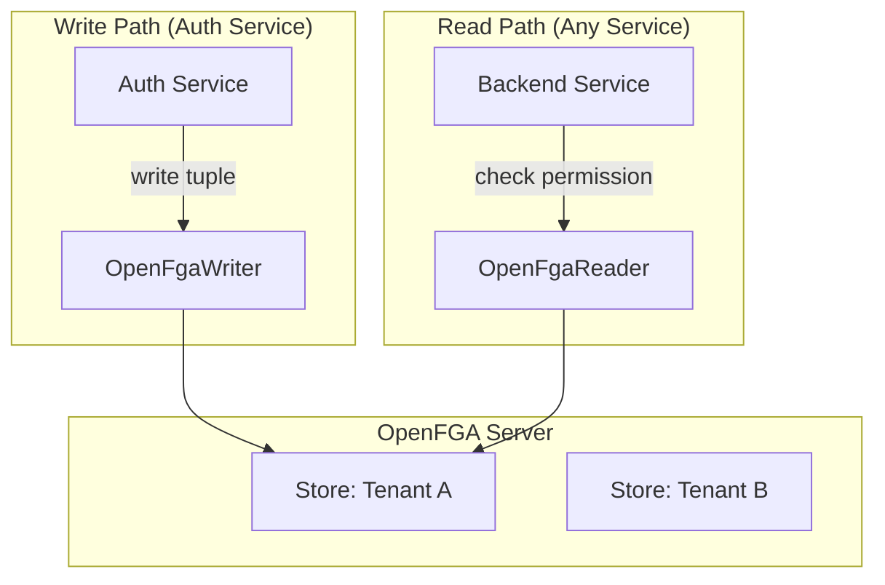

# OpenFGA Fine-Grained Authorization

**Version:** 7.2 (Extracted from HLD)
**Last Updated:** 2026-01-17

This project integrates [OpenFGA](https://openfga.dev) for Relation-Based Access Control (ReBAC). This allows for complex, hierarchical, and data-driven permissions like "Google Drive" sharing.

---

## 🧐 What is OpenFGA?

OpenFGA is an open-source authorization engine based on Google Zanzibar. It moves beyond "Roles" (RBAC) to "Relationships" (ReBAC).

| Feature | Traditional RBAC | OpenFGA (ReBAC) |
|---------|------------------|-----------------|
| **Granularity** | Role-level (e.g., "editor") | Object-level (e.g., "editor of folder X") |
| **Sharing** | Typically global | Per-object sharing ("share with Bob") |
| **Hierarchies** | Limited | Native (folders contain documents) |
| **Scale** | Thousands of users | Billions of tuples |

---

## 🏗️ Architecture

### Multi-Tenant Stores
Each tenant gets their **own OpenFGA Store**.
- **Signup:** Platform Service creates a store.
- **Runtime:** `OpenFgaClientWrapper` looks up the `store_id` for the current tenant.

### Flow Diagram


---

## 📝 The Authorization Model

Our default model supports Organizations, Projects, Folders, and Documents.

```dsl
model
  schema 1.1

type user

type organization
  relations
    define admin: [user]
    define member: [user] or admin

type project
  relations
    define parent: [organization]
    define owner: [user] or admin from parent
    define editor: [user] or owner
    define viewer: [user] or editor

type folder
  relations
    define parent: [project, folder]
    define owner: [user] or owner from parent
    define editor: [user] or owner or editor from parent
    define viewer: [user] or editor or viewer from parent

type document
  relations
    define parent: [folder]
    define owner: [user] or owner from parent
    define editor: [user] or owner or editor from parent
    define viewer: [user] or editor or viewer from parent
```

---

## 🛡️ Resilience & Circuit Breaker

The integration uses **Resilience4j** to protect the application if OpenFGA goes down.

### Configuration
- **Retry:** 3 attempts, 100ms delay.
- **Circuit Breaker:** Opens after 50% failure rate.
- **Fail-Safe:**
  - **Reads:** Fail-closed (Deny Access) on error.
  - **Writes:** Log error but don't crash transaction (Best effort).

```yaml
resilience4j:
  circuitbreaker:
    instances:
      openfga:
        failure-rate-threshold: 50
        wait-duration-in-open-state: 30s
```

---

## 💻 API Usage

### Check Permission
```bash
GET /auth/api/v1/resource-permissions/check
  ?userId=user-456
  &resourceType=folder
  &resourceId=folder-123
  &relation=viewer
```
**Response:** `{ "allowed": true }`

### Share Resource
```bash
POST /auth/api/v1/resource-permissions/share
{
  "resourceType": "folder",
  "resourceId": "folder-123",
  "targetUserId": "user-456",
  "relation": "editor"
}
```
