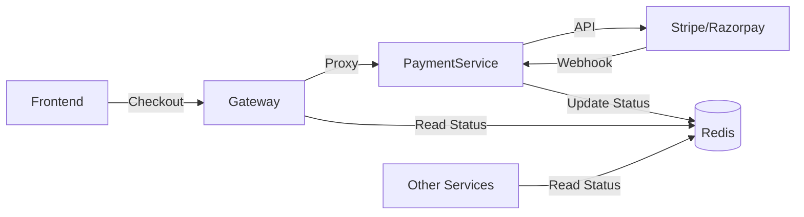

# Payment Service

**Version:** 2.1
**Last Updated:** 2026-01-24

## Overview
The `payment-service` is a dedicated microservice responsible for:
- Managing billing subscriptions (Stripe/Razorpay).
- Handling payment webhooks.
- Maintaining the "Paid Status" of a tenant.
- Decoupling financial logic from `platform-service` and `auth-service`.

---

## 🏗️ Architecture

The service follows a **Strategy Pattern** for payment providers and an **Asynchronous/Event-Driven** model for access control.



### Components
- **Payment Service**: Dedicated service for managing checkout sessions, portals, and webhook processing.
- **Provider Strategies**: Pluggable implementations for Stripe (`StripeProvider`) and Razorpay (`RazorpayProvider`).
- **Redis Cache**: Auth and Gateway services check `billing:status:{tenantId}` in Redis to block/allow traffic based on payment status.

---

## 1. Stripe Configuration

Before running the application, you must configure Stripe.

### 1.1 API Keys
1. Go to [Stripe Dashboard](https://dashboard.stripe.com/test/apikeys).
2. Copy your **Secret key** (starts with `sk_test_`).

### 1.2 Create Products and Prices
Navigate to **Products** and create the following:

| Product Name | Price (Monthly) | Notes |
|-------------|-----------------|-------|
| **Starter** | $9/month | For small teams (up to 5 users) |
| **Pro** | $29/month | For growing teams (up to 50 users) |
| **Enterprise** | $99/month | Unlimited users |

> **Important:** Copy the **Price ID** (starts with `price_`) for each product.

### 1.3 Provider Configuration & Switching
The service supports multiple payment providers (Stripe and Razorpay). The active provider is controlled by the `PAYMENT_PROVIDER` environment variable.

| Variable | Values | Description |
|----------|--------|-------------|
| `PAYMENT_PROVIDER` | `stripe` OR `razorpay` | Determines which payment strategy is loaded at startup. |

### 1.4 Environment Variables (Stripe)
Set `PAYMENT_PROVIDER=stripe` and add the following:

```bash
# Stripe Keys
STRIPE_API_KEY=sk_test_...
STRIPE_WEBHOOK_SECRET=whsec_...

# Stripe Price IDs (From Dashboard)
STRIPE_PRICE_STARTER=price_...
STRIPE_PRICE_PRO=price_...
STRIPE_PRICE_ENTERPRISE=price_...

# Redirect URLs
STRIPE_SUCCESS_URL=http://localhost:4200/settings/billing?success=true
STRIPE_CANCEL_URL=http://localhost:4200/settings/billing?canceled=true
```

## 2. Razorpay Configuration

To switch to Razorpay, set `PAYMENT_PROVIDER=razorpay`.

### 2.1 API Keys
1.  Go to [Razorpay Dashboard](https://dashboard.razorpay.com/).
2.  Generate **Key ID** and **Key Secret**.

### 2.2 Create Plans
Navigate to **Subscriptions -> Plans** and create Plans for Starter, Pro, and Enterprise. Copy the `plan_id` for each.

### 2.3 Environment Variables (Razorpay)

```bash
# Razorpay Keys
RAZORPAY_KEY_ID=rzp_test_...
RAZORPAY_KEY_SECRET=...
RAZORPAY_WEBHOOK_SECRET=...

# Razorpay Plan IDs (Matched to Tiers)
RAZORPAY_PLAN_STARTER=plan_...
RAZORPAY_PLAN_PRO=plan_...
RAZORPAY_PLAN_ENTERPRISE=plan_...
```

---

## 2. API Reference

### 2.1 Checkout Session
Generate a checkout URL to redirect the user to the payment provider.

`POST /api/v1/payment/{accountId}/checkout`

**Body:**
```json
{
  "tier": "pro",
  "successUrl": "http://localhost:4200/success",
  "cancelUrl": "http://localhost:4200/cancel"
}
```

**Response:**
```json
{
  "checkoutUrl": "https://checkout.stripe.com/c/pay/..."
}
```

### 2.2 Customer Portal
Generate a self-serve portal URL for users to manage their subscription (upgrade, cancel, view invoices).

`POST /api/v1/payment/{accountId}/portal`

**Response:**
```json
{
  "url": "https://billing.stripe.com/p/login/..."
}
```

### 2.3 Internal Migration (Platform Use Only)
Triggered by `platform-service` during tenant provisioning.

`POST /api/v1/payment/internal/migrate`

---

## 3. Webhook Handling

Webhooks are crucial for keeping the local database and Redis cache in sync.

**Endpoint:** `POST /api/v1/payment/hooks/stripe` (or `/razorpay`)

| Stripe Event | System Action | Redis Status |
|--------------|---------------|--------------|
| `checkout.session.completed` | **Activate Tenant** | `ACTIVE` |
| `invoice.payment_failed` | **Suspend** | `PAST_DUE` |
| `customer.subscription.deleted`| **Cancel** | `CANCELLED` |
| `invoice.paid` | Log payment success | `ACTIVE` |

> **Security Note:** The Gateway permits traffic to `/api/v1/payment/hooks/**` without a JWT. The Service verifies the **Stripe-Signature** header using the webhook secret.

---

## 4. Access Control Integration

- **Platform/Auth Service**: Do NOT store billing status in their DBs.
- **Enforcement**: Gateways and Services check Redis `billing:status:{id}` via `TenantContextFilter`.
- **Policy**:
    - `ACTIVE` / `TRIAL`: Allow Request.
    - `PAST_DUE` / `SUSPENDED`: **Block Request** (HTTP 402 Payment Required).
    - **Exception**: Requests to `/api/v1/payment/**` are always allowed so users can pay their bills.

---

## 5. Database Schema (Payment DB)

**Table: `billing_account`**

| Column | Type | Description |
|--------|------|-------------|
| `account_id` | VARCHAR(64) | **PK** (Maps to Tenant ID) |
| `email` | VARCHAR(255) | Billing Email |
| `provider` | VARCHAR(20) | `STRIPE` or `RAZORPAY` |
| `customer_id` | VARCHAR(255) | Provider Customer ID |
| `subscription_id` | VARCHAR(255) | Provider Subscription ID |
| `status` | VARCHAR(32) | `ACTIVE`, `PAST_DUE`, `CANCELLED` |
| `current_period_end` | TIMESTAMP | Subscription expiry |
| `price_id` | VARCHAR(255) | Current Plan Price ID |

---

## 6. Testing & Verification

### 6.1 Requirements
- Docker running (`redis`)
- Stripe CLI installed

### 6.2 Forward Webhooks
Start the listener to forward events to your local Payment Service:
```bash
stripe listen --forward-to localhost:8088/api/v1/payment/hooks/stripe
# Output: Your webhook signing secret is whsec_xxxxx
# Copy this secret to your .env / application.yml
```

### 6.3 Validating Checkout
```bash
curl -X POST http://localhost:8088/api/v1/payment/tenant-123/checkout \
  -H "Content-Type: application/json" \
  -d '{"tier": "pro"}'
```
